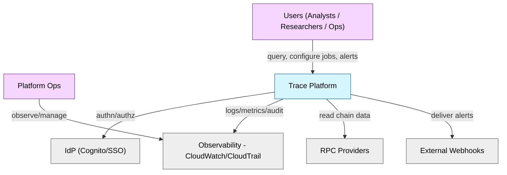
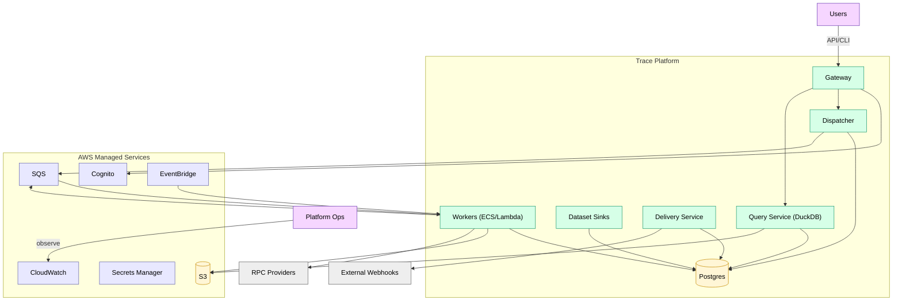
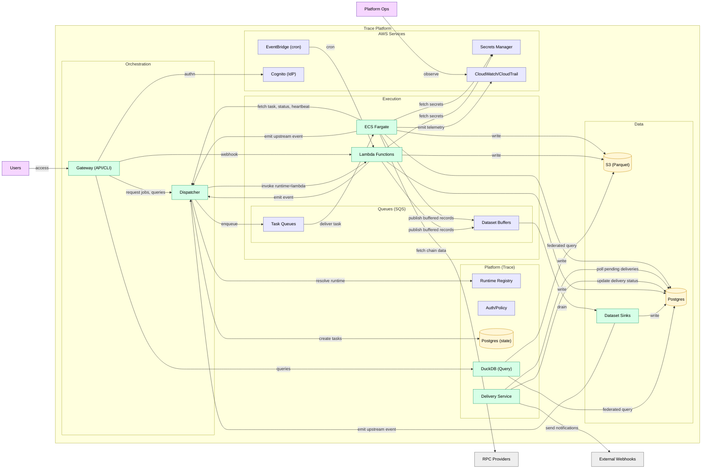
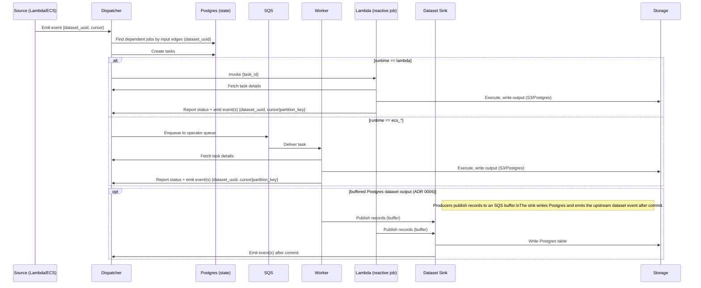
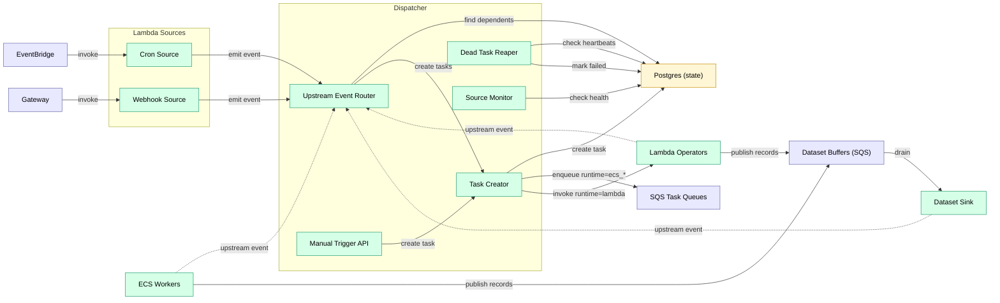
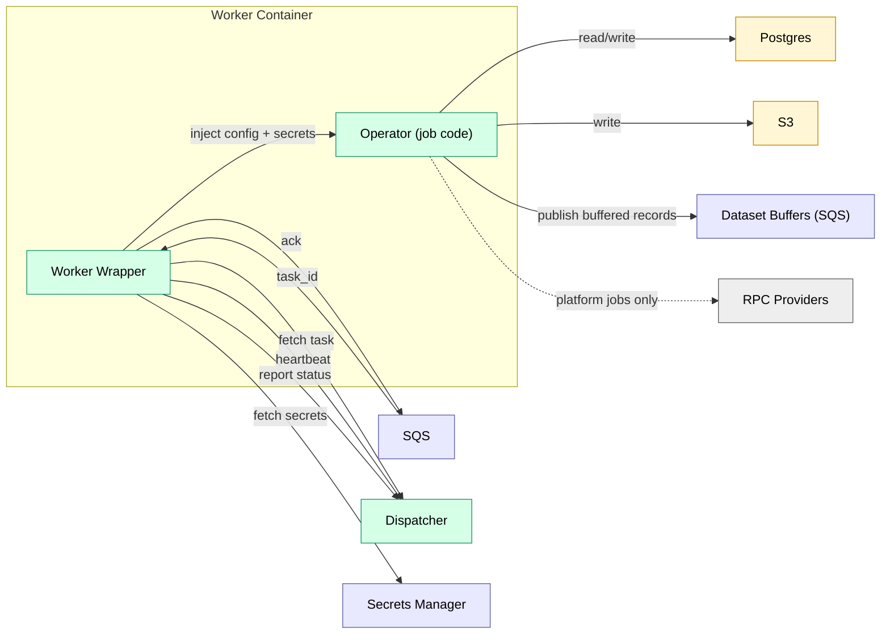
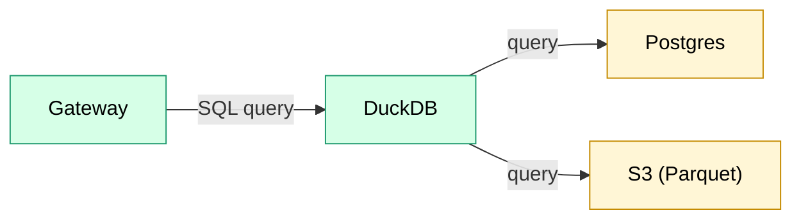

# ETL Orchestration System Architecture

**Version:** 1.0.0  
**Date:** December 2025

---

## Table of Contents

1. [Overview](#overview)
2. [System Architecture](#system-architecture)
3. [Core Components](#core-components)
4. [Data Model](#data-model)
5. [Access Control](#access-control)
6. [PII and User Data](#pii-and-user-data)
7. [Job Lifecycle](#job-lifecycle)
8. [DAG Configuration](#dag-configuration)
9. [Infrastructure](#infrastructure)
10. [Deployment](#deployment)

---

## Overview

A general-purpose ETL orchestration system designed for:

- **Multi-runtime support** — Rust, Python, TypeScript (v1); additional runtimes are deferred (see backlog)
- **Asset-based lineage** — Everything produces trackable assets
- **Flexible partitioning** — Data-driven, not static time-based
- **Source jobs** — Long-running services with `activation: source` (e.g., blockchain followers)
- **Config-as-code** — DAGs defined in YAML, version controlled

See the Build Plan in [docs/plan/build.md](../plan/build.md) for the phased delivery roadmap.

### Design Principles

1. **Everything is a job** — Streaming services, batch transforms, checks
2. **Everything produces assets** — Postgres tables, S3 Parquet, any URI
3. **Workers are dumb** — Receive task, execute, report result
4. **YAML is source of truth** — Definitions in git, state in Postgres
5. **Single dispatcher** — Simple, stateless, restartable

### Tenancy Model

> **v1 is single-tenant.** The architecture includes `org_id` scoping throughout (jobs, tasks, data, queries) to support future multi-tenant expansion, but v1 deploys as a single-org instance. Multi-tenancy (shared infrastructure with logical isolation) and physical tenant isolation (per-org deployments) are deferred. See [backlog.md](../plan/backlog.md).

### Job Characteristics

- **Containerized**: jobs run as containers or services, called remotely (not co-located)
- **Polyglot**: any runtime — Rust, Python, TypeScript, etc. — packaged as a container
- **Standard contract**: jobs receive inputs, produce outputs, return metadata
- **Composable**: jobs can depend on outputs of other jobs, forming DAGs

### Job Types

| Type | Purpose | Example |
|------|---------|---------|
| Ingest | Pull data from onchain or offchain sources | `block_follower`, `cryo_ingest` |
| Transform | Alter, clean, reshape data | decode logs |
| Combine | Join or merge datasets | onchain + offchain |
| Enrich | Add labels, annotations, computed fields | address tagging |
| Summarize | Aggregate, roll up, compute metrics | daily volumes |
| Validate | Check invariants, data quality | `integrity_check` |
| Alert | Evaluate conditions, route notifications | `alert_evaluate`, `alert_route` |

### Glossary

| Term | Definition |
|------|------------|
| Operator | Job implementation (e.g., `block_follower`, `alert_evaluate`) |
| Activation | `source` (emits events) or `reactive` (runs from tasks) |
| Source | Job with `activation: source` — maintains connections, emits events |
| Asset | Output of a job — Parquet file, table rows |
| Partition | A subset of an asset (e.g., blocks 0-10000) |
| Runtime | Execution environment: `lambda`, `ecs_rust`, `ecs_python`, `dispatcher` |

---

## System Architecture

### System Context



### Container View (C4)



### Architecture Overview

Detailed view showing internal structure and data flows.



**Storage:** Postgres (state) holds orchestration metadata (multi-AZ, PITR). Postgres and S3 are available for job data — the "hot" (recent/mutable) vs "cold" (historical/immutable) split is a **naming convention** used by operators like `block_follower` and `parquet_compact`, not an architectural distinction. DuckDB federates across both.

### Event Flow



**Flow:** Source emits → Dispatcher routes → Worker executes → Worker emits → repeat.

### Component View: Orchestration



### Component View: Workers



### Component View: Query Service



---

## Core Components

### Platform Components

These are infrastructure services, not jobs:

### 1. Dispatcher

Central orchestration coordinator. The only platform service.

**Responsibilities:**
- Route all upstream events to dependent jobs
- Create tasks and enqueue to operator queues (SQS)
- Handle `runtime: dispatcher` jobs in-process (platform-only)
- Monitor source job health (ECS workers with `activation: source`, `source.kind: always_on`)
- Track in-flight jobs per operator (scaling control)
- Run reaper for dead tasks
- Publish queue depth metrics to CloudWatch
- Expose manual source API (emits events)

**Event model:**

Every job emits **one event per output** when it materializes data. At runtime, outputs are identified by `dataset_uuid` (a system UUID). User-facing `dataset_name` is resolved via the dataset registry for publishing/querying.

```json
{"dataset_uuid": "uuid", "cursor": 12345}
```

Events can also include partition or row-range context when relevant:

```json
{"dataset_uuid": "uuid", "partition_key": "1000000-1010000"}
```

The Dispatcher routes based on the upstream output identity (`dataset_uuid`). Reactive jobs that list the output as an input edge receive the event.

**Event routing:**
1. Worker emits event: `{dataset_uuid: "...", cursor: 12345}`
2. Dispatcher queries: jobs whose input edges reference that `dataset_uuid`
3. For each dependent reactive job:
   - If `runtime: dispatcher` → Dispatcher handles directly
   - Else if `runtime: lambda` → create task, invoke Lambda
   - Else → create task, enqueue to SQS

**Backpressure:**

Propagates upstream through DAG edges. When a queue trips its threshold (depth or age), Dispatcher pauses upstream producers recursively. When pressure clears (depth drops below threshold), Dispatcher unpauses and producers resume.

- Per-job thresholds: `max_queue_depth`, `max_queue_age`
- Mode: `pause` (stop task creation until queue drains)
- Priority tiers: `normal`, `backfill` — shed `backfill` first when under pressure

**Does NOT:**
- Execute compute tasks (that's workers)
- Pull from queues
- Evaluate cron schedules (that's EventBridge + Lambda)

**Failure mode:**

Dispatcher is stateless — all state lives in Postgres. On failure:
- ECS auto-restarts the service (RTO: ~1 minute)
- Workers continue executing in-flight tasks from SQS
- Source jobs (e.g., `block_follower`) continue running and writing data
- Event routing pauses, but no events are lost — downstream jobs use cursor-based catch-up on restart
- No data loss, only delayed processing

### 2. SQS Queues

Task dispatch mechanism for ECS workers.

**Why SQS over Postgres-as-queue:**
- Efficient long-polling (workers block on SQS, not busy-loop on Postgres)
- Native ECS autoscaling integration
- Built-in visibility timeout
- Workers stay dumb — no orchestration logic

**Configuration:**
- FIFO queue with deduplication
- Visibility timeout: 5 minutes (configurable per job)
- Dead letter queue after 3 failed receives

### 3. Workers

Executors. One worker image per runtime.

| Runtime | Execution | Use Case |
|---------|-----------|----------|
| `dispatcher` | In-process | Platform-only jobs |
| `lambda` | AWS Lambda | Cron/webhook/manual sources, lightweight reactive operators |
| `ecs_rust` | ECS (Rust) | Ingest, transforms, compaction |
| `ecs_python` | ECS (Python) | ML, pandas |

**Queue model (ECS):** One SQS queue per runtime. SQS payload includes `task_id` only; the worker wrapper fetches `operator`, `config`, and event context (`cursor`/`partition_key`) from the Dispatcher.

**Lambda sources:** Invoked by EventBridge/API Gateway, emit upstream events to Dispatcher.

**Lambda reactive jobs:** Invoked by Dispatcher when upstream datasets update (jobs with `runtime: lambda`). Dispatcher invokes the Lambda with the **full task payload** (same shape as `/internal/task-fetch`) and does not wait; a task is “done” only when the Lambda reports `/internal/task-complete`. Timeouts/crashes are handled by the reaper + retries (`max_attempts`) and Lambda built-in retries should be disabled (Dispatcher owns retries uniformly).

**ECS:** Long-polls SQS, stays warm per `idle_timeout`, heartbeats to Dispatcher.

**Architecture (v1):** ECS worker images run on `linux/amd64` to keep user bundle targeting simple. Additional architectures (e.g., `arm64`) can be introduced as separate runtimes in the registry.

### Runtime Registry (Extensible)

Runtimes are identifiers used by the Dispatcher to select a worker image and queue.
They are modeled as strings (not a fixed enum) to allow future additions.

**Registry responsibilities:**
- Map `runtime` → worker image and SQS queue.
- Declare capabilities (e.g., supports long-running tasks, source jobs, GPU, etc.).
- Define default resource limits and heartbeat expectations.

**Adding a new runtime:**
1. Build a worker image (e.g., `ecs_r` for R).
2. Register it in the Dispatcher config with queue + capabilities.
3. Use `runtime: ecs_r` in job YAML.

### 4. Postgres

Source of truth for all state.

**Stores:**
- Job definitions (synced from YAML)
- Tasks (append-only history)
- Task inputs (for memoization)
- Data partitions (asset registry)

### 5. Asset Storage

**Flexibility:** Jobs can write to platform-supported backends (S3, Postgres). Outbound side effects and third-party integrations (PagerDuty/Slack/webhooks) are handled via platform services, not operator/UDF code.

**Hot path:** Postgres
- Immediate writes
- Immediate queries for alerts
- UPDATE/DELETE for reorgs

**Cold path:** S3 Parquet
- Compacted from hot
- Immutable partitions
- Analytics optimized

**Manifests:** Emitted per job run for integrity verification.

**Query layer:** DuckDB
- Spans both Postgres and S3
- Federated queries

---

## Data Model

See [erd.md](erd.md) for the complete entity relationship diagram with all fields.

### Schema Reference

Full DDL for all tables:

- **Orchestration** (orgs, users, jobs, tasks, task_inputs, column_lineage): [capabilities/orchestration.md](../capabilities/orchestration.md)
- **PII** (pii_access_log): [capabilities/pii.md](../capabilities/pii.md)
- **Alerting** (alert_definitions, alert_events, alert_deliveries): [capabilities/alerting.md](../capabilities/alerting.md)
- **Data Versioning** (partition_versions, dataset_cursors, data_invalidations): [data_versioning.md](data_versioning.md)
- **Query Service** (saved_queries, query_results): [query_service.md](query_service.md)
- **Operators** (address_labels): [operators/address_labels.md](operators/address_labels.md)

---

## Access Control

**Hierarchy:** Global → Org → Permission Role (reader/writer/admin) → User

**Org Roles:** User-defined roles used for visibility scoping (e.g., `role:finance`). See [orchestration.md](../capabilities/orchestration.md) and [pii.md](../capabilities/pii.md).

**Identity:** Users authenticate via external IdP (OIDC/SAML). `external_id` links to IdP subject.

**Enforcement:** All actions (job execution, data access, config changes) require authn/authz. All API requests include org context. Jobs, tasks, assets scoped by `org_id`.

**Tenancy (v1):** Single-tenant deployment. One org per instance. The data model includes `org_id` on all entities to enable future multi-tenant expansion without schema changes.

**Tenancy (future):** Logical multi-tenancy (shared infra, `org_id` filtering) and physical isolation (per-org Terraform deployment) are supported by the schema but not implemented in v1. See [backlog.md](../plan/backlog.md).

**Cross-org sharing (future):** Users can be granted access to another org's data via explicit grants, not shared infrastructure.

---

## PII and User Data

PII is a column-level classification with visibility controls and audit logging. See [capabilities/pii.md](../capabilities/pii.md) for visibility semantics (including org-defined roles) and `pii_access_log`.

---

## Job Lifecycle

Jobs are defined in DAG YAML and synced into Postgres. The Dispatcher creates task instances for reactive jobs when upstream datasets update; source jobs run continuously and emit upstream events.

- Job fields and configuration: [dag_configuration.md](../capabilities/dag_configuration.md)
- Task lifecycle, retries, heartbeats: [orchestration.md](../capabilities/orchestration.md#task-lifecycle)
- Incremental processing, staleness, reorg invalidations: [data_versioning.md](data_versioning.md)
- Operator contract (task input/output + emit event): [operators/README.md](operators/README.md)

---

## DAG Configuration

See [dag_configuration.md](../capabilities/dag_configuration.md) for:
- YAML schema with examples

See [dag_deployment.md](dag_deployment.md) for:
- Deploy/sync flow and upsert semantics
- Source provisioning

---

## Infrastructure

See [infrastructure.md](../capabilities/infrastructure.md) for:
- AWS architecture diagram
- Terraform module structure
- Deployment order and rollback

---

## Deployment

Deployment is separated into:
- **Infrastructure**: provision AWS resources via Terraform (VPC, ECS, SQS, RDS, S3).
- **Database**: apply migrations before starting services.
- **DAG sync**: parse/validate DAG YAML and upsert jobs into Postgres (see [dag_deployment.md](dag_deployment.md)).
- **Services**: roll out Dispatcher, workers, Lambda sources, and Query Service.

---

## Monitoring

**Key alerts:**
- Queue depth > 1000
- Task failure rate > 5%
- Source heartbeat stale > 2 min
- Workers at max capacity

**Logging:** Structured JSON to CloudWatch, 30 day retention.

---

## Security

**IAM roles:** dispatcher-role (SQS, RDS, CloudWatch), worker-role (SQS, RDS, S3, Secrets Manager)

**Secrets:** RPC keys and DB creds in Secrets Manager, injected as env vars.

**Network:** Workers in private subnets. VPC endpoints for S3, SQS, Secrets Manager. ALB HTTPS only.

See [security_model.md](../standards/security_model.md) for job isolation, threat model, and credential handling.

---

## Appendix

### References

- [cryo GitHub](https://github.com/paradigmxyz/cryo)
- [DuckDB Documentation](https://duckdb.org/docs/)
- [AWS ECS Autoscaling](https://docs.aws.amazon.com/AmazonECS/latest/developerguide/service-auto-scaling.html)
