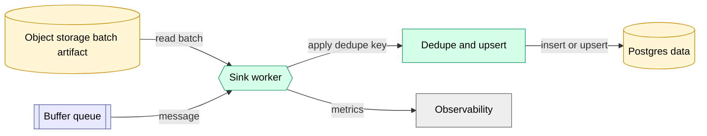

# ADR 0006: Buffered Postgres Datasets (Queue Buffer + Sink)

## Status
- Accepted (December 2025)

## Decision

The platform supports a general **buffer → sink** pattern for Postgres-backed datasets:

- Producers **write a batch artifact** to object storage (S3/MinIO) and call `POST /internal/buffer-publish` with a pointer to that artifact.
- The Dispatcher persists the publish request (outbox) and enqueues a **small** message to the Buffer Queue.
- A platform-managed **sink worker** drains the Buffer Queue and performs idempotent upsert into a Postgres data table.

Queue backend is selected by deployment profile:

- **AWS**: SQS
- **Trace Lite**: pgqueue (Postgres-backed)

v1 defaults:

- One buffer queue per buffered dataset (v1 expects only a small number of buffered datasets; start with alerts and expand when needed).
- Dataset schema is declared at deploy time (as part of publishing the dataset) and the platform creates the table (indexes/constraints) during deploy/startup.

## Implementation sketch

In v1, sink consumers run as a **platform worker** (`ecs_platform`) rather than as a separate conceptual service.

## Context

- Some datasets are naturally **multi-writer** (many jobs produce the same event stream), e.g., alerts, integrity signals, monitoring events.
- Some datasets should be written via a platform-managed sink (not direct Postgres data writes from user/UDF code).
- We want buffering, backpressure visibility, and decoupling between producers and Postgres data writes.
- We do not want to grant arbitrary jobs direct Postgres data write credentials or DDL privileges.

## Why

- **Security**: producers do not need direct Postgres write credentials. They also do not need direct queue permissions; the Dispatcher owns queue publishing.
- **Backpressure**: queue depth/age becomes the explicit health metric.
- **Operational simplicity (v1)**: a small number of buffered datasets (start with alerts) keeps infra manageable.

## Notes (EIP mapping)

- Buffer: **Message Channel** (Queue Channel).
- Sink: **Service Activator** that persists to a **Message Store** (Postgres data).

## Consequences

- Dataset update events for buffered datasets are emitted **by the sink** after commit (not directly by producers).
- Queue messages must remain small (<256KB). **Do not embed full records**; use a pointer to an object-store batch artifact.
- Buffered Postgres dataset schema is managed by the platform and updated via deploy-time migrations (DAG update + controlled migration), not runtime “first writer creates table”.
- Multi-writer datasets are supported: multiple producers can publish to the same buffer and rely on sink-side idempotency keys / unique constraints.
- Buffers use a DLQ / dead-letter mechanism (SQS DLQ in AWS). Messages that exceed the max receive count require manual inspection and replay.

## Idempotency requirements

Buffered datasets must be correct under **at-least-once** publish and task retries.

- **Row-level idempotency is required.** Each row must include a deterministic idempotency key (e.g., `dedupe_key`) or natural unique key that is stable across retries and does not include `attempt` or timestamps.
- The sink enforces idempotency with `UNIQUE(...)` constraints and `ON CONFLICT DO NOTHING/UPDATE`.
- Duplicates across task attempts are expected. Batch artifacts may be written per-attempt to avoid S3 key collisions; correctness comes from sink-side row dedupe.
- **Tenant attribution is not trusted from payload.** The sink must assign `org_id` (and other attribution fields) from the trusted publish record / queue message produced by the Dispatcher and must not trust `org_id` values embedded inside batch rows.
