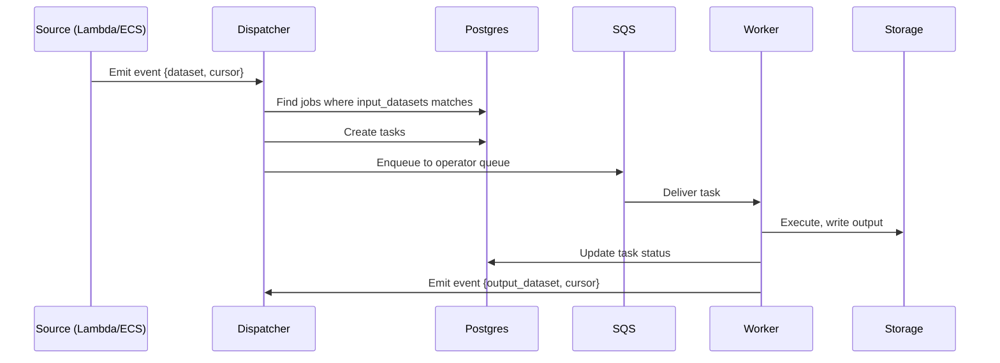
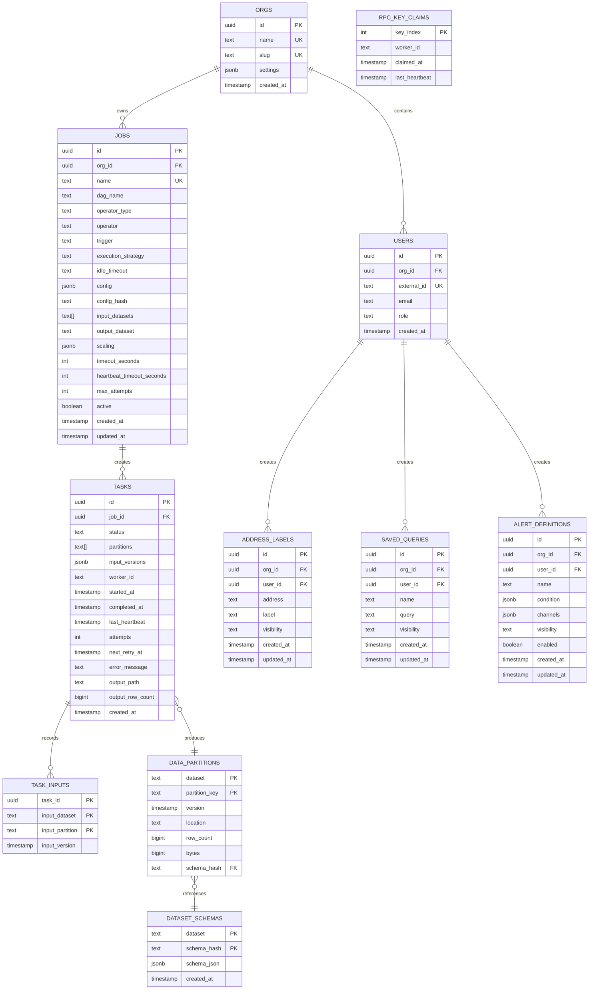
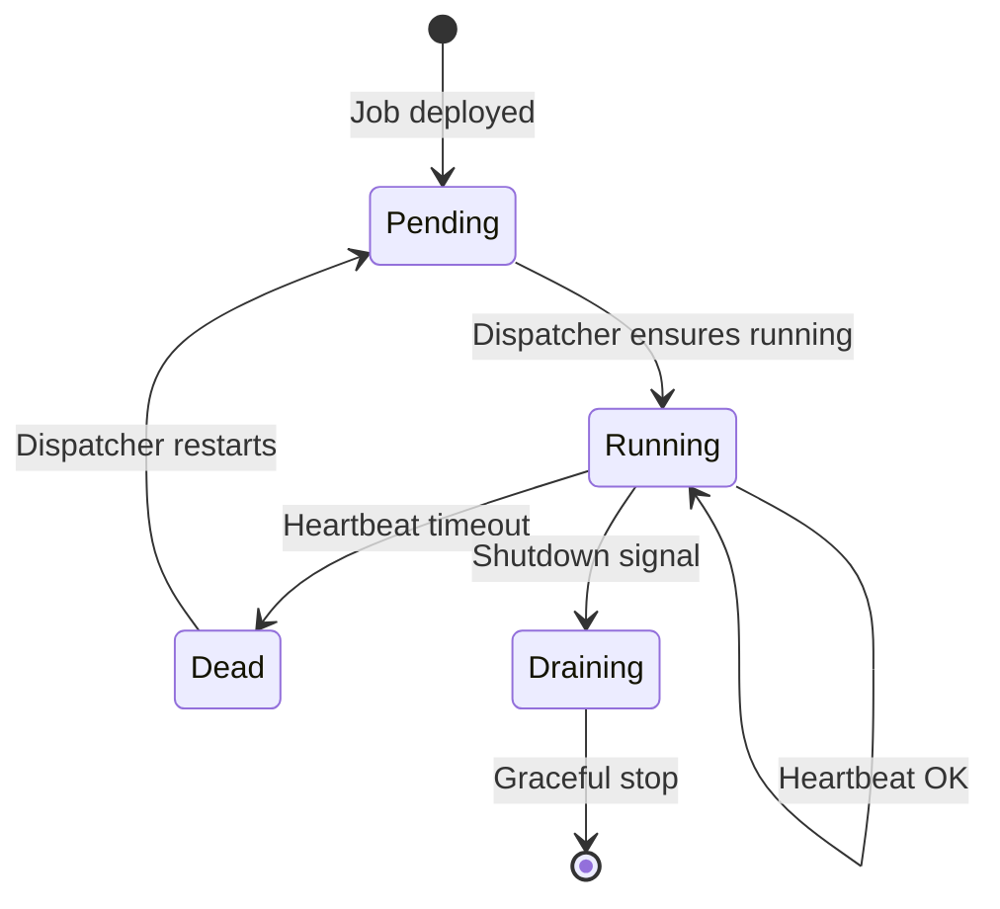
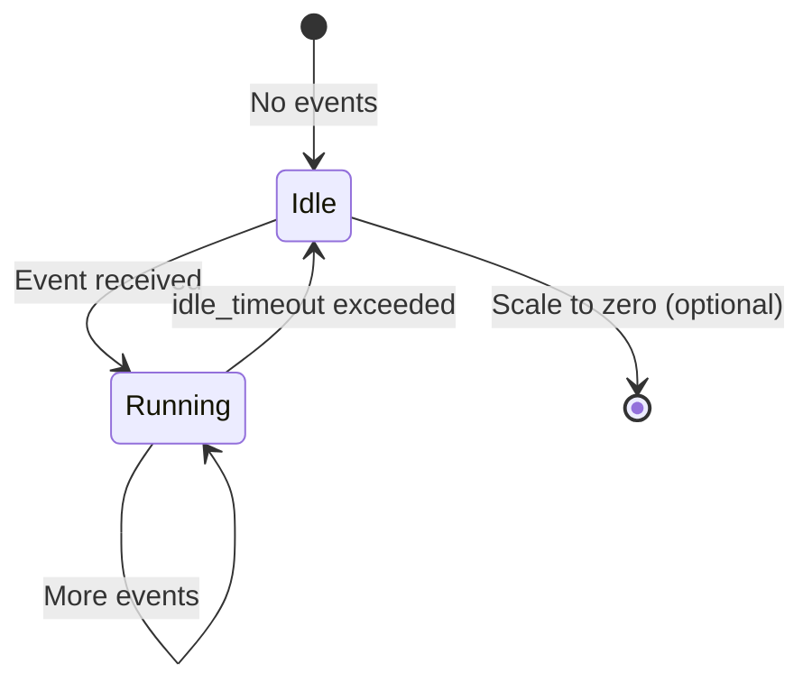
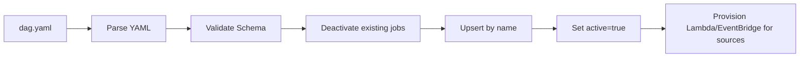
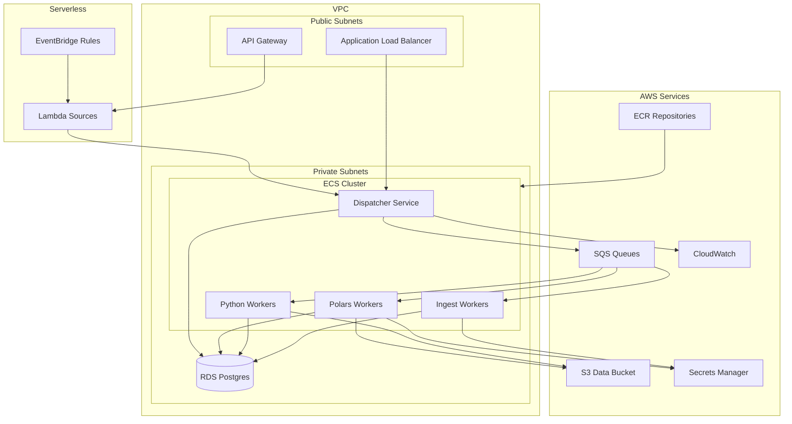

# ETL Orchestration System Architecture

**Version:** 1.2  
**Date:** December 2025

---

## Table of Contents

1. [Overview](#overview)
2. [Build Plan](#build-plan)
3. [System Architecture](#system-architecture)
4. [Core Components](#core-components)
5. [Data Model](#data-model)
6. [Access Control](#access-control)
7. [PII and User Data](#pii-and-user-data)
8. [Job Lifecycle](#job-lifecycle)
9. [DAG Configuration](#dag-configuration)
10. [Infrastructure](#infrastructure)
11. [Deployment](#deployment)

---

## Overview

A general-purpose ETL orchestration system designed for:

- **Multi-runtime support** — Rust, Python, R, TypeScript, Scala
- **Asset-based lineage** — Everything produces trackable assets
- **Flexible partitioning** — Data-driven, not static time-based
- **Source jobs** — Long-running services with no trigger (e.g., blockchain followers)
- **Config-as-code** — DAGs defined in YAML, version controlled

### Design Principles

1. **Everything is a job** — Streaming services, batch transforms, checks
2. **Everything produces assets** — Postgres tables, S3 Parquet, any URI
3. **Workers are dumb** — Receive task, execute, report result
4. **YAML is source of truth** — Definitions in git, state in Postgres
5. **Single dispatcher** — Simple, stateless, restartable

---

## Build Plan

Phased approach: prove orchestration and data flow before user-facing features.

| Phase | Components | Validates |
|-------|------------|-----------|
| 0 | Terraform scaffolding (VPC, ECS, SQS, RDS, S3) | Infrastructure provisioning |
| 1 | Dispatcher + Lambda sources + Worker wrapper | Orchestration layer |
| 2 | `block_follower` → Postgres | Real-time ingestion to hot storage |
| 2 | `cryo_ingest` → S3 (parallel) | Historical backfill to cold storage |
| 3 | `duckdb_query` (hot only) | Query path works |
| 4 | `parquet_compact` | Hot → cold compaction lifecycle |
| 5 | `duckdb_query` (federated) | Query spans hot + cold |
| 6 | `alert_evaluate` + `alert_deliver` | User-facing alerting |
| 7 | `integrity_check` | Cold storage verification |

### Deferred

- User-defined jobs / arbitrary code execution — platform operators first
- Physical tenant isolation — logical isolation sufficient for v1
- Multiple chains — Monad only initially
- Aggregator (fan-in) virtual operator — requires correlation state per partition

---

## System Architecture



**Flow:** Source emits → Dispatcher routes → Worker executes → Worker emits → repeat.

---

## Core Components

### Platform Components

These are infrastructure services, not jobs:

### 1. Dispatcher

Central orchestration coordinator. The only platform service.

**Responsibilities:**
- Route all upstream events to dependent jobs
- Create tasks and enqueue to operator queues (SQS)
- Handle virtual operators (e.g., `aggregator`) directly — no worker needed
- Monitor source job health (ECS workers with `trigger: none`)
- Track in-flight jobs per operator (scaling control)
- Run reaper for dead tasks
- Publish queue depth metrics to CloudWatch
- Expose manual trigger API

**Event model:**

Every job emits an event when it writes to its `output_dataset`. The event is simple:

```json
{"dataset": "hot_blocks", "cursor": 12345}
```

The Dispatcher routes based on dataset name alone. Downstream jobs with `trigger: upstream` receive the event.

**Event routing:**
1. Worker emits event: `{dataset: "hot_blocks", cursor: 12345}`
2. Dispatcher queries: jobs where `input_datasets` includes `"hot_blocks"`
3. For each dependent job with `trigger: upstream`:
   - If `operator_type: virtual` → Dispatcher handles directly
   - Else → create task, enqueue to SQS

**Does NOT:**
- Execute compute tasks (that's workers)
- Pull from queues
- Evaluate cron schedules (that's EventBridge + Lambda)

### 2. SQS Queues

Task dispatch mechanism. One queue per operator type.

**Why SQS over Postgres-as-queue:**
- Push to workers (no polling loop in workers)
- Native ECS autoscaling integration
- Built-in visibility timeout
- Workers stay dumb — no orchestration logic

**Configuration:**
- FIFO queue with deduplication
- Visibility timeout: 5 minutes (configurable per job)
- Dead letter queue after 3 failed receives

### 3. Workers

Executors. One worker image per operator type.

| Operator Type | Runtime | Use Case |
|---------------|---------|----------|
| `virtual` | Dispatcher | Routing patterns (aggregator) — no worker |
| `lambda` | AWS Lambda | Cron/webhook sources |
| `polars` | ECS (Rust) | Data transforms |
| `python` | ECS (Python) | ML, pandas |
| `ingest` | ECS (Rust) | RPC connections |

**Queue model:** One SQS queue per operator type (except `virtual`). Task payload includes `operator`, `config`, `cursor`.

**Lambda:** Invoked by EventBridge/API Gateway, emits event to Dispatcher.

**ECS:** Long-polls SQS, stays warm per `idle_timeout`, heartbeats to Dispatcher.

### 4. Postgres

Source of truth for all state.

**Stores:**
- Job definitions (synced from YAML)
- Tasks (append-only history)
- Task inputs (for memoization)
- Data partitions (asset registry)
- RPC key claims (resource pool)

### 5. Asset Storage

**Hot path:** Postgres
- Immediate writes
- Immediate queries for alerts
- UPDATE/DELETE for reorgs

**Cold path:** S3 Parquet
- Compacted from hot
- Immutable partitions
- Analytics optimized

**Query layer:** DuckDB
- Spans both Postgres and S3
- Federated queries

---

## Data Model

### Entity Relationship



### Schema SQL

```sql
-- Organizations
CREATE TABLE orgs (
    id UUID PRIMARY KEY DEFAULT gen_random_uuid(),
    name TEXT NOT NULL,
    slug TEXT NOT NULL UNIQUE,
    settings JSONB NOT NULL DEFAULT '{}',
    created_at TIMESTAMPTZ DEFAULT now()
);

-- Job definitions (synced from YAML)
CREATE TABLE jobs (
    id UUID PRIMARY KEY DEFAULT gen_random_uuid(),
    org_id UUID NOT NULL REFERENCES orgs(id),
    name TEXT NOT NULL,
    dag_name TEXT NOT NULL,
    operator_type TEXT NOT NULL,        -- 'lambda', 'polars', 'python', 'ingest'
    operator TEXT NOT NULL,             -- 'cron_source', 'block_follower', 'alert_evaluate', etc.
    trigger TEXT NOT NULL,              -- 'none', 'upstream'
    execution_strategy TEXT,            -- NULL for sources, else 'PerUpdate', 'PerPartition', 'Bulk'
    idle_timeout TEXT NOT NULL,         -- 'never', '5m', '0', etc.
    config JSONB NOT NULL DEFAULT '{}',
    config_hash TEXT NOT NULL,
    input_datasets TEXT[],
    output_dataset TEXT,
    scaling JSONB,                      -- { "mode": "backfill", "max_concurrency": 20 }
    timeout_seconds INT,
    heartbeat_timeout_seconds INT,
    max_attempts INT DEFAULT 3,
    active BOOLEAN DEFAULT true,
    created_at TIMESTAMPTZ DEFAULT now(),
    updated_at TIMESTAMPTZ DEFAULT now(),
    CONSTRAINT unique_job_name UNIQUE (dag_name, name)
);

-- Task instances (append-only)
CREATE TABLE tasks (
    id UUID PRIMARY KEY DEFAULT gen_random_uuid(),
    job_id UUID NOT NULL REFERENCES jobs(id),
    status TEXT NOT NULL DEFAULT 'Queued',
    partitions TEXT[],
    input_versions JSONB,
    worker_id TEXT,
    started_at TIMESTAMPTZ,
    completed_at TIMESTAMPTZ,
    last_heartbeat TIMESTAMPTZ,
    attempts INT DEFAULT 0,
    next_retry_at TIMESTAMPTZ,
    error_message TEXT,
    output_path TEXT,
    output_row_count BIGINT,
    created_at TIMESTAMPTZ DEFAULT now()
);

-- Task input versions (for memoization)
CREATE TABLE task_inputs (
    task_id UUID REFERENCES tasks(id),
    input_dataset TEXT NOT NULL,
    input_partition TEXT NOT NULL,
    input_version TIMESTAMPTZ NOT NULL,
    PRIMARY KEY (task_id, input_dataset, input_partition)
);

-- Asset registry
CREATE TABLE data_partitions (
    dataset TEXT NOT NULL,
    partition_key TEXT NOT NULL,
    version TIMESTAMPTZ NOT NULL DEFAULT now(),
    location TEXT NOT NULL,
    row_count BIGINT,
    bytes BIGINT,
    schema_hash TEXT,
    PRIMARY KEY (dataset, partition_key)
);

-- Schema registry (full schema storage)
CREATE TABLE dataset_schemas (
    dataset TEXT NOT NULL,
    schema_hash TEXT NOT NULL,
    schema_json JSONB NOT NULL,  -- column names, types, structure
    created_at TIMESTAMPTZ DEFAULT now(),
    PRIMARY KEY (dataset, schema_hash)
);

-- RPC key pool
CREATE TABLE rpc_key_claims (
    key_index INT PRIMARY KEY,
    worker_id TEXT,
    claimed_at TIMESTAMPTZ,
    last_heartbeat TIMESTAMPTZ
);

-- Column lineage (optional)
CREATE TABLE column_lineage (
    output_dataset TEXT NOT NULL,
    output_column TEXT NOT NULL,
    input_dataset TEXT NOT NULL,
    input_column TEXT NOT NULL,
    job_id UUID REFERENCES jobs(id),
    PRIMARY KEY (output_dataset, output_column, input_dataset, input_column)
);

-- Indexes
CREATE INDEX idx_tasks_status ON tasks(status) WHERE status IN ('Queued', 'Running');
CREATE INDEX idx_tasks_job_id ON tasks(job_id);
CREATE INDEX idx_tasks_next_retry ON tasks(next_retry_at) WHERE status = 'Failed';
CREATE INDEX idx_tasks_last_heartbeat ON tasks(last_heartbeat) WHERE status = 'Running';
CREATE INDEX idx_data_partitions_dataset ON data_partitions(dataset);
CREATE INDEX idx_jobs_active ON jobs(dag_name) WHERE active = true;

-- PII: Address labels
CREATE TABLE address_labels (
    id UUID PRIMARY KEY DEFAULT gen_random_uuid(),
    org_id UUID NOT NULL REFERENCES orgs(id),
    user_id UUID NOT NULL REFERENCES users(id),
    address TEXT NOT NULL,
    label TEXT NOT NULL,
    visibility TEXT NOT NULL DEFAULT 'private',  -- private, org, public
    created_at TIMESTAMPTZ DEFAULT now(),
    updated_at TIMESTAMPTZ DEFAULT now(),
    UNIQUE (org_id, user_id, address, label)
);

-- PII: Saved queries
CREATE TABLE saved_queries (
    id UUID PRIMARY KEY DEFAULT gen_random_uuid(),
    org_id UUID NOT NULL REFERENCES orgs(id),
    user_id UUID NOT NULL REFERENCES users(id),
    name TEXT NOT NULL,
    query TEXT NOT NULL,
    visibility TEXT NOT NULL DEFAULT 'private',
    created_at TIMESTAMPTZ DEFAULT now(),
    updated_at TIMESTAMPTZ DEFAULT now()
);

-- PII: Alert definitions
CREATE TABLE alert_definitions (
    id UUID PRIMARY KEY DEFAULT gen_random_uuid(),
    org_id UUID NOT NULL REFERENCES orgs(id),
    user_id UUID NOT NULL REFERENCES users(id),
    name TEXT NOT NULL,
    condition JSONB NOT NULL,
    channels JSONB NOT NULL,  -- email, sms, webhook configs
    visibility TEXT NOT NULL DEFAULT 'private',
    enabled BOOLEAN DEFAULT true,
    created_at TIMESTAMPTZ DEFAULT now(),
    updated_at TIMESTAMPTZ DEFAULT now()
);

-- PII access audit log
CREATE TABLE pii_access_log (
    id UUID PRIMARY KEY DEFAULT gen_random_uuid(),
    user_id UUID NOT NULL REFERENCES users(id),
    table_name TEXT NOT NULL,
    record_id UUID NOT NULL,
    action TEXT NOT NULL,  -- read, write, delete
    accessed_at TIMESTAMPTZ DEFAULT now()
);

CREATE INDEX idx_address_labels_org ON address_labels(org_id);
CREATE INDEX idx_address_labels_user ON address_labels(user_id);
CREATE INDEX idx_address_labels_address ON address_labels(address);
CREATE INDEX idx_saved_queries_org ON saved_queries(org_id);
CREATE INDEX idx_alert_definitions_org ON alert_definitions(org_id);
CREATE INDEX idx_pii_access_log_user ON pii_access_log(user_id);
CREATE INDEX idx_pii_access_log_time ON pii_access_log(accessed_at);
```

---

## Access Control

**Hierarchy:** Global → Org → Role (reader/writer/admin) → User

**Identity:** Users authenticate via external IdP (OIDC/SAML). `external_id` links to IdP subject.

**Enforcement:** All API requests include org context. Jobs, tasks, assets scoped by `org_id`.

**Tenant isolation:** Logical by default (queries filtered by `org_id`). Physical isolation optional (separate Terraform deployment).

---

## PII and User Data

PII = address labels, saved queries, alert definitions.

All PII tables have: `org_id`, `user_id`, `visibility` (private/org/public).

**Rules:**
- `private`: only creator can read
- `org`: any org member can read
- Reads logged to `pii_access_log`
- Hard delete only (GDPR)

---

## Job Lifecycle

### Job Properties

Every job has two key properties:

| Property | Description | Values |
|----------|-------------|--------|
| `trigger` | What activates the job | `none` (source), `upstream` (event-driven) |
| `idle_timeout` | How long to stay alive with no work | `never`, duration (`5m`), or `0` |

**Trigger behavior:**

| Trigger | Behavior | Example |
|---------|----------|--------|
| `none` | Always running, no external activation | `block_follower` — holds RPC connection |
| `upstream` | Activated by event from another job | `alert_evaluate` — reacts to new blocks |

**How cron and manual work:** They're just Lambda sources with `trigger: none` that emit events. Downstream jobs have `trigger: upstream`. There's no special cron/manual trigger type.

### Execution Strategies

How work is divided for `trigger: upstream` jobs:

| Strategy | Description | Use Case |
|----------|-------------|----------|
| `PerUpdate` | One task per upstream event | Alert evaluation |
| `PerPartition` | One task per partition | Historical backfills |
| `Bulk` | Single task for all pending work | Compaction, aggregations |

Jobs with `trigger: none` don't have an execution strategy — they run continuously.

### Task States


### Source Job Lifecycle (trigger: none)



### Reactive Job Lifecycle (trigger: upstream)



### Staleness & Memoization

**Staleness:** A job is stale if:
- Input data changed since last run, OR
- Job config changed (`config_hash` differs)

**Memoization:** Before execution, check if outputs exist with same input versions. If yes, skip.

### Scaling

Dispatcher-controlled, not AWS auto-scaling.

| Mode | Behavior |
|------|----------|
| `backfill` | Max parallelism (e.g., 20 concurrent) |
| `steady` | Single worker |

```yaml
scaling:
  mode: backfill
  max_concurrency: 20
```

Dispatcher tracks in-flight jobs and only releases work when slots available.

---

## DAG Configuration

### Directory Structure

```
/dags
  /monad
    dag.yaml
  /ethereum
    dag.yaml
  /ml-pipeline
    dag.yaml
```

### YAML Schema

```yaml
name: monad

defaults:
  heartbeat_timeout_seconds: 60
  max_attempts: 3

jobs:
  # Source: Lambda cron emits daily event
  - name: daily_trigger
    operator_type: lambda
    operator: cron_source
    trigger: none
    idle_timeout: 0
    config:
      schedule: "0 0 * * *"
    output_dataset: daily_events

  # Source: always-running block follower
  - name: block_follower
    operator_type: ingest
    operator: block_follower
    trigger: none
    idle_timeout: never
    config:
      chain_id: 10143
      rpc_pool: monad
    output_dataset: hot_blocks
    heartbeat_timeout_seconds: 60
    
  # Reactive: evaluate alerts on new blocks
  - name: alert_evaluate
    operator_type: polars
    operator: alert_evaluate
    trigger: upstream
    execution_strategy: PerUpdate
    idle_timeout: 5m
    input_datasets: [hot_blocks]
    output_dataset: triggered_alerts
    timeout_seconds: 60
    
  # Batch: compact triggered by daily cron
  - name: compact_blocks
    operator_type: polars
    operator: parquet_compact
    trigger: upstream
    execution_strategy: Bulk
    idle_timeout: 0
    input_datasets: [hot_blocks, daily_events]
    output_dataset: cold_blocks
    timeout_seconds: 1800
    
  # Backfill: manual trigger, parallel partitions
  - name: cryo_backfill
    operator_type: ingest
    operator: cryo_ingest
    trigger: upstream  # triggered via manual API
    execution_strategy: PerPartition
    idle_timeout: 0
    config:
      chain_id: 10143
      datasets: [blocks, transactions, logs]
    scaling:
      mode: backfill
      max_concurrency: 20
    output_dataset: cold_blocks
    timeout_seconds: 3600
```

### Deploy Process



**SQL logic:**
```sql
UPDATE jobs SET active = false WHERE dag_name = 'monad';

INSERT INTO jobs (name, dag_name, operator_type, operator, trigger, execution_strategy, idle_timeout, ...)
VALUES ('block_follower', 'monad', 'ingest', 'block_follower', 'none', NULL, 'never', ...)
ON CONFLICT (dag_name, name) DO UPDATE SET
  operator_type = EXCLUDED.operator_type,
  operator = EXCLUDED.operator,
  trigger = EXCLUDED.trigger,
  execution_strategy = EXCLUDED.execution_strategy,
  idle_timeout = EXCLUDED.idle_timeout,
  config = EXCLUDED.config,
  config_hash = EXCLUDED.config_hash,
  active = true,
  updated_at = now();
```

---

## Infrastructure

### AWS Architecture



### Terraform Structure

```
/terraform
  /modules
    /vpc           # VPC, subnets, NAT, VPC endpoints
    /rds           # Postgres, security groups
    /ecs           # Cluster, services, task definitions, autoscaling
    /sqs           # FIFO queues, DLQ
    /s3            # Data bucket, lifecycle rules
    /lambda        # Lambda sources, API Gateway
    /eventbridge   # Cron schedules
  /environments
    /dev
    /prod
```

Key resources per module:
- **VPC**: Private/public subnets, VPC endpoints for S3/SQS/Secrets Manager
- **ECS**: Fargate services, SQS-based autoscaling
- **RDS**: Postgres 15, encrypted, multi-AZ in prod
- **SQS**: FIFO with deduplication, 5min visibility, DLQ after 3 failures
- **S3**: Versioned, lifecycle to Glacier after 1 year

---

## Deployment

**Order:**
1. Terraform apply (infra)
2. Database migrations
3. Sync DAG YAML → Postgres
4. Deploy ECS services

**Rollback:** Terraform state rollback, ECS deployment rollback, git revert DAGs.

---

## Monitoring

**Key alerts:**
- Queue depth > 1000
- Task failure rate > 5%
- Source heartbeat stale > 2 min
- Workers at max capacity

**Logging:** Structured JSON to CloudWatch, 30 day retention.

---

## Security

**IAM roles:** dispatcher-role (SQS, RDS, CloudWatch), worker-role (SQS, RDS, S3, Secrets Manager)

**Secrets:** RPC keys and DB creds in Secrets Manager, injected as env vars.

**Network:** Workers in private subnets. VPC endpoints for S3, SQS, Secrets Manager. ALB HTTPS only.

---

## Appendix

### Glossary

| Term | Definition |
|------|------------|
| Operator | Job implementation (e.g., `block_follower`, `alert_evaluate`) |
| Operator Type | Runtime category: `lambda`, `polars`, `python`, `ingest` |
| Trigger | `none` (always running) or `upstream` (event-driven) |
| Source | Job with `trigger: none` — maintains connections, emits events |
| Asset | Output of a job — Parquet file, table rows |
| Partition | A subset of an asset (e.g., blocks 0-10000) |

### References

- [cryo GitHub](https://github.com/paradigmxyz/cryo)
- [DuckDB Documentation](https://duckdb.org/docs/)
- [AWS ECS Autoscaling](https://docs.aws.amazon.com/AmazonECS/latest/developerguide/service-auto-scaling.html)