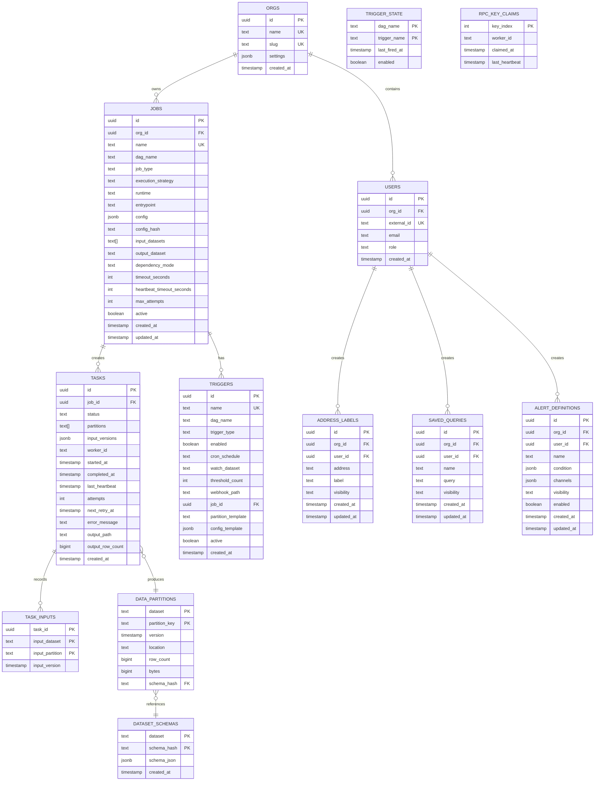

# ETL Orchestration System Architecture

**Version:** 1.2  
**Date:** December 2025

---

## Table of Contents

1. [Overview](#overview)
2. [Build Plan](#build-plan)
3. [System Architecture](#system-architecture)
4. [Core Components](#core-components)
5. [Data Model](#data-model)
6. [Access Control](#access-control)
7. [PII and User Data](#pii-and-user-data)
8. [Job Lifecycle](#job-lifecycle)
9. [DAG Configuration](#dag-configuration)
10. [Infrastructure](#infrastructure)
11. [Deployment](#deployment)

---

## Overview

A general-purpose ETL orchestration system designed for:

- **Multi-runtime support** — Rust, Python, R, TypeScript, Scala
- **Asset-based lineage** — Everything produces trackable assets
- **Flexible partitioning** — Data-driven, not static time-based
- **Singleton jobs** — Long-running services (e.g., blockchain followers)
- **Config-as-code** — DAGs defined in YAML, version controlled

### Design Principles

1. **Everything is a job** — Streaming services, batch transforms, checks
2. **Everything produces assets** — Postgres tables, S3 Parquet, any URI
3. **Workers are dumb** — Receive task, execute, report result
4. **YAML is source of truth** — Definitions in git, state in Postgres
5. **Single dispatcher** — Simple, stateless, restartable

---

## Build Plan

Phased approach: prove orchestration and data flow before user-facing features.

| Phase | Components | Validates |
|-------|------------|-----------|
| 0 | Terraform scaffolding (VPC, ECS, SQS, RDS, S3) | Infrastructure provisioning |
| 1 | Dispatcher + Trigger Service + Worker wrapper | Orchestration layer |
| 2 | `block_follower` → Postgres | Real-time ingestion to hot storage |
| 2 | `cryo_ingest` → S3 (parallel) | Historical backfill to cold storage |
| 3 | `duckdb_query` (hot only) | Query path works |
| 4 | `parquet_compact` | Hot → cold compaction lifecycle |
| 5 | `duckdb_query` (federated) | Query spans hot + cold |
| 6 | `alert_evaluate` + `alert_deliver` | User-facing alerting |
| 7 | `integrity_check` | Cold storage verification |

### Deferred

- User-defined jobs / arbitrary code execution — platform operators first
- Physical tenant isolation — logical isolation sufficient for v1
- Multiple chains — Monad only initially

---

## System Architecture

### High-Level Diagram


### Component Interaction


---

## Core Components

### Platform Components

These are infrastructure services, not jobs:

### 1. Trigger Service

Evaluates trigger conditions and emits job requests. Part of the platform, not a job.

**Responsibilities:**
- Evaluate cron schedules
- Handle webhook requests
- Receive threshold events from Singleton jobs
- Request job creation from Dispatcher

**Runtime behavior:**
- YAML definitions loaded into memory on startup
- State (last_fired_at, enabled) persisted to Postgres
- Stateless in memory — can restart and reload definitions from Postgres

### 2. Dispatcher

Central orchestration coordinator. Part of the platform, not a job.

**Responsibilities:**
- Create tasks from trigger requests
- Send task IDs to SQS
- Monitor Singleton job health
- Run reaper for dead tasks
- Publish queue depth metrics to CloudWatch

**Does NOT:**
- Execute tasks
- Pull from queues
- Know about task internals

### 3. SQS Queue

Task dispatch mechanism.

**Why SQS over Postgres-as-queue:**
- Push to workers (no polling loop in workers)
- Native ECS autoscaling integration
- Built-in visibility timeout
- Workers stay dumb — no orchestration logic

**Configuration:**
- FIFO queue with deduplication
- Visibility timeout: 5 minutes (configurable per job)
- Dead letter queue after 3 failed receives

### 4. Workers

Dumb executors. Workers execute operators (job implementations).

**Concepts:**
- **Runtime** — execution environment (Rust, Python, R, Scala, etc.)
- **Operator** — a specific job implementation (e.g., `cryo_ingest`, `pandas_transform`)
- Multiple operators can share a runtime
- One image per operator — simple mental model, independent versioning, no dependency conflicts

**Contract:**
```
Receive task_id from SQS
  → Fetch task from Postgres
  → Execute entrypoint
  → Write output to storage
  → Update task status in Postgres
  → Record output in data_partitions
  → Ack SQS message
```

**Heartbeat:**
- Worker wrapper sends heartbeat every 30s
- Dispatcher reaper kills tasks with stale heartbeats
- Transform code doesn't know about heartbeats

### 5. Postgres

Source of truth for all state.

**Stores:**
- Job definitions (synced from YAML)
- Trigger definitions (synced from YAML)
- Trigger state (runtime)
- Tasks (append-only history)
- Task inputs (for memoization)
- Data partitions (asset registry)
- RPC key claims (resource pool)

### 6. Asset Storage

**Hot path:** Postgres
- Immediate writes
- Immediate queries for alerts
- UPDATE/DELETE for reorgs

**Cold path:** S3 Parquet
- Compacted from hot
- Immutable partitions
- Analytics optimized

**Query layer:** DuckDB
- Spans both Postgres and S3
- Federated queries

---

## Data Model

### Entity Relationship



### Schema SQL

```sql
-- Organizations
CREATE TABLE orgs (
    id UUID PRIMARY KEY DEFAULT gen_random_uuid(),
    name TEXT NOT NULL,
    slug TEXT NOT NULL UNIQUE,
    settings JSONB NOT NULL DEFAULT '{}',
    created_at TIMESTAMPTZ DEFAULT now()
);

-- Job definitions (synced from YAML)
CREATE TABLE jobs (
    id UUID PRIMARY KEY DEFAULT gen_random_uuid(),
    org_id UUID NOT NULL REFERENCES orgs(id),
    name TEXT NOT NULL,
    dag_name TEXT NOT NULL,
    job_type TEXT NOT NULL,
    execution_strategy TEXT NOT NULL,
    runtime TEXT NOT NULL,
    entrypoint TEXT NOT NULL,
    config JSONB NOT NULL DEFAULT '{}',
    config_hash TEXT NOT NULL,
    input_datasets TEXT[],
    output_dataset TEXT,
    dependency_mode TEXT,
    timeout_seconds INT,
    heartbeat_timeout_seconds INT,
    max_attempts INT DEFAULT 3,
    active BOOLEAN DEFAULT true,
    created_at TIMESTAMPTZ DEFAULT now(),
    updated_at TIMESTAMPTZ DEFAULT now(),
    CONSTRAINT unique_job_name UNIQUE (dag_name, name)
);

-- Trigger definitions (synced from YAML)
CREATE TABLE triggers (
    id UUID PRIMARY KEY DEFAULT gen_random_uuid(),
    name TEXT NOT NULL,
    dag_name TEXT NOT NULL,
    trigger_type TEXT NOT NULL,
    enabled BOOLEAN DEFAULT true,
    cron_schedule TEXT,
    watch_dataset TEXT,
    threshold_count INT,
    webhook_path TEXT,
    job_id UUID REFERENCES jobs(id),
    partition_template TEXT,
    config_template JSONB,
    active BOOLEAN DEFAULT true,
    created_at TIMESTAMPTZ DEFAULT now(),
    CONSTRAINT unique_trigger_name UNIQUE (dag_name, name)
);

-- Trigger runtime state
CREATE TABLE trigger_state (
    dag_name TEXT NOT NULL,
    trigger_name TEXT NOT NULL,
    last_fired_at TIMESTAMPTZ,
    enabled BOOLEAN DEFAULT true,
    PRIMARY KEY (dag_name, trigger_name)
);

-- Task instances (append-only)
CREATE TABLE tasks (
    id UUID PRIMARY KEY DEFAULT gen_random_uuid(),
    job_id UUID NOT NULL REFERENCES jobs(id),
    status TEXT NOT NULL DEFAULT 'Queued',
    partitions TEXT[],
    input_versions JSONB,
    worker_id TEXT,
    started_at TIMESTAMPTZ,
    completed_at TIMESTAMPTZ,
    last_heartbeat TIMESTAMPTZ,
    attempts INT DEFAULT 0,
    next_retry_at TIMESTAMPTZ,
    error_message TEXT,
    output_path TEXT,
    output_row_count BIGINT,
    created_at TIMESTAMPTZ DEFAULT now()
);

-- Task input versions (for memoization)
CREATE TABLE task_inputs (
    task_id UUID REFERENCES tasks(id),
    input_dataset TEXT NOT NULL,
    input_partition TEXT NOT NULL,
    input_version TIMESTAMPTZ NOT NULL,
    PRIMARY KEY (task_id, input_dataset, input_partition)
);

-- Asset registry
CREATE TABLE data_partitions (
    dataset TEXT NOT NULL,
    partition_key TEXT NOT NULL,
    version TIMESTAMPTZ NOT NULL DEFAULT now(),
    location TEXT NOT NULL,
    row_count BIGINT,
    bytes BIGINT,
    schema_hash TEXT,
    PRIMARY KEY (dataset, partition_key)
);

-- Schema registry (full schema storage)
CREATE TABLE dataset_schemas (
    dataset TEXT NOT NULL,
    schema_hash TEXT NOT NULL,
    schema_json JSONB NOT NULL,  -- column names, types, structure
    created_at TIMESTAMPTZ DEFAULT now(),
    PRIMARY KEY (dataset, schema_hash)
);

-- RPC key pool
CREATE TABLE rpc_key_claims (
    key_index INT PRIMARY KEY,
    worker_id TEXT,
    claimed_at TIMESTAMPTZ,
    last_heartbeat TIMESTAMPTZ
);

-- Column lineage (optional)
CREATE TABLE column_lineage (
    output_dataset TEXT NOT NULL,
    output_column TEXT NOT NULL,
    input_dataset TEXT NOT NULL,
    input_column TEXT NOT NULL,
    job_id UUID REFERENCES jobs(id),
    PRIMARY KEY (output_dataset, output_column, input_dataset, input_column)
);

-- Indexes
CREATE INDEX idx_tasks_status ON tasks(status) WHERE status IN ('Queued', 'Running');
CREATE INDEX idx_tasks_job_id ON tasks(job_id);
CREATE INDEX idx_tasks_next_retry ON tasks(next_retry_at) WHERE status = 'Failed';
CREATE INDEX idx_tasks_last_heartbeat ON tasks(last_heartbeat) WHERE status = 'Running';
CREATE INDEX idx_data_partitions_dataset ON data_partitions(dataset);
CREATE INDEX idx_jobs_active ON jobs(dag_name) WHERE active = true;
CREATE INDEX idx_triggers_active ON triggers(dag_name) WHERE active = true;

-- PII: Address labels
CREATE TABLE address_labels (
    id UUID PRIMARY KEY DEFAULT gen_random_uuid(),
    org_id UUID NOT NULL REFERENCES orgs(id),
    user_id UUID NOT NULL REFERENCES users(id),
    address TEXT NOT NULL,
    label TEXT NOT NULL,
    visibility TEXT NOT NULL DEFAULT 'private',  -- private, org, public
    created_at TIMESTAMPTZ DEFAULT now(),
    updated_at TIMESTAMPTZ DEFAULT now(),
    UNIQUE (org_id, user_id, address, label)
);

-- PII: Saved queries
CREATE TABLE saved_queries (
    id UUID PRIMARY KEY DEFAULT gen_random_uuid(),
    org_id UUID NOT NULL REFERENCES orgs(id),
    user_id UUID NOT NULL REFERENCES users(id),
    name TEXT NOT NULL,
    query TEXT NOT NULL,
    visibility TEXT NOT NULL DEFAULT 'private',
    created_at TIMESTAMPTZ DEFAULT now(),
    updated_at TIMESTAMPTZ DEFAULT now()
);

-- PII: Alert definitions
CREATE TABLE alert_definitions (
    id UUID PRIMARY KEY DEFAULT gen_random_uuid(),
    org_id UUID NOT NULL REFERENCES orgs(id),
    user_id UUID NOT NULL REFERENCES users(id),
    name TEXT NOT NULL,
    condition JSONB NOT NULL,
    channels JSONB NOT NULL,  -- email, sms, webhook configs
    visibility TEXT NOT NULL DEFAULT 'private',
    enabled BOOLEAN DEFAULT true,
    created_at TIMESTAMPTZ DEFAULT now(),
    updated_at TIMESTAMPTZ DEFAULT now()
);

-- PII access audit log
CREATE TABLE pii_access_log (
    id UUID PRIMARY KEY DEFAULT gen_random_uuid(),
    user_id UUID NOT NULL REFERENCES users(id),
    table_name TEXT NOT NULL,
    record_id UUID NOT NULL,
    action TEXT NOT NULL,  -- read, write, delete
    accessed_at TIMESTAMPTZ DEFAULT now()
);

CREATE INDEX idx_address_labels_org ON address_labels(org_id);
CREATE INDEX idx_address_labels_user ON address_labels(user_id);
CREATE INDEX idx_address_labels_address ON address_labels(address);
CREATE INDEX idx_saved_queries_org ON saved_queries(org_id);
CREATE INDEX idx_alert_definitions_org ON alert_definitions(org_id);
CREATE INDEX idx_pii_access_log_user ON pii_access_log(user_id);
CREATE INDEX idx_pii_access_log_time ON pii_access_log(accessed_at);
```

---

## Access Control

### Hierarchy

- **Global** — Platform-wide settings, shared public data
- **Org** — Organization-scoped jobs, data, and assets; one tenant per org
- **Role** — Permissions within an org: `reader`, `writer`, `admin`
- **User** — Individual identity, linked to IdP

### Identity

- Users authenticate via external IdP (OIDC/SAML)
- `external_id` links to IdP subject
- Org membership and role stored locally

### Enforcement

- All API/query requests include org context
- Jobs, tasks, triggers, assets scoped by `org_id`
- Cross-org data sharing requires explicit grants (future)

### Tenant Isolation

**Logical isolation** (default):
- All queries filtered by `org_id`
- Per-org quotas and rate limits
- Shared infrastructure with strict access control

**Physical isolation** (optional, for compliance/enterprise):
- Separate Terraform deployment per org
- Isolated: VPC/subnets, ECS cluster, S3 bucket, RDS instance
- Shared: ECR images, base infra (Route53, etc.)

---

## PII and User Data

### What Constitutes PII

- **Address labels** — links wallet addresses to real-world identities or intent
- **Saved queries** — may reveal research targets
- **Alert definitions** — surveillance of specific addresses

### Ownership Model

All PII tables share a common pattern:
- `org_id` — which org owns this data
- `user_id` — which user created it
- `visibility` — access level: `private`, `org`, `public`

### Visibility Rules

| Visibility | Who Can Read |
|------------|--------------|
| `private` | Only the creating user |
| `org` | Any user in the same org |
| `public` | Any authenticated user (if supported) |

### Access Logging

- Every individual-record read from PII tables is logged to `pii_access_log`
- Logs include: who, what table, which record, when
- Aggregate queries (counts, sums) do not require per-record logging

### Deletion

- Users can delete their own PII data
- Org admins can delete any org PII data
- Deletion is hard delete (GDPR-style); no soft delete for PII

---

## Job Lifecycle

### Job Types

| Type | Description | Output |
|------|-------------|--------|
| Ingest | Pull data from external sources | Table rows, Parquet |
| Transform | Compute logic | Parquet/table rows |
| Check | Validation | pass/fail + metadata |
| Gate | Dependency aggregation | None (blocks until upstreams clean) |

### Execution Strategies

| Strategy | Description | Use Case |
|----------|-------------|----------|
| Singleton | Long-running, auto-restart | Block followers, stream processors |
| Bulk | Single task, all partitions | Spark jobs, full table operations |
| Chunked | N tasks, chunk_size each | Memory-bounded batch processing |
| PerPartition | N tasks, 1 partition each | Parallelizable, isolated failures |

### Task States


### Singleton Job Lifecycle


### Staleness & Memoization

**Two staleness types:**
1. **Data staleness** — Input partition version > recorded version at last run
2. **Config staleness** — Job config_hash ≠ last run's config_hash

**Memoization:** Before execution, check if outputs exist with same input versions. If yes, skip.

**Dependency modes:**
- **Incremental** — Cursor-based, process new partitions only
- **Snapshot** — Recompute if any input changed
- **Windowed** — Recompute if inputs within window changed

---

## DAG Configuration

### Directory Structure

```
/dags
  /monad
    dag.yaml
  /ethereum
    dag.yaml
  /ml-pipeline
    dag.yaml
```

### YAML Schema

```yaml
name: monad

defaults:
  runtime: Rust
  heartbeat_timeout_seconds: 60
  max_attempts: 3

jobs:
  - name: block_follower
    job_type: Ingest
    execution_strategy: Singleton
    runtime: Rust
    entrypoint: ingest::block_follower
    config:
      chain_id: 10143
      rpc_pool: monad
    input_datasets: []
    output_dataset: hot_blocks
    heartbeat_timeout_seconds: 60
    
  - name: log_follower
    job_type: Ingest
    execution_strategy: Singleton
    runtime: Rust
    entrypoint: ingest::log_follower
    config:
      chain_id: 10143
    input_datasets: []
    output_dataset: hot_logs
    heartbeat_timeout_seconds: 60
    
  - name: compact_blocks
    job_type: Transform
    execution_strategy: Bulk
    runtime: Rust
    entrypoint: compact::blocks
    config:
      chunk_size: 10000
    input_datasets: [hot_blocks]
    output_dataset: cold_blocks
    dependency_mode: Incremental
    timeout_seconds: 1800
    
  - name: enrich_transfers
    job_type: Transform
    execution_strategy: PerPartition
    runtime: Python
    entrypoint: enrichment.transfers:enrich
    input_datasets: [cold_blocks, cold_logs]
    output_dataset: enriched_transfers
    dependency_mode: Incremental
    timeout_seconds: 300

triggers:
  - name: compact_on_threshold
    trigger_type: threshold
    watch_dataset: hot_blocks
    threshold_count: 10000
    job: compact_blocks
    partition_template: "${threshold_start}-${threshold_end}"
    
  - name: daily_summary
    trigger_type: cron
    cron_schedule: "0 0 * * *"
    job: daily_summary
    partition_template: "${date:yesterday}"
```

### Deploy Process


**SQL logic:**
```sql
-- Deactivate all for this DAG
UPDATE jobs SET active = false WHERE dag_name = 'monad';
UPDATE triggers SET active = false WHERE dag_name = 'monad';

-- Upsert each job
INSERT INTO jobs (name, dag_name, job_type, ...)
VALUES ('block_follower', 'monad', 'Transform', ...)
ON CONFLICT (dag_name, name) DO UPDATE SET
  job_type = EXCLUDED.job_type,
  execution_strategy = EXCLUDED.execution_strategy,
  config = EXCLUDED.config,
  config_hash = EXCLUDED.config_hash,
  active = true,
  updated_at = now();
```

---

## Infrastructure

### AWS Architecture


### Terraform Structure

```
/terraform
  /modules
    /vpc
      main.tf
      variables.tf
      outputs.tf
    /rds
      main.tf
      variables.tf
      outputs.tf
    /ecs
      main.tf
      variables.tf
      outputs.tf
    /sqs
      main.tf
      variables.tf
      outputs.tf
    /s3
      main.tf
      variables.tf
      outputs.tf
  /environments
    /dev
      main.tf
      terraform.tfvars
    /prod
      main.tf
      terraform.tfvars
  main.tf
  variables.tf
  outputs.tf
```

### Key Terraform Resources

#### VPC Module
```hcl
# /terraform/modules/vpc/main.tf

resource "aws_vpc" "main" {
  cidr_block           = var.vpc_cidr
  enable_dns_hostnames = true
  enable_dns_support   = true
  
  tags = {
    Name = "${var.environment}-orchestrator-vpc"
  }
}

resource "aws_subnet" "private" {
  count             = length(var.availability_zones)
  vpc_id            = aws_vpc.main.id
  cidr_block        = cidrsubnet(var.vpc_cidr, 4, count.index)
  availability_zone = var.availability_zones[count.index]
  
  tags = {
    Name = "${var.environment}-private-${count.index}"
  }
}

resource "aws_subnet" "public" {
  count                   = length(var.availability_zones)
  vpc_id                  = aws_vpc.main.id
  cidr_block              = cidrsubnet(var.vpc_cidr, 4, count.index + length(var.availability_zones))
  availability_zone       = var.availability_zones[count.index]
  map_public_ip_on_launch = true
  
  tags = {
    Name = "${var.environment}-public-${count.index}"
  }
}
```

#### SQS Module
```hcl
# /terraform/modules/sqs/main.tf

resource "aws_sqs_queue" "tasks" {
  name                        = "${var.environment}-tasks.fifo"
  fifo_queue                  = true
  content_based_deduplication = true
  visibility_timeout_seconds  = 300
  message_retention_seconds   = 86400
  receive_wait_time_seconds   = 20
  
  redrive_policy = jsonencode({
    deadLetterTargetArn = aws_sqs_queue.tasks_dlq.arn
    maxReceiveCount     = 3
  })
}

resource "aws_sqs_queue" "tasks_dlq" {
  name                      = "${var.environment}-tasks-dlq.fifo"
  fifo_queue                = true
  message_retention_seconds = 1209600  # 14 days
}
```

#### ECS Module (Workers)
```hcl
# /terraform/modules/ecs/main.tf

resource "aws_ecs_cluster" "main" {
  name = "${var.environment}-orchestrator"
  
  setting {
    name  = "containerInsights"
    value = "enabled"
  }
}

resource "aws_ecs_service" "rust_workers" {
  name            = "rust-workers"
  cluster         = aws_ecs_cluster.main.id
  task_definition = aws_ecs_task_definition.rust_worker.arn
  desired_count   = var.rust_worker_min_count
  
  capacity_provider_strategy {
    capacity_provider = "FARGATE_SPOT"
    weight            = 1
  }
  
  network_configuration {
    subnets         = var.private_subnet_ids
    security_groups = [aws_security_group.workers.id]
  }
}

resource "aws_appautoscaling_target" "rust_workers" {
  max_capacity       = var.rust_worker_max_count
  min_capacity       = var.rust_worker_min_count
  resource_id        = "service/${aws_ecs_cluster.main.name}/${aws_ecs_service.rust_workers.name}"
  scalable_dimension = "ecs:service:DesiredCount"
  service_namespace  = "ecs"
}

resource "aws_appautoscaling_policy" "rust_workers_sqs" {
  name               = "rust-workers-sqs-scaling"
  policy_type        = "TargetTrackingScaling"
  resource_id        = aws_appautoscaling_target.rust_workers.resource_id
  scalable_dimension = aws_appautoscaling_target.rust_workers.scalable_dimension
  service_namespace  = aws_appautoscaling_target.rust_workers.service_namespace
  
  target_tracking_scaling_policy_configuration {
    target_value = 10  # Messages per worker
    
    customized_metric_specification {
      metric_name = "ApproximateNumberOfMessagesVisible"
      namespace   = "AWS/SQS"
      statistic   = "Average"
      
      dimensions {
        name  = "QueueName"
        value = aws_sqs_queue.tasks.name
      }
    }
  }
}
```

#### RDS Module
```hcl
# /terraform/modules/rds/main.tf

resource "aws_db_instance" "postgres" {
  identifier           = "${var.environment}-orchestrator"
  engine               = "postgres"
  engine_version       = "15.4"
  instance_class       = var.db_instance_class
  allocated_storage    = var.db_allocated_storage
  storage_encrypted    = true
  
  db_name  = "orchestrator"
  username = "orchestrator"
  password = var.db_password
  
  vpc_security_group_ids = [aws_security_group.rds.id]
  db_subnet_group_name   = aws_db_subnet_group.main.name
  
  backup_retention_period = 7
  backup_window          = "03:00-04:00"
  maintenance_window     = "Mon:04:00-Mon:05:00"
  
  multi_az               = var.environment == "prod"
  deletion_protection    = var.environment == "prod"
  skip_final_snapshot    = var.environment != "prod"
}
```

#### S3 Module
```hcl
# /terraform/modules/s3/main.tf

resource "aws_s3_bucket" "data" {
  bucket = "${var.environment}-orchestrator-data"
}

resource "aws_s3_bucket_versioning" "data" {
  bucket = aws_s3_bucket.data.id
  versioning_configuration {
    status = "Enabled"
  }
}

resource "aws_s3_bucket_lifecycle_configuration" "data" {
  bucket = aws_s3_bucket.data.id
  
  rule {
    id     = "archive-cold-data"
    status = "Enabled"
    
    filter {
      prefix = "cold/"
    }
    
    transition {
      days          = 90
      storage_class = "STANDARD_IA"
    }
    
    transition {
      days          = 365
      storage_class = "GLACIER"
    }
  }
}
```

### Environment Configuration

```hcl
# /terraform/environments/prod/terraform.tfvars

environment = "prod"
aws_region  = "us-east-1"

vpc_cidr           = "10.0.0.0/16"
availability_zones = ["us-east-1a", "us-east-1b", "us-east-1c"]

db_instance_class    = "db.r6g.large"
db_allocated_storage = 100

rust_worker_min_count = 1
rust_worker_max_count = 10

python_worker_min_count = 0
python_worker_max_count = 5

rpc_key_count = 10
```

---

## Deployment

### CI/CD Pipeline


### Docker Images

```
/docker
  /dispatcher
    Dockerfile
  /trigger-service
    Dockerfile
  /rust-worker
    Dockerfile
  /python-worker
    Dockerfile
```

### Deployment Order

1. **Infrastructure** — Terraform apply (VPC, RDS, SQS, S3, ECS cluster)
2. **Migrations** — Run database migrations
3. **DAG sync** — Deploy dag.yaml files, sync to Postgres
4. **Services** — Deploy ECS services (dispatcher, trigger, workers)

### Rollback Strategy

- **Infrastructure:** Terraform state rollback
- **Migrations:** Backward-compatible migrations only
- **DAGs:** Git revert + redeploy
- **Services:** ECS deployment rollback

---

## Monitoring & Observability

### Key Metrics

| Metric | Source | Alert Threshold |
|--------|--------|-----------------|
| Queue depth | SQS | > 1000 messages |
| Task failure rate | Postgres | > 5% in 5 min |
| Singleton heartbeat | Postgres | > 2 min stale |
| Worker count | ECS | At max capacity |
| RDS connections | RDS | > 80% |
| S3 write errors | CloudWatch | Any |

### Dashboards

1. **System Health** — Queue depth, worker count, dispatcher status
2. **Job Performance** — Task duration, failure rates, throughput
3. **Asset Status** — Partition freshness, data volumes
4. **Cost** — ECS spend, S3 storage, RDS utilization

### Logging

- **Structured JSON logs** to CloudWatch Logs
- **Log groups per service:** /orchestrator/{service}
- **Retention:** 30 days hot, archive to S3

---

## Security

### IAM Roles

| Role | Permissions |
|------|-------------|
| dispatcher-role | SQS send, RDS access, CloudWatch publish |
| trigger-role | RDS access, invoke dispatcher |
| worker-role | SQS receive/delete, RDS access, S3 read/write, Secrets Manager read |

### Secrets Management

- **RPC keys:** Secrets Manager, injected as env vars
- **DB credentials:** Secrets Manager, rotated quarterly
- **No secrets in code or config**

### Network Security

- **Workers:** Private subnets only
- **RDS:** Private subnets, security group restricted
- **ALB:** Public subnets, HTTPS only
- **VPC endpoints:** S3, SQS, Secrets Manager

---

## Appendix

### Glossary

| Term | Definition |
|------|------------|
| Asset | Output of a job — Parquet file, table rows, check results |
| DAG | Directed Acyclic Graph — a collection of jobs and triggers |
| Operator | A specific job implementation packaged as a container (e.g., `cryo_ingest`, `pandas_transform`) |
| Org | Organization — a tenant; isolated compute, storage, and data |
| Partition | A subset of an asset (e.g., blocks 0-10000) |
| PII | Personally identifiable information — address labels, saved queries, alerts |
| Runtime | Execution environment for operators (Rust, Python, R, Scala, etc.) |
| Singleton | Long-running job that auto-restarts on failure |
| Staleness | Data or config has changed since last run |
| Memoization | Skipping execution when inputs unchanged |
| Visibility | Access level for user data — private, org, public |

### References

- [cryo GitHub](https://github.com/paradigmxyz/cryo)
- [DuckDB Documentation](https://duckdb.org/docs/)
- [AWS ECS Autoscaling](https://docs.aws.amazon.com/AmazonECS/latest/developerguide/service-auto-scaling.html)