# C4 Architecture Diagrams

This page is the canonical home for Trace's C4 diagrams.

- **L1 (System Context)** shows Trace and its external dependencies.
- **L2 (Container View)** shows the major deployable services and data stores inside Trace.

Lower-level component details live in each container document under `docs/architecture/containers/` (see the L3 index below).

## C4 L1: System Context

## C4 L2: Container View

```mermaid
flowchart TB
    users([Users]):::person
    ops([Platform Ops]):::person

    idp[IdP]:::ext
    rpc[RPC providers]:::ext
    webhooks[External webhooks]:::ext
    obs[Observability]:::ext
    sts[AWS STS]:::infra
    eventbridge[EventBridge]:::infra
    cron[Cron trigger lambda]:::infra

    subgraph Trace["Trace platform"]
        subgraph Control["Control plane"]
            gateway["Gateway"]:::container
            dispatcher["Dispatcher"]:::container
            query["Query Service"]:::container
        end

        subgraph Exec["Execution plane"]
            platform_workers{{Platform Workers - ecs_platform}}:::compute
            udf_runner{{Lambda UDF runner - untrusted}}:::compute
        end

        subgraph Egress["Egress services"]
            rpcgw["RPC Egress Gateway"]:::container
            delivery["Delivery Service"]:::container
        end

        subgraph Data["Data stores"]
            pg_state[(Postgres state)]:::database
            pg_data[(Postgres data)]:::database
            s3[(S3 Parquet)]:::database
        end

        subgraph Messaging["Messaging"]
            task_queue[[Task Queue]]:::infra
            buffer_queue[[Buffer Queue]]:::infra
        end
    end

    users -->|use API| gateway
    ops -->|admin API| gateway

    gateway -->|authenticate| idp
    gateway -->|configure and trigger| dispatcher
    gateway -->|interactive SQL| query
    gateway -->|emit logs and metrics| obs

    eventbridge -->|invoke| cron
    cron -->|emit scheduled event| dispatcher

    dispatcher -->|persist tasks and versions| pg_state
    dispatcher -->|publish task wake ups| task_queue
    dispatcher -->|emit logs and metrics| obs

    dispatcher -->|publish buffer batches| buffer_queue

    task_queue -->|wake up with task id| platform_workers

    %% v1 untrusted execution uses Lambda, invoked directly by Dispatcher.
    %% ecs_udf is deferred to v2; if enabled later it would be queue-woken.
    dispatcher -->|invoke runtime=lambda| udf_runner

    platform_workers -->|claim, heartbeat, complete, buffer publish| dispatcher
    udf_runner -->|task-scoped APIs| dispatcher

    platform_workers -->|write hot tables| pg_data
    platform_workers -->|write parquet outputs| s3
    platform_workers -->|RPC requests| rpcgw

    udf_runner -->|task SQL| query
    udf_runner -->|request temp creds| dispatcher
    udf_runner -->|read and write parquet| s3

    dispatcher -->|assume role| sts
    dispatcher -->|temp creds| udf_runner

    buffer_queue -->|drain buffered datasets| platform_workers

    query -->|read hot data| pg_data
    query -->|read cold data and export| s3
    query -->|emit logs and metrics| obs

    rpcgw -->|JSON RPC| rpc
    delivery -->|lease and record outcomes| pg_data
    delivery -->|POST notifications| webhooks
    delivery -->|emit logs and metrics| obs

    classDef person fill:#f6d6ff,stroke:#6f3fb3,color:#000;
    classDef container fill:#d6ffe7,stroke:#1f9a6f,color:#000;
    classDef compute fill:#d6ffe7,stroke:#1f9a6f,color:#000;
    classDef database fill:#fff6d6,stroke:#c58b00,color:#000;
    classDef infra fill:#e8e8ff,stroke:#6666aa,color:#000;
    classDef ext fill:#eee,stroke:#666,color:#000;
```

## C4 L3: Component Views

Component diagrams for each container live in the corresponding container document:

- [Gateway](containers/gateway.md)
- [Dispatcher](containers/dispatcher.md)
- [Workers](containers/workers.md)
- [Query Service](containers/query_service.md)
- [Delivery Service](containers/delivery_service.md)
- [RPC Egress Gateway](containers/rpc_egress_gateway.md)

## Notes

- **Buffered datasets** are implemented by platform worker sink consumers (ADR 0006).
- **Workers have no direct internet egress.** Any external calls happen through dedicated egress services (Delivery Service, RPC Egress Gateway). See ADR 0002.
- **Lambda UDF runner does not connect to Postgres directly.** It reads via Query Service and obtains scoped S3 credentials via Dispatcher credential minting.
- The Dispatcher is the orchestration control plane; Postgres state is the durable source of truth; the **Task Queue** is a wake-up mechanism (SQS in AWS, pgqueue in Lite). See `task_lifecycle.md`.
