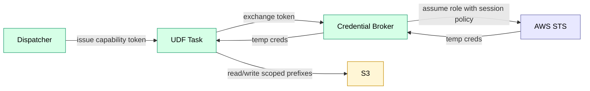

# Credential Broker

Service that exchanges a **task capability token** for short-lived AWS credentials.

## Purpose

Untrusted UDF tasks run with a near-zero-permission task role. When they need to read/write S3, they request scoped credentials from this broker instead of receiving broad IAM permissions.

The broker is a **policy enforcement point** for:
- Allowed input dataset prefixes (read)
- Allowed output prefix (write)
- Allowed scratch/export prefix (read/write)

## Component View



## API

```
POST /v1/task/credentials
X-Trace-Task-Capability: <capability_token>
Content-Type: application/json
```

Request:

```json
{
  "purpose": "s3_data",
  "want": {
    "read": ["s3://bucket/datasets/..."],
    "write": ["s3://bucket/datasets/..."],
    "scratch": ["s3://bucket/scratch/..." ]
  }
}
```

Response:

```json
{
  "access_key_id": "...",
  "secret_access_key": "...",
  "session_token": "...",
  "expires_at": "2025-12-31T12:00:00Z"
}
```

## Enforcement Model

- Capability tokens are signed by the Dispatcher and include `(org_id, task_id, attempt, expiry)` plus the allowed S3 prefixes.
- The broker validates the token signature + expiry and rejects stale `attempt` values.
- The broker calls STS `AssumeRole` (or `GetFederationToken`) with a **session policy** that restricts S3 access to the prefixes encoded in the token.
- Credentials are short-lived and may be refreshed.

## Operational Notes

- Deploy on ECS Fargate behind an internal ALB.
- Add strict rate limits per `org_id` and per `task_id`.
- Emit audit logs: `(org_id, task_id, attempt, prefixes, ttl)`.

## Related

- [security_model.md](../../standards/security_model.md) — least privilege, no direct Postgres for UDFs
- [udf.md](../../features/udf.md) — UDF runtime model
- [contracts.md](../contracts.md) — capability token contract
