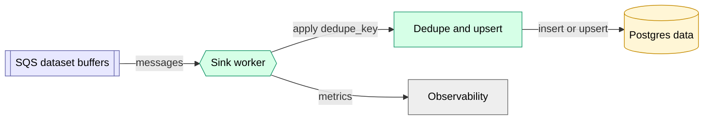

# Dataset Sinks

Dataset Sinks are trusted platform workers that consume buffered dataset records from SQS and write them into Postgres data.

This pattern is used when:

- many producers need to write to the same logical dataset, and/or
- direct Postgres writes from producers are undesirable (credential isolation), and/or
- we want queue-based backpressure and retry.

See ADR 0006 for the full design.

## Responsibilities

- Consume messages from dataset buffer queues (SQS).
- Enforce idempotency using stable `dedupe_key` and unique constraints.
- Write to the target Postgres dataset table(s).
- Emit sink health metrics (queue age, lag, error rate).

## Component View

