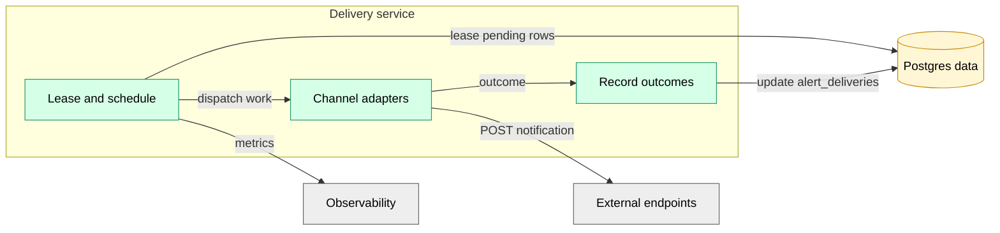

# Delivery Service

Platform service responsible for delivering alert notifications to external channels (webhooks, Slack, PagerDuty, etc.) and recording outcomes.

Delivery is intentionally centralized:

- **Operators/UDFs never perform external side effects.**
- Delivery Service is the only component with outbound internet egress for alerting.

See also: [alerting.md](../../specs/alerting.md) and [ADR 0004](../../adr/0004-alert-event-sinks.md).

## Responsibilities

- Lease pending rows from `alert_deliveries` (durable work queue).
- Send notifications to the configured channel.
- Update `alert_deliveries` with status, timestamps, and error details.
- Retry with backoff, using stable idempotency keys.

## Component View

## Data model

- `alert_deliveries` is the durable queue: one row per `(alert_event_id, channel)`.
- Retries update the same row (replace/upsert semantics).

## Delivery guarantees

- Internal execution is **at-least-once**.
- External sends may occur more than once in rare failure cases (timeouts, unknown outcomes).
- Delivery Service includes an **idempotency key** with outbound requests whenever supported by the destination.

## Webhook safety

Webhook URLs are user input. Delivery Service must treat them as untrusted and enforce SSRF defenses.

v1 policy:

- **POST-only** requests; `https://` URLs only.
- Reject redirects (do not follow `3xx` to a new host).
- Resolve DNS server-side and reject destinations that resolve to private/link-local/loopback/multicast ranges, the VPC CIDR, or cloud metadata IPs (e.g., `169.254.169.254`).
- Strip/deny unsafe headers (e.g., `Host`, `Connection`, `Proxy-*`) and cap total header size.
- Tight timeouts and response size limits; never log webhook headers/bodies that may contain secrets.
- Always include a stable idempotency key (`Idempotency-Key: <delivery_id>`), and include `delivery_id` in the payload for receiver-side dedupe.

This service is the only internet-egress component in the alerting path; it must audit outbound requests and attribute them to `(org_id, delivery_id)`.

## Related

- C4 overview: [../c4.md](../c4.md)
- Invariants: [../invariants.md](../invariants.md)
- Security model: [../security.md](../security.md)
- Operations: [../operations.md](../operations.md)
- Alerting spec: [alerting.md](../../specs/alerting.md)
