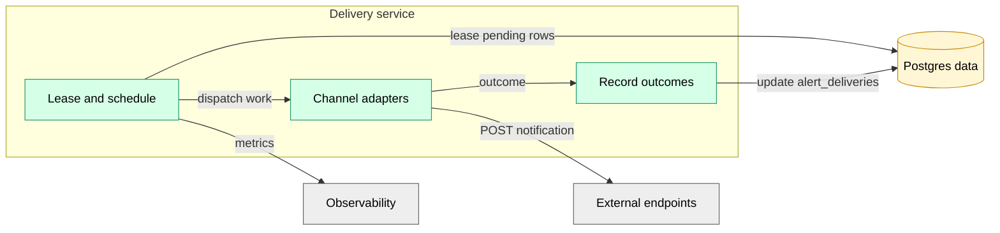

# Delivery Service

Platform service responsible for delivering alert notifications to external channels (webhooks, Slack, PagerDuty, etc.) and recording outcomes.

Delivery is intentionally centralized:

- **Operators/UDFs never perform external side effects.**
- Delivery Service is the only component with outbound internet egress for alerting.

See also: `docs/features/alerting.md` and ADR 0004.

## Responsibilities

- Lease pending rows from `alert_deliveries` (durable work queue).
- Send notifications to the configured channel.
- Update `alert_deliveries` with status, timestamps, and error details.
- Retry with backoff, using stable idempotency keys.

## Component View

## Data model

- `alert_deliveries` is the durable queue: one row per `(alert_event_id, channel)`.
- Retries update the same row (replace/upsert semantics).

## Delivery guarantees

- Internal execution is **at-least-once**.
- External sends may occur more than once in rare failure cases (timeouts, unknown outcomes).
- Delivery Service includes an **idempotency key** with outbound requests whenever supported by the destination.

## Webhook safety

Webhook URLs are user input. Delivery Service must treat them as untrusted and enforce SSRF defenses (HTTPS-only, block private/metadata ranges, reject redirects, tight timeouts, and request auditing). Webhooks are **POST-only in v1**.

The normative requirements for webhook validation live in `docs/features/alerting.md`.
