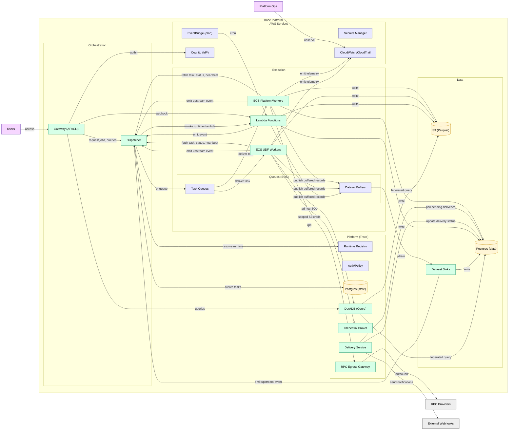
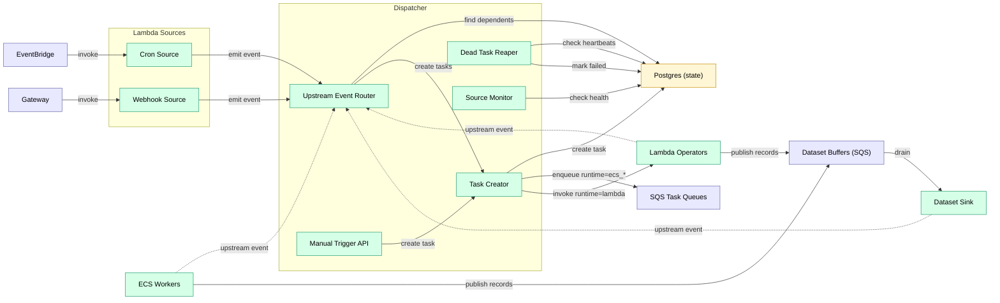

# Dispatcher

Central orchestration coordinator. Primary control-plane service.

> **Note on Postgres:** the docs use “Postgres” as a technology for two separate databases:
> - **Postgres (state)** — control-plane source of truth (jobs, tasks, versions, leases)
> - **Postgres (data)** — data-plane hot tables (alerts, hot chain tables, query results, etc.)
>
> They are deployed as **two separate instances/clusters** (e.g., two RDS databases), even if they share the same engine/version.

## Architecture Overview

Detailed view showing internal structure and data flows.



## Responsibilities

**Responsibilities:**
- Route all upstream events to dependent jobs
- Create tasks and enqueue to operator queues (SQS)
- Handle `runtime: dispatcher` jobs in-process (platform-only)
- Monitor source job health (ECS workers with `activation: source`, `source.kind: always_on`)
- Track in-flight jobs per operator (scaling control)
- Run reaper for dead tasks
- Publish queue depth metrics to CloudWatch
- Expose manual source API (emits events)

## Event Model

Every job emits events when it materializes outputs. At runtime, outputs are identified by a stable `dataset_uuid` plus a **generation** `dataset_version`.

Minimal cursor event:

```json
{"dataset_uuid": "uuid", "dataset_version": "uuid", "cursor": 12345}
```

Partition event (block-range example):

```json
{"dataset_uuid": "uuid", "dataset_version": "uuid", "partition_key": "1000000-1010000", "start": 1000000, "end": 1010000}
```

**Routing rule:** by default, the Dispatcher routes only events for the dataset's **current** `dataset_version` (older generations may be accepted for audit but are not routed).

Events are treated as **at-least-once** and may be duplicated or arrive out of order. Correctness comes from task leasing + idempotent outputs. See [task_lifecycle.md](../task_lifecycle.md).

## Event Routing

**Event routing:**
1. Worker emits event: `{dataset_uuid: "...", dataset_version: "...", cursor: 12345}`
2. Dispatcher queries: jobs whose input edges reference that `dataset_uuid`
3. For each dependent reactive job:
   - If `runtime: dispatcher` → Dispatcher handles directly
   - Else if `runtime: lambda` → create task, invoke Lambda
   - Else → create task, enqueue to SQS

## Backpressure

**Backpressure:**

Propagates upstream through DAG edges. When a queue trips its threshold (depth or age), Dispatcher pauses upstream producers recursively. When pressure clears (depth drops below threshold), Dispatcher unpauses and producers resume.

- Per-job thresholds: `max_queue_depth`, `max_queue_age`
- Mode: `pause` (stop task creation until queue drains)
- Priority tiers: `normal`, `backfill` — shed `backfill` first when under pressure

## Out of Scope

**Does NOT:**
- Execute compute tasks (that's workers)
- Pull from queues
- Evaluate cron schedules (that's EventBridge + Lambda)

## Failure Mode

Dispatcher is stateless — durable state lives in Postgres. On failure/restart:

- ECS restarts the service.
- In-flight workers may continue executing their current attempt.
- If a worker cannot heartbeat/report completion during the outage, it retries until the Dispatcher is reachable again.
- Queued tasks are not lost: the enqueue reconciler will republish SQS wake-ups after restart.

Because execution is **at-least-once**, a long outage may cause some duplicate work (e.g., leases expire and tasks are retried). Output commits and routing are designed to be idempotent.

## SQS Queues

Task dispatch mechanism for ECS workers.

**Model:**
- SQS carries a pointer (`task_id`) as a wake-up.
- Workers must **claim** the task from the Dispatcher to acquire a lease before executing.
- Duplicates are expected; leasing prevents concurrent execution.

**Why SQS (wake-up) + Postgres (source of truth):**
- Efficient long-polling and ECS autoscaling integration.
- Durable task state and retries live in Postgres, so lost/duplicated messages do not lose work.

**Configuration:**
- Standard queue (FIFO is not required for correctness).
- Visibility timeout: minutes (base), with worker-side visibility extension for long tasks.
- DLQ for poison messages / repeated receive failures.

See [task_lifecycle.md](../task_lifecycle.md) for leasing, visibility extension, and rehydration loops.

## Component View



## Runtime Registry (Extensible)

Runtimes are identifiers used by the Dispatcher to select a worker image and queue.
They are modeled as strings (not a fixed enum) to allow future additions.

**Registry responsibilities:**
- Map `runtime` → worker image and SQS queue.
- Declare capabilities (e.g., supports long-running tasks, source jobs, GPU, etc.).
- Define default resource limits and heartbeat expectations.

**Adding a new runtime:**
1. Build a worker image (e.g., `ecs_r` for R).
2. Register it in the Dispatcher config with queue + capabilities.
3. Use `runtime: ecs_r` in job YAML.

## Related

- [contracts.md](../contracts.md) — task, event, and API schemas
- [orchestration.md](../data_model/orchestration.md) — job/task schemas
- [event_flow.md](../event_flow.md) — end-to-end sequence diagram
- [security_model.md](../../standards/security_model.md) — isolation model

