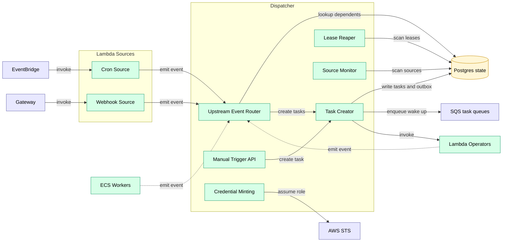

# Dispatcher

Central orchestration coordinator. Primary control-plane service.

> **Note on Postgres:** the docs use “Postgres” as a technology for two separate databases:
> - **Postgres state** - control-plane source of truth (jobs, tasks, versions, leases)
> - **Postgres data** - data-plane hot tables (alerts, hot chain tables, query results, etc.)
>
> They are deployed as **two separate instances/clusters** (e.g., two RDS databases), even if they share the same engine/version.

## Doc ownership

This doc covers Dispatcher responsibilities and internal components.

Canonical owners for shared semantics:
- System-level container relationships: [c4.md](../c4.md)
- Task lifecycle (leasing, retries, outbox, rehydration): [task_lifecycle.md](../task_lifecycle.md)
- Task-scoped and worker-only contracts (tokens and endpoint payloads): [contracts.md](../contracts.md)
- Security invariants: [security.md](../security.md)
- DAG config surface (including reserved fields): [dag_configuration.md](../../specs/dag_configuration.md)

## Responsibilities

- Route all upstream events to dependent jobs
- Create tasks and enqueue to operator queues (outbox → SQS)
- Handle `runtime: dispatcher` jobs in-process (platform-only)
- Monitor source job health (ECS workers with `activation: source`, `source.kind: always_on`)
- Track in-flight jobs per operator (scaling control)
- Run reaper for dead tasks
- Publish queue depth metrics to CloudWatch
- Expose manual source API (emits events)
- Issue per-attempt task capability tokens and expose an internal task JWKS for verifiers (see [task_capability_tokens.md](../contracts/task_capability_tokens.md))
- Mint scoped object-store credentials from task capability tokens (see [credential_minting.md](../contracts/credential_minting.md))

## Event Model

Every job emits events when it materializes outputs. At runtime, outputs are identified by a stable `dataset_uuid` plus a **generation** `dataset_version`.

Minimal cursor event:

```json
{"dataset_uuid": "uuid", "dataset_version": "uuid", "cursor": 12345}
```

Partition event (block-range example):

```json
{"dataset_uuid": "uuid", "dataset_version": "uuid", "partition_key": "1000000-1010000", "start": 1000000, "end": 1010000}
```

**Routing rule:** by default, the Dispatcher routes only events for the dataset's **current** `dataset_version` (older generations may be accepted for audit but are not routed).

Events are treated as **at-least-once** and may be duplicated or arrive out of order. Correctness comes from task leasing + idempotent outputs.

## Event Routing

**Event routing:**
1. Worker emits event: `{dataset_uuid: "...", dataset_version: "...", cursor: 12345}`
2. Dispatcher queries: jobs whose input edges reference that `dataset_uuid`
3. For each dependent reactive job:
   - If `runtime: dispatcher` → Dispatcher handles directly
   - Else if `runtime: lambda` → create task, invoke Lambda
   - Else → create task, enqueue to SQS

## Backpressure

**Backpressure:**

Propagates upstream through DAG edges. When a queue trips its threshold (depth or age), Dispatcher pauses upstream producers recursively. When pressure clears (depth drops below threshold), Dispatcher unpauses and producers resume.

- **v1:** Backpressure is global and operational (protect the system), not per-job configurable.
- Per-job backpressure knobs are **reserved** and MUST be rejected in v1: `max_queue_depth`, `max_queue_age`, `backpressure_mode`.
  See [dag_configuration.md](../../specs/dag_configuration.md) ("Reserved fields").
- Priority/tiers (e.g., shedding bulk bootstrap work first) is a future optimization and is not required for v1 correctness.

## Out of Scope

**Does NOT:**
- Execute compute tasks (that's workers)
- Pull from queues
- Evaluate cron schedules (that's EventBridge + Lambda)

## Failure mode

Dispatcher is stateless. Durable state lives in Postgres state.

Leasing, retries, outbox draining, and rehydration semantics are specified in [task_lifecycle.md](../task_lifecycle.md).


## Component View




## Runtime Registry

`runtime` is a string used by the Dispatcher to decide how to execute a job (in-process, Lambda, or ECS queue).
The mapping from `runtime` to worker image, queue, and resource defaults is configured in the Dispatcher.

## Related

- C4 overview: [../c4.md](../c4.md)
- Invariants: [../invariants.md](../invariants.md)
- Security model: [../security.md](../security.md)
- Operations: [../operations.md](../operations.md)
- Task lifecycle: [../task_lifecycle.md](../task_lifecycle.md)
