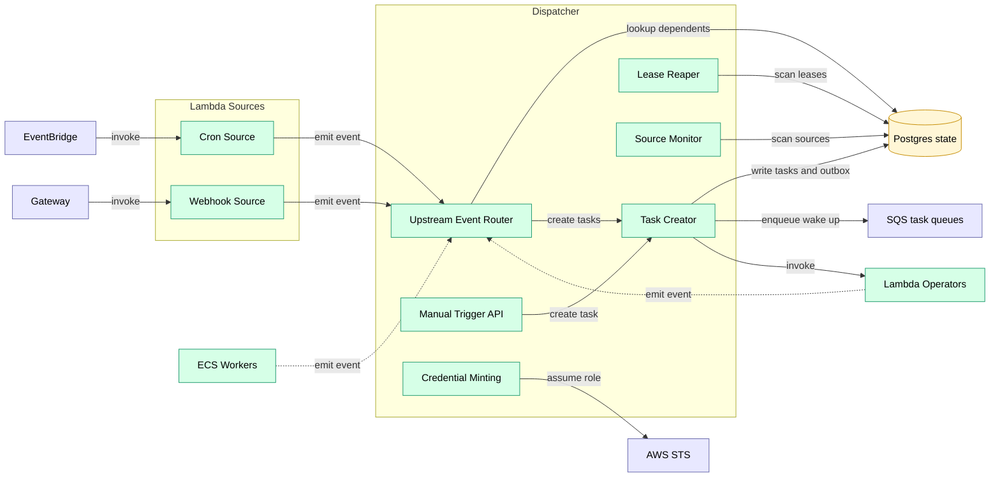

# Dispatcher

Central orchestration coordinator. Primary control-plane service.

> **Note on Postgres:** the docs use “Postgres” as a technology for two separate databases:
> - **Postgres state** — control-plane source of truth (jobs, tasks, versions, leases)
> - **Postgres data** — data-plane hot tables (alerts, hot chain tables, query results, etc.)
>
> They are deployed as **two separate instances/clusters** (e.g., two RDS databases), even if they share the same engine/version.

## Architecture Overview

System-level container relationships are documented in [c4.md](../c4.md).

This document focuses on Dispatcher responsibilities and internal components.

## Responsibilities

**Responsibilities:**
- Route all upstream events to dependent jobs
- Create tasks and enqueue to operator queues (outbox → SQS)
- Handle `runtime: dispatcher` jobs in-process (platform-only)
- Monitor source job health (ECS workers with `activation: source`, `source.kind: always_on`)
- Track in-flight jobs per operator (scaling control)
- Run reaper for dead tasks
- Publish queue depth metrics to CloudWatch
- Expose manual source API (emits events)

## Event Model

Every job emits events when it materializes outputs. At runtime, outputs are identified by a stable `dataset_uuid` plus a **generation** `dataset_version`.

Minimal cursor event:

```json
{"dataset_uuid": "uuid", "dataset_version": "uuid", "cursor": 12345}
```

Partition event (block-range example):

```json
{"dataset_uuid": "uuid", "dataset_version": "uuid", "partition_key": "1000000-1010000", "start": 1000000, "end": 1010000}
```

**Routing rule:** by default, the Dispatcher routes only events for the dataset's **current** `dataset_version` (older generations may be accepted for audit but are not routed).

Events are treated as **at-least-once** and may be duplicated or arrive out of order. Correctness comes from task leasing + idempotent outputs.

## Event Routing

**Event routing:**
1. Worker emits event: `{dataset_uuid: "...", dataset_version: "...", cursor: 12345}`
2. Dispatcher queries: jobs whose input edges reference that `dataset_uuid`
3. For each dependent reactive job:
   - If `runtime: dispatcher` → Dispatcher handles directly
   - Else if `runtime: lambda` → create task, invoke Lambda
   - Else → create task, enqueue to SQS

## Backpressure

**Backpressure:**

Propagates upstream through DAG edges. When a queue trips its threshold (depth or age), Dispatcher pauses upstream producers recursively. When pressure clears (depth drops below threshold), Dispatcher unpauses and producers resume.

- Per-job thresholds: `max_queue_depth`, `max_queue_age`
- Mode: `pause` (stop task creation until queue drains)
- Priority tiers: `normal`, `bulk` — shed `bulk` first when under pressure (bulk = bootstrap/catch-up workloads)

## Task capability token issuance

Dispatcher issues a per-attempt **task capability token** (JWT) for untrusted execution. This token is used for:

- Task-scoped lifecycle endpoints (`/v1/task/heartbeat`, `/v1/task/complete`, `/v1/task/events`, `/v1/task/buffer-publish`)
- Task-scoped Query Service access (`/v1/task/query`)
- Credential minting (`/v1/task/credentials`)

**Recommended v1 signing:**
- JWT algorithm: ES256
- AWS profile: sign with an AWS KMS asymmetric key (`ECC_NIST_P256`)
- Lite profile: sign with a local PEM keypair

Dispatcher exposes an internal-only JWKS document so other services can verify tokens:

```
GET /internal/jwks/task
```

Verifiers (Query Service, sinks) should cache this JWKS and refresh on `kid` miss. Key rotation keeps old keys until all outstanding tokens have expired.

## Credential minting

To keep UDF tasks near-zero-permission, the Dispatcher includes a **credential minting** component.
It exchanges a **task capability token** for short-lived AWS credentials scoped to the task’s allowed S3 prefixes.

This is the v1 replacement for a separate “Credential Broker” service.

### API

```
POST /v1/task/credentials
X-Trace-Task-Capability: <capability_token>
```

> This endpoint is **internal-only**: it is reachable only from within the VPC (workers/Lambdas) and must not be routed through the public Gateway.

- The capability token is issued per `(task_id, attempt)` and defines allowed input/output/scratch prefixes.
- Dispatcher calls `sts:AssumeRole` with a session policy derived from the token.
- Returned credentials are short-lived and allow only S3 access within the encoded prefixes.


### Scope derivation and canonicalization (required)

Credential minting is a privilege boundary. The Dispatcher MUST derive the STS session policy from the
capability token using **deny-by-default** rules.

Rules (v1):
- The token MUST encode allowed prefixes as canonical `s3://bucket/prefix/` strings.
- Prefixes MUST be normalized before policy generation:
  - scheme must be `s3`,
  - bucket must be non-empty,
  - prefix must be non-empty and must not contain `..`,
  - wildcards (`*`, `?`) are forbidden,
  - prefix must be treated as a directory prefix (effectively `prefix/*`), never as a “starts-with anything” pattern.
- The resulting session policy MUST grant only the minimum required S3 actions within those prefixes.
  - Prefer object-level access (`GetObject`/`PutObject`) over bucket-level actions.
  - If `ListBucket` is required, constrain it with an `s3:prefix` condition to the allowed prefixes only.

Defense-in-depth (recommended):
- Enforce the same prefix constraints at the bucket policy layer so that even a buggy session policy cannot
  read/write outside allowed prefixes.

Example (illustrative) session policy shape:

```json
{
  "Version": "2012-10-17",
  "Statement": [
    {
      "Effect": "Allow",
      "Action": ["s3:GetObject"],
      "Resource": ["arn:aws:s3:::<bucket>/<read_prefix>*"]
    },
    {
      "Effect": "Allow",
      "Action": ["s3:PutObject"],
      "Resource": ["arn:aws:s3:::<bucket>/<write_prefix>*"]
    },
    {
      "Effect": "Allow",
      "Action": ["s3:ListBucket"],
      "Resource": ["arn:aws:s3:::<bucket>"],
      "Condition": {"StringLike": {"s3:prefix": ["<read_prefix>*", "<write_prefix>*"]}}
    }
  ]
}
```

Verification (required):
- Unit tests for prefix normalization/canonicalization.
- Negative tests: `..`, empty prefixes, wildcard widening, wrong bucket.
- (AWS profile) Integration test that minted credentials cannot read/write outside scope.


**Networking:** Dispatcher must be able to reach AWS STS (prefer an STS VPC endpoint).

## Out of Scope

**Does NOT:**
- Execute compute tasks (that's workers)
- Pull from queues
- Evaluate cron schedules (that's EventBridge + Lambda)

## Failure Mode

Dispatcher is stateless — durable state lives in Postgres state. On failure/restart:

- ECS restarts the service.
- In-flight workers may continue executing their current attempt.
- If a worker cannot heartbeat/report completion during the outage, it retries until the Dispatcher is reachable again.
- Queued tasks are not lost: enqueue intents are persisted via the Postgres state outbox and published after restart.

Because execution is **at-least-once**, a long outage may cause some duplicate work (e.g., leases expire and tasks are retried). Output commits and routing are designed to be idempotent.


## Component View




## Runtime Registry

`runtime` is a string used by the Dispatcher to decide how to execute a job (in-process, Lambda, or ECS queue).
The mapping from `runtime` to worker image, queue, and resource defaults is configured in the Dispatcher.


