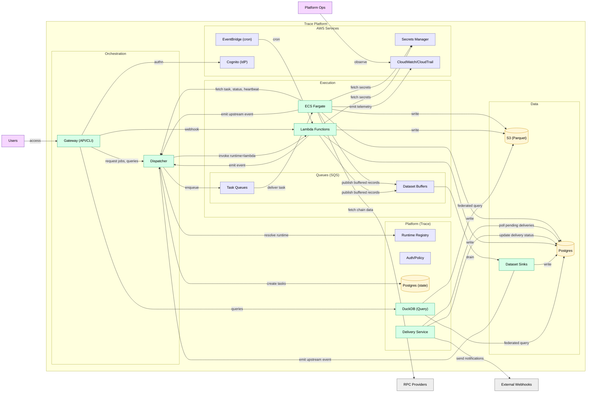
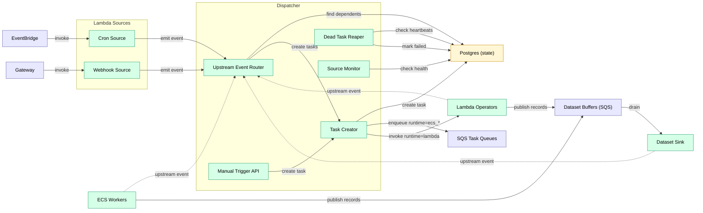

# Dispatcher

Central orchestration coordinator. The only platform service.

## Architecture Overview

Detailed view showing internal structure and data flows.



## Responsibilities

**Responsibilities:**
- Route all upstream events to dependent jobs
- Create tasks and enqueue to operator queues (SQS)
- Handle `runtime: dispatcher` jobs in-process (platform-only)
- Monitor source job health (ECS workers with `activation: source`, `source.kind: always_on`)
- Track in-flight jobs per operator (scaling control)
- Run reaper for dead tasks
- Publish queue depth metrics to CloudWatch
- Expose manual source API (emits events)

## Event Model

**Event model:**

Every job emits **one event per output** when it materializes data. At runtime, outputs are identified by `dataset_uuid` (a system UUID). User-facing `dataset_name` is resolved via the dataset registry for publishing/querying.

```json
{"dataset_uuid": "uuid", "cursor": 12345}
```

Events can also include partition or row-range context when relevant:

```json
{"dataset_uuid": "uuid", "partition_key": "1000000-1010000"}
```

The Dispatcher routes based on the upstream output identity (`dataset_uuid`). Reactive jobs that list the output as an input edge receive the event.

## Event Routing

**Event routing:**
1. Worker emits event: `{dataset_uuid: "...", cursor: 12345}`
2. Dispatcher queries: jobs whose input edges reference that `dataset_uuid`
3. For each dependent reactive job:
   - If `runtime: dispatcher` → Dispatcher handles directly
   - Else if `runtime: lambda` → create task, invoke Lambda
   - Else → create task, enqueue to SQS

## Backpressure

**Backpressure:**

Propagates upstream through DAG edges. When a queue trips its threshold (depth or age), Dispatcher pauses upstream producers recursively. When pressure clears (depth drops below threshold), Dispatcher unpauses and producers resume.

- Per-job thresholds: `max_queue_depth`, `max_queue_age`
- Mode: `pause` (stop task creation until queue drains)
- Priority tiers: `normal`, `backfill` — shed `backfill` first when under pressure

## Out of Scope

**Does NOT:**
- Execute compute tasks (that's workers)
- Pull from queues
- Evaluate cron schedules (that's EventBridge + Lambda)

## Failure Mode

**Failure mode:**

Dispatcher is stateless — all state lives in Postgres. On failure:
- ECS auto-restarts the service (RTO: ~1 minute)
- Workers continue executing in-flight tasks from SQS
- Source jobs (e.g., `block_follower`) continue running and writing data
- Event routing pauses, but no events are lost — downstream jobs use cursor-based catch-up on restart
- No data loss, only delayed processing

## SQS Queues

Task dispatch mechanism for ECS workers.

**Why SQS over Postgres-as-queue:**
- Efficient long-polling (workers block on SQS, not busy-loop on Postgres)
- Native ECS autoscaling integration
- Built-in visibility timeout
- Workers stay dumb — no orchestration logic

**Configuration:**
- FIFO queue with deduplication
- Visibility timeout: 5 minutes (configurable per job)
- Dead letter queue after 3 failed receives

## Component View



## Runtime Registry (Extensible)

Runtimes are identifiers used by the Dispatcher to select a worker image and queue.
They are modeled as strings (not a fixed enum) to allow future additions.

**Registry responsibilities:**
- Map `runtime` → worker image and SQS queue.
- Declare capabilities (e.g., supports long-running tasks, source jobs, GPU, etc.).
- Define default resource limits and heartbeat expectations.

**Adding a new runtime:**
1. Build a worker image (e.g., `ecs_r` for R).
2. Register it in the Dispatcher config with queue + capabilities.
3. Use `runtime: ecs_r` in job YAML.

## Related

- [contracts.md](../contracts.md) — task, event, and API schemas
- [orchestration.md](../data_model/orchestration.md) — job/task schemas
- [event_flow.md](../event_flow.md) — end-to-end sequence diagram
- [security_model.md](../../standards/security_model.md) — isolation model

