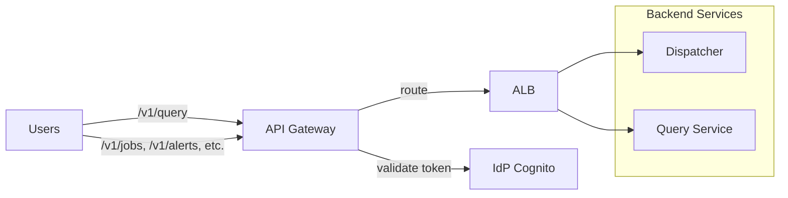

# Gateway

Entry point for all external API traffic. Routes requests to backend services.

## Overview

| Property | Value |
|----------|-------|
| **Type** | API Gateway + internal ALB |
| **Deployment** | API Gateway (JWT) with VPC Link to internal ALB |
| **Auth** | Bearer token (JWT from IdP) |

## Architecture

## Endpoints

| Path | Backend | Purpose |
|------|---------|---------|
| `POST /v1/query` | Query Service | Interactive SQL queries |
| `GET /v1/jobs/*` | Dispatcher | Job status, list |
| `POST /v1/emit` | Dispatcher | Manual event emission |
| `POST /v1/backfill` | Dispatcher | Trigger backfill |
| `GET /v1/tasks/*` | Dispatcher | Task status |
| `GET,POST,PUT,DELETE /v1/alerts/*` | Dispatcher | Alert CRUD |
| `GET,POST,PUT,DELETE /v1/labels/*` | Dispatcher | Address label CRUD |
| `GET,POST,PUT,DELETE /v1/queries/*` | Dispatcher | Saved query CRUD |
| `POST /v1/dags` | Dispatcher | DAG deployment |

## Authentication

All requests require `Authorization: Bearer <token>`.

1. API Gateway validates JWT signature against IdP JWKS
2. Extracts claims: `sub`, `org_id`, `email`, `role`
3. Passes claims to backend via headers:
   - `X-Org-Id`: org UUID
   - `X-User-Id`: user UUID (resolved from `sub`)
   - `X-User-Role`: platform role (reader/writer/admin)
4. Backend services trust these headers **only** because the ALB is internal and reachable only via API Gateway VPC Link (security groups deny all other ingress).

> **Hard requirement:** do not expose the ALB to the public internet. If the ALB must be internet-facing, backend services must validate JWTs themselves and treat forwarded identity headers as untrusted hints.

## Rate Limiting

| Scope | Limit | Window |
|-------|-------|--------|
| Per-org | 1000 req | 1 minute |
| Per-user | 100 req | 1 minute |
| Query endpoint | 10 req | 1 minute |

Enforced at API Gateway layer. Returns `429 Too Many Requests` when exceeded.

## CORS

Allowed origins configured per environment. Default: same-origin only.

## Related

- [query_service.md](query_service.md) — query endpoint details
- [contracts.md](../contracts.md) — dispatcher API contracts
- [security_model.md](../../standards/security_model.md) — auth model
