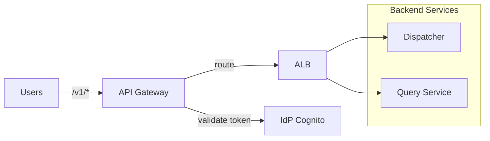

# Gateway

Entry point for all external API traffic. Routes requests to backend services.

## Overview

| Property | Value |
|----------|-------|
| **Type** | API Gateway + internal ALB |
| **Deployment** | API Gateway (JWT) with VPC Link to internal ALB |
| **Auth** | Bearer token (JWT from IdP) |

## Architecture

## Routing

- The Gateway routes **user** endpoints under `/v1/*` to backend services (Dispatcher and Query Service).
- The Gateway MUST NOT expose task-scoped worker endpoints (`/v1/task/*`) or any `/internal/*` endpoints.

> **Hard requirement:** the ALB must be internal-only (private subnets; no public listener). API Gateway reaches the ALB via VPC Link.

## Authentication

All user requests require `Authorization: Bearer <jwt>`.

- API Gateway validates the JWT signature/expiry against the IdP JWKS and applies edge controls (rate limiting, request validation).
- API Gateway forwards the request to the internal ALB and preserves the `Authorization` header.
- Backend services MUST validate the JWT again.

**Claim mapping (canonical):**
- Treat the IdP JWT as **authentication** only.
- Use `sub` (and `iss`/`aud`) to look up the user in Postgres state.
- Derive the effective role/permissions from Postgres state.

**v1 tenancy:** Trace v1 deploys as a single-org instance. Requests do not select an org.

## Rate Limiting

Rate limiting is enforced at the API Gateway layer. Default limits and recommended starting values live in `docs/standards/operations.md`.

## CORS

Allowed origins configured per environment. Default: same-origin only.

## Related

- `docs/standards/security_model.md` — canonical auth model and trust boundaries
- `docs/architecture/contracts.md` — worker/task contracts (internal-only)
- `docs/architecture/containers/query_service.md` — query endpoint behavior
