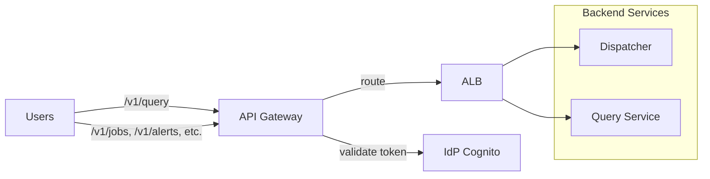

# Gateway

Entry point for all external API traffic. Routes requests to backend services.

## Overview

| Property | Value |
|----------|-------|
| **Type** | API Gateway + internal ALB |
| **Deployment** | API Gateway (JWT) with VPC Link to internal ALB |
| **Auth** | Bearer token (JWT from IdP) |

## Architecture

## Endpoints

| Path | Backend | Purpose |
|------|---------|---------|
| `POST /v1/query` | Query Service | Interactive SQL queries |
| `GET /v1/jobs/*` | Dispatcher | Job status, list |
| `POST /v1/emit` | Dispatcher | Manual event emission |
| `POST /v1/backfill` | Dispatcher | Trigger backfill |
| `GET /v1/tasks/*` | Dispatcher | Task status |
| `GET,POST,PUT,DELETE /v1/alerts/*` | Dispatcher | Alert CRUD |
| `GET,POST,PUT,DELETE /v1/labels/*` | Dispatcher | Address label CRUD |
| `GET,POST,PUT,DELETE /v1/queries/*` | Dispatcher | Saved query CRUD |
| `POST /v1/dags` | Dispatcher | DAG deployment |

## Authentication

All requests require `Authorization: Bearer <token>`.

- API Gateway validates the JWT signature/expiry against the IdP JWKS and applies edge controls (rate limiting, request validation).
- API Gateway forwards the request to the internal ALB and preserves the `Authorization` header.
- Backend services **must validate the user JWT themselves** and derive `org_id`, `user_id`, and `role` from the JWT claims.

> **Hard requirement:** the ALB must be internal-only (private subnets; no public listener).
>
> **Not exposed:** task-scoped endpoints under `/v1/task/*` are **internal-only** (workers/Lambdas) and must not be routed through the public Gateway. They use a task capability token (see `security_model.md` and `contracts.md`).
## Rate Limiting

| Scope | Limit | Window |
|-------|-------|--------|
| Per-org | 1000 req | 1 minute |
| Per-user | 100 req | 1 minute |
| Query endpoint | 10 req | 1 minute |

Enforced at API Gateway layer. Returns `429 Too Many Requests` when exceeded.

## CORS

Allowed origins configured per environment. Default: same-origin only.

## Related

- [query_service.md](query_service.md) — query endpoint details
- [contracts.md](../contracts.md) — dispatcher API contracts
- [security_model.md](../../standards/security_model.md) — auth model
