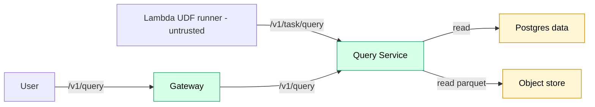

# Query Service

Stateless service that executes validated, read-only SQL against authorized hot and cold storage.

## Overview

| Property | Value |
|----------|-------|
| **Type** | Platform service |
| **Runtime** | Rust + embedded DuckDB |
| **Deployment** | ECS Fargate behind an internal ALB |

## Doc ownership

This doc is intentionally link-first. API semantics and data model details live elsewhere:

- API semantics:
  - User query endpoint: [query_service_user_query.md](../../specs/query_service_user_query.md)
  - Task query endpoint: [query_service_task_query.md](../../specs/query_service_task_query.md)
- Query results and exports: [query_service_query_results.md](../../specs/query_service_query_results.md)
- SQL gate: [query_sql_gating.md](../../specs/query_sql_gating.md)
- Capability token rules: [task_capability_tokens.md](../contracts/task_capability_tokens.md)
- Operations defaults: [operations.md](../operations.md)
- Security invariants: [security.md](../security.md)
- Data model: [data_model/query_service.md](../data_model/query_service.md)
- PII audit rules: [data_model/pii.md](../data_model/pii.md)
- Query results decision: [ADR 0005](../../adr/0005-query-results.md)

## Architecture

## Responsibilities and invariants

- Authenticate and authorize the caller:
  - `/v1/query` uses a user Bearer JWT.
  - `/v1/task/query` uses a task capability token.
- Enforce read-only, fail-closed SQL execution:
  - Always gate with `trace-core::query::validate_sql`.
  - Apply DuckDB runtime hardening as defense-in-depth.
- Attach datasets in trusted code only:
  - Expose authorized datasets as stable relations (for example `dataset`).
  - Execute untrusted SQL only against attached relations.
- Enforce data access boundaries:
  - No arbitrary filesystem access from untrusted SQL.
  - When remote Parquet scans are supported, restrict egress to the configured object store endpoints.
- Emit audit records without storing raw SQL and follow PII audit rules.

## Interfaces

- `POST /v1/query` - user-scoped interactive query: [query_service_user_query.md](../../specs/query_service_user_query.md)
- `POST /v1/task/query` - task-scoped query: [query_service_task_query.md](../../specs/query_service_task_query.md)

## Query capabilities

Query Service supports a constrained SQL surface and is designed to fail closed. The canonical allow and deny rules live in [query_sql_gating.md](../../specs/query_sql_gating.md).

## Query results

Query executions that produce persisted results use the platform-managed `query_results` table. See [ADR 0005](../../adr/0005-query-results.md) and [Query Service data model](../data_model/query_service.md).

## Related

- C4 overview: [../c4.md](../c4.md)
- Invariants: [../invariants.md](../invariants.md)
- Security model: [../security.md](../security.md)
- Operations: [../operations.md](../operations.md)
