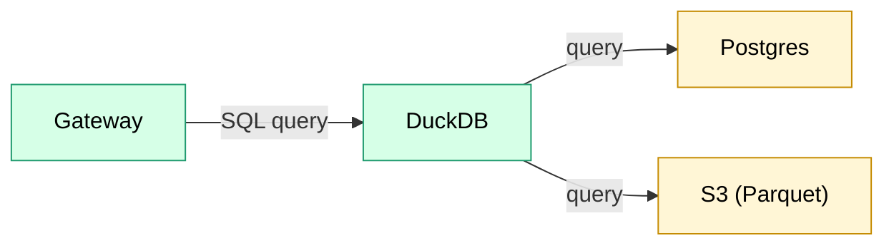

# Query Service

Stateless service for interactive and batch SQL queries across hot and cold storage.

## Overview

| Property | Value |
|----------|-------|
| **Type** | Platform service (not a job) |
| **Runtime** | Rust + embedded DuckDB |
| **Deployment** | ECS Fargate, behind ALB |

## Component View



## Description

Accepts SQL queries via REST API and executes against federated hot (Postgres) and cold
(S3 Parquet) storage using embedded DuckDB. Designed for interactive, ad-hoc exploration,
with a batch mode that enqueues a `query` job when limits are exceeded.

## Endpoint

```
POST /v1/query
Authorization: Bearer <token>
Content-Type: application/json
```

### Request

```json
{
  "sql": "SELECT * FROM transactions WHERE block_number > 1000000 LIMIT 100",
  "mode": "interactive",
  "format": "json",
  "timeout_seconds": 30
}
```

| Field | Type | Default | Description |
|-------|------|---------|-------------|
| `sql` | string | required | SQL query (SELECT only) |
| `mode` | string | `interactive` | `interactive` or `batch` |
| `format` | string | `json` | Response format: `json`, `csv`, `parquet` |
| `timeout_seconds` | int | 30 | Max execution time (capped at 30s) |

### Response (interactive, inline result)

For results ≤ 10,000 rows:

```json
{
  "query_id": "uuid",
  "columns": [
    {"name": "hash", "type": "varchar"},
    {"name": "block_number", "type": "bigint"},
    {"name": "value", "type": "hugeint"}
  ],
  "rows": [
    ["0xabc...", 1000001, "1000000000000000000"],
    ["0xdef...", 1000002, "2500000000000000000"]
  ],
  "row_count": 2,
  "truncated": false,
  "duration_ms": 245
}
```

### Response (interactive, large result)

For results > 10,000 rows, written to S3 and returned as presigned URL:

```json
{
  "query_id": "uuid",
  "output_path": "s3://bucket/results/{org_id}/{query_id}/",
  "result_url": "https://s3.../results/{org_id}/{query_id}/result.parquet?X-Amz-...",
  "format": "parquet",
  "row_count": 150000,
  "bytes": 12345678,
  "expires_at": "2025-12-27T12:00:00Z",
  "duration_ms": 8420
}
```

### Response (batch)

Returned when `mode: batch` is requested or when interactive limits are exceeded:

```json
{
  "mode": "batch",
  "query_id": "uuid",
  "task_id": "uuid",
  "reason": "query exceeds interactive limits",
  "output_path": "s3://bucket/results/{org_id}/{query_id}/"
}
```

### Error Response

```json
{
  "error": "Query timeout exceeded",
  "code": "QUERY_TIMEOUT",
  "detail": "Query did not complete within 30 seconds. Consider narrowing your query or using batch mode."
}
```

## Interactive Constraints

| Constraint | Value | Rationale |
|------------|-------|-----------|
| Statement type | SELECT only | Read-only access enforced |
| Timeout | 30 seconds max | Prevent resource hogging |
| Inline result limit | 10,000 rows | Larger results → S3 |
| Result expiry | 1 hour | Presigned URLs for large results |

## Read-Only Enforcement

DuckDB is opened with `AccessMode::ReadOnly`. Any DDL or DML statements fail at the DuckDB layer.

## Org Isolation

- Bearer token resolved to `org_id` via IdP / auth service
- Query Service attaches **per-org dataset views** and enforces dataset visibility (e.g., via `datasets.read_roles`)
- For Postgres-backed datasets, views filter underlying tables by `org_id`
- User cannot query other orgs' data

Dataset registry ACLs (`datasets.read_roles`) are the shared visibility enforcement point across the platform (Query Service reads and DAG-to-dag reads that reference a published dataset by name).

## Data Sources

Query Service exposes **published** datasets from the dataset registry (see [ADR 0008](../adr/0008-dataset-registry-and-publishing.md)). Internal unpublished edges are not directly queryable.

| Source | Attachment | Access |
|--------|------------|--------|
| Hot storage | Postgres via `postgres_scanner` | Read-only user |
| Cold storage | S3 Parquet via `httpfs` / `parquet_scan` | IAM role with S3 read |

Virtual tables (e.g., `transactions`) unify hot and cold transparently.

## Dataset Resolution

Users query using `dataset_name` (human-readable). Physical storage uses UUIDs and versioned locations; Query Service resolves names to concrete locations “under the hood”.

At query start, Query Service resolves and pins:

1. `dataset_name -> dataset_uuid` (registry)
2. `dataset_uuid -> current dataset_version` (producer DAG’s current `dag_version` pointer set)
3. `(dataset_uuid, dataset_version) -> storage_location` (version-addressed location)

Concretely (v1 model):

- Lookup `datasets` by `(org_id, dataset_name)` to get `dataset_uuid`, storage backend config, and `producer_dag_name`.
- Lookup producer DAG’s current `dag_version_id` in `dag_current_versions` by `(org_id, producer_dag_name)`.
- Lookup `dataset_version` in `dag_version_datasets` by `(dag_version_id, dataset_uuid)`.
- Lookup `storage_location` in `dataset_versions` by `(dataset_uuid, dataset_version)`.
- Attach a DuckDB view named `dataset_name` that points at that pinned `storage_location` (Postgres table/view or S3 prefix/manifest).

For Postgres-backed datasets, `storage_location` points at a UUID-based physical table/view (implementation detail). Query Service keeps user SQL ergonomic by always exposing a stable view named `dataset_name` that resolves to the pinned physical location at query start.

Pinning means no “moving target” mid-query:
- Postgres reads run inside a single transaction snapshot (e.g., `REPEATABLE READ`).
- S3/Parquet reads use a fixed manifest/file list resolved at query start.

For deploy/rematerialize cutover/rollback semantics, see [ADR 0009](../adr/0009-atomic-cutover-and-query-pinning.md).

## Authentication

1. Client sends `Authorization: Bearer <token>`
2. Service validates token with IdP (Cognito/SSO)
3. Extracts `org_id`, `user_id`, `role` from claims
4. Rejects if token invalid or expired

## Dependencies

- **IdP** — token validation
- **Postgres** — hot storage (read-only user)
- **S3** — cold storage reads, result writes
- **DuckDB extensions** — `postgres_scanner`, `httpfs`

## Observability

| Metric | Description |
|--------|-------------|
| `query_duration_ms` | Execution time histogram |
| `query_count` | Queries per org/user |
| `query_errors` | Failures by error code |
| `query_result_rows` | Rows returned histogram |
| `query_result_bytes` | Bytes written to S3 |

## Admission & Limits

> **v1 is single-tenant.** Limits protect the service from runaway queries, not tenants from each other. Per-org quotas and stricter isolation deferred to multi-tenant.

- Concurrency cap: small fixed pool (e.g., 3-5 interactive queries). Beyond cap, requests queue briefly; if queue exceeds depth/age, force `mode: batch`.
- Memory cap with spill: DuckDB spill-to-disk enabled; log spill events.
- Timeouts: existing 30s interactive limit applies; long-running jobs go to batch.
- Metrics: emit queue depth, queue age p95, spill count, OOM/circuit trips, forced-batch count.

Logs include: query hash (not full SQL for PII), org_id, user_id, duration, row_count, error (if any).

## Batch Mode

Batch mode creates a `query` task using the same operator as the interactive path and records a `query_results` row.
Results are written to S3; clients poll task status or fetch `query_results` by `query_id`.

## Query Capabilities

| Feature | Support |
|---------|---------|
| Federated joins (hot + cold) | ✅ |
| Aggregations | ✅ |
| Window functions | ✅ |
| Parquet pushdown | ✅ |
| Postgres pushdown | ✅ |
| Export formats (JSON, CSV, Parquet) | ✅ |

## Saved Queries

Users can save queries for reuse.

PII column: `saved_queries.query` (user-provided). Mark it as PII in dataset metadata; see [pii.md](../data_model/pii.md) for visibility and audit rules.

## Query Results

Query executions (interactive and batch) are recorded in a platform-managed table. See [ADR 0005](../adr/0005-query-results.md).

`query_id` in API responses is `query_results.id`.

## Deferred

See [backlog](../../plan/backlog.md#query-service) for discovery and rate limiting.
