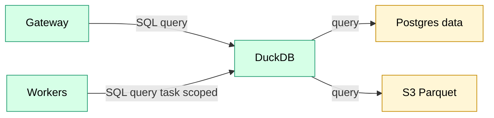

# Query Service

Stateless service for interactive and batch SQL queries across hot and cold storage.

## Overview

| Property | Value |
|----------|-------|
| **Type** | Platform service (not a job) |
| **Runtime** | Rust + embedded DuckDB |
| **Deployment** | ECS Fargate, behind ALB |

**Implementation note (v1):** Only `POST /v1/task/query` is implemented today. It executes against Parquet datasets that Query Service attaches via a pinned manifest referenced by the **task capability token** (Lite/harness uses a deterministic fixture dataset in MinIO). The federation diagram below reflects the intended future topology; the implemented v1 contract is specified in `docs/specs/query_service_task_query.md`.


## Component View (future topology)



## Description

Accepts SQL queries via REST API and executes against federated hot (Postgres data) and cold
(S3 Parquet) storage using embedded DuckDB. Designed for interactive exploration with a batch mode for heavy queries.

## Query capabilities

The supported SQL surface is intentionally constrained. Query execution is **fail-closed**:

- The SQL validator (`trace-core::query::validate_sql`) MUST accept the query, and
- the runtime hardening MUST prevent external I/O and mutation even if a query slips through.

Canonical gate spec and required tests live in: `docs/specs/query_sql_gating.md`.

At a minimum, Query Service supports:
- A single `SELECT` (including `WITH` / CTEs).
- Reads from published/pinned datasets (Postgres views and/or S3 Parquet manifests).
- Common relational operators: joins, filters, aggregates, and window functions (as permitted by the gate).

Explicitly not supported:
- Any DDL/DML or multi-statement SQL.
- Extension install/load/attach workflows.
- File/URL readers or anything that implies filesystem or network access.

## Endpoint

Status (v1):
- Implemented: `POST /v1/task/query` (task-scoped; internal-only; capability token gated)
- Not implemented yet: `POST /v1/query` (user-facing; blocked on dataset registry + authz + result persistence)

v1 references:
- Task Query API spec: `docs/specs/query_service_task_query.md`
- SQL gate spec: `docs/specs/query_sql_gating.md`

## Implemented (v1): Task Query API (UDF)

Untrusted UDF tasks may issue ad-hoc SQL using a **capability token** (not a user Bearer token).

```
POST /v1/task/query
X-Trace-Task-Capability: <capability_token>
Content-Type: application/json
```

> Task-scoped endpoints (`/v1/task/*`) are **internal-only** and are not routed through the public Gateway.

The request/response shape is a constrained subset of the Query Service contract, and dataset exposure is strictly limited to the dataset versions enumerated in the capability token.

**Verification:** Query Service validates the capability token as a JWT (signature + expiry).
- **Lite/harness:** HS256 shared secret configured by env (acceptable for local dev only).
- **AWS/prod:** cache the Dispatcher’s internal task-JWKS (e.g., `GET /internal/jwks/task`) and refresh on `kid` miss.
- Query Service does not call Dispatcher per request for authorization; the token contents are the authorization.

### Dataset attach hardening

Even though dataset manifests are produced by Trace components, Query Service treats `_manifest.json` as **untrusted input**.

Hard limits (defaults) are enforced to prevent accidental or adversarial resource exhaustion:

- `DATASET_MAX_MANIFEST_BYTES` (default: 1 MiB)
- `DATASET_MAX_PARQUET_OBJECTS` (default: 2048)
- `DATASET_MAX_PARQUET_OBJECT_BYTES` (default: 256 MiB)
- `DATASET_MAX_TOTAL_PARQUET_BYTES` (default: 1 GiB)

Failure modes are classified:

- **Permanent**: malformed manifest, exceeds size limits, structural violations.
- **Retryable**: object store temporarily unavailable (network errors, server 5xx, missing objects).

## Future: User Query API

This user-facing endpoint is not implemented yet.

```
POST /v1/query
Authorization: Bearer <token>
Content-Type: application/json
```

### Request

```json
{
  "sql": "SELECT * FROM transactions WHERE block_number > 1000000 LIMIT 100",
  "mode": "interactive",
  "format": "json",
  "timeout_seconds": 60
}
```

| Field | Type | Default | Description |
|-------|------|---------|-------------|
| `sql` | string | required | SQL query (SELECT only) |
| `mode` | string | `interactive` | `interactive` or `batch` |
| `format` | string | `json` | Response format: `json`, `csv` (inline when small), `parquet` (exported) |
| `timeout_seconds` | int | (see operations) | Max execution time (clamped; see `docs/standards/operations.md`) |

### Responses

Interactive queries return results in one of two ways:

- **Inline** for small results (bounded by `inline_row_limit` and `inline_byte_limit`).
- **Exported** to S3 for larger results (and always when `format: parquet`).

User queries (`/v1/query`) may include a presigned `result_url`. Task-scoped queries (`/v1/task/query`)
return `output_location` and should fetch results using scoped STS credentials from the Dispatcher credential minting.

Exported results are written to caller-scoped prefixes:

- `/v1/query`: org results prefix (e.g., `s3://.../results/{org_id}/{query_id}/`).
- `/v1/task/query`: task scratch/export prefix from the capability token (so the task can read it via the Dispatcher credential minting).

#### Response (interactive, inline)

```json
{
  "mode": "interactive",
  "query_id": "uuid",
  "columns": [
    {"name": "hash", "type": "varchar"},
    {"name": "block_number", "type": "bigint"}
  ],
  "rows": [
    ["0xabc...", 1000001],
    ["0xdef...", 1000002]
  ],
  "row_count": 2,
  "truncated": false,
  "duration_ms": 245
}
```

#### Response (interactive, exported)

```json
{
  "mode": "interactive",
  "query_id": "uuid",
  "output_location": "s3://bucket/results/{org_id}/{query_id}/",
  "format": "parquet",
  "row_count": 150000,
  "bytes": 12345678,
  "expires_at": "2025-12-27T12:00:00Z",
  "result_url": "https://s3.../results/{org_id}/{query_id}/result.parquet?X-Amz-..." 
}
```

> `result_url` is optional and intended for user queries. Task-scoped callers should use `output_location`.

#### Response (batch)

Returned when `mode: batch` is requested or when interactive limits are exceeded:

```json
{
  "mode": "batch",
  "query_id": "uuid",
  "task_id": "uuid",
  "reason": "query exceeds interactive limits",
  "output_location": "s3://bucket/results/{org_id}/{query_id}/"
}
```

### Error Response

```json
{
  "error": "Query timeout exceeded",
  "code": "QUERY_TIMEOUT",
  "detail": "Query did not complete within the configured timeout. Consider narrowing your query or using batch mode."
}
```

## Interactive Constraints

| Constraint | Value | Rationale |
|------------|-------|-----------|
| Statement type | SELECT only | Read-only access enforced |
| Timeout | 60s (`/v1/query`), 300s (`/v1/task/query`) | Prevent resource hogging; long work uses batch |
| Inline result limit | 10,000 rows | Larger results → S3 |
| Inline byte limit | 10 MB | Prevent oversized responses; larger results → S3 |
| Presigned URL expiry | 1 hour | User queries only; task callers use `output_location` + STS |

## Read-Only Enforcement

Query Service enforces a read-only SQL surface using **both**:

- **Gate:** `trace-core::query::validate_sql` (single `SELECT` / CTE only; rejects DDL/DML and multi-statement SQL).
- **Runtime hardening:** DuckDB settings such as disabling the `LocalFileSystem`, locking configuration, and disabling extension auto-install.

v1 attaches Parquet datasets via a **trusted attach** step:
- Query Service resolves a pinned dataset manifest and validates it against capability-token S3 grants.
- Query Service attaches the dataset as a stable relation (name: `dataset`) using a TEMP VIEW over `read_parquet(...)`.
  - This preserves Parquet projection/predicate pushdown.
  - The Parquet files may be remote (HTTP/S3). This means DuckDB needs network access for those authorized scans.
- Query Service executes gated SQL (untrusted) against only those attached relations.

## SQL sandboxing (required)

Before executing any query, Query Service MUST call the gate:
- `trace-core::query::validate_sql(sql)`

The canonical rules + deny cases are specified in `docs/specs/query_sql_gating.md`.


Read-only mode is necessary but not sufficient. Query Service MUST also prevent SQL from accessing
unintended data sources (filesystem/HTTP/arbitrary S3) or bypassing the authorized dataset catalog.

v1 requirements:
- Queries may reference only platform-attached relations for authorized datasets.
  - `/v1/query`: published datasets only.
  - `/v1/task/query`: dataset versions enumerated in the capability token only.
- Host filesystem access MUST be disabled for untrusted SQL (e.g. `SET disabled_filesystems='LocalFileSystem'` + `SET lock_configuration=true`).
- Network egress MUST be restricted at the OS/container layer to only the configured object-store endpoint(s).
  - Reason: if the dataset relation is backed by remote Parquet, DuckDB must be allowed to perform authorized HTTP/S3 reads.
- User-supplied external reads MUST be blocked by SQL gating:
  - no `read_parquet('http...')` / `read_csv('file...')` / string-literal relations in FROM,
  - no `ATTACH` with user-supplied connection strings,
  - no extension install/load (and disable auto-install).
- Reject anything other than a single `SELECT` statement (no multi-statement batches).

Verification (required):
- Negative tests must fail closed: `read_csv('file://...')`, `read_parquet('http://...')`, `ATTACH ...`,
  `INSTALL/LOAD ...`, and any non-authorized relation reference.
- Log sandbox denials as structured events **without** logging raw SQL.

## Access Control

Query Service supports two authn/authz modes:

1. **User queries** (`/v1/query`)
   - Authenticated with a user Bearer token.
   - Exposes only **published datasets** from the dataset registry (see [ADR 0008](../../adr/0008-dataset-registry-and-publishing.md)).
   - Enforces org isolation and dataset visibility.

2. **Task-scoped queries** (`/v1/task/query`)
   - Authenticated with a **task capability token** issued by Dispatcher.
   - Exposes only the dataset versions enumerated in the token (may include internal/unpublished versions referenced by the task’s input edges).

For Postgres data-backed datasets, Query Service uses a read-only Postgres user and views filter by `org_id`.


## Dataset resolution and pinning

- **User queries** resolve `dataset_name` through the dataset registry and the producer DAG’s current `dag_version` pointer.
- **Task-scoped queries** are already pinned by the capability token (it contains resolved dataset versions/locations).

Pinning is per-query:
- Postgres data reads run inside a single transaction snapshot (e.g., `REPEATABLE READ`).
- S3/Parquet reads use a fixed manifest/file list resolved at query start.

For deploy/rematerialize cutover and rollback semantics, see [ADR 0009](../../adr/0009-atomic-cutover-and-query-pinning.md).


## Audit logging (v1)

v1 requires a dataset-level audit row for task-scoped queries.

- Implemented table: `data.query_audit` (see `docs/architecture/data_model/query_service.md`).
- Constraints:
  - MUST NOT store raw SQL (store hashes/metadata only).
  - Task-scoped queries record `{org_id, task_id, dataset_id, result_row_count}` at minimum.


## PII access auditing

Query Service MUST emit `pii_access_log` entries when a query touches a dataset that has PII-classified columns.

Constraints:
- Do **not** store raw SQL in the audit log.
- For arbitrary SQL, Query Service may not be able to reliably determine selected columns. In that case:
  - record dataset-level access,
  - set `column_name` to `NULL`.

Suggested minimum fields:
- `org_id` (deployment org)
- `user_id` for `/v1/query`, or `task_id` for `/v1/task/query`
- `dataset`
- `record_id = query_id`
- `action = 'read'`

See `docs/architecture/data_model/pii.md`.


## Observability

| Metric | Description |
|--------|-------------|
| `query_duration_ms` | Execution time histogram |
| `query_count` | Queries per org/user |
| `query_errors` | Failures by error code |
| `query_result_rows` | Rows returned histogram |
| `query_result_bytes` | Bytes written to S3 |

## Admission & Limits

> **v1 is single-tenant.** Limits protect the service from runaway queries, not tenants from each other. Per-org quotas and stricter isolation deferred to multi-tenant.

- Concurrency cap: **Lite** runs queries serially (single DuckDB connection behind a mutex). Before enabling `/v1/query`, implement a small pool (e.g., 3-5 concurrent queries) and backpressure; beyond the cap, queue briefly and then force `mode: batch`.
- Memory cap with spill: DuckDB spill-to-disk enabled; log spill events.
- Timeouts: follow `docs/standards/operations.md` (60s for `/v1/query`, 300s for `/v1/task/query`); long-running jobs go to batch.
- Metrics: emit queue depth, queue age p95, spill count, OOM/circuit trips, forced-batch count.

Logs include: query hash (not full SQL for PII), org_id, user_id, duration, row_count, error (if any).

## Batch Mode

Batch mode creates a `query` task using the same operator as the interactive path and records a `query_results` row.
Results are written to S3; clients poll task status or fetch `query_results` by `query_id`.


## Query Results

Query executions (interactive and batch) are recorded in a platform-managed table. See [ADR 0005](../../adr/0005-query-results.md).

`query_id` in API responses is `query_results.id`.
