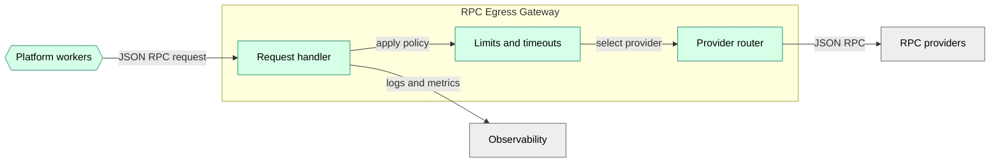

# RPC Egress Gateway

Platform service that provides a controlled outbound path for blockchain RPC calls.

Workers do not have direct internet egress. Any RPC access happens through this gateway (or via in-VPC nodes).

See [ADR 0002](../../adr/0002-networking.md).

## Responsibilities

- Provide a stable internal endpoint for RPC requests from workers.
- Apply environment-level controls (timeouts, concurrency limits, request logging).
- Hold provider credentials (if any) via launch-time secret injection.

## Notes

- This service is the only component with outbound internet egress for RPC access.
- Destination selection is environment-configured (e.g., per-chain upstream RPC providers).

## Component View

## Related

- C4 overview: [../c4.md](../c4.md)
- Invariants: [../invariants.md](../invariants.md)
- Security model: [../security.md](../security.md)
- Operations: [../operations.md](../operations.md)
- Workers container: [workers.md](workers.md)
- Networking decision: [ADR 0002](../../adr/0002-networking.md)
