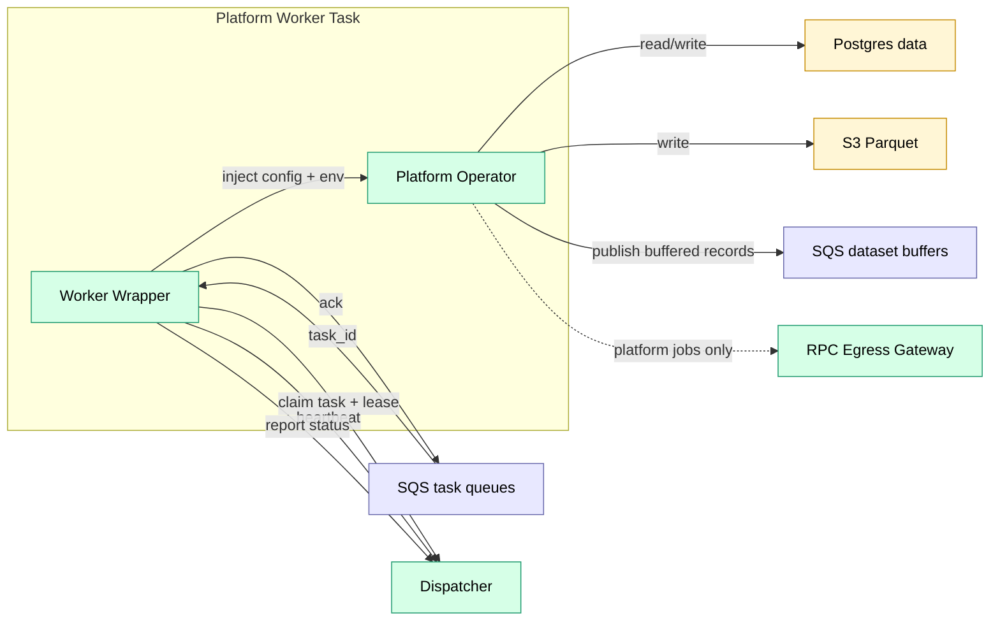
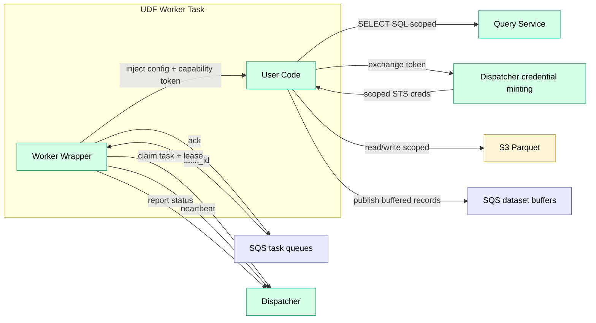

# Workers

Executors. One worker image per runtime.

Trace uses **two worker profiles** with different trust assumptions:

- **Platform workers** run trusted platform operators (block follower, ingest, compaction). They may use platform-managed secrets and may reach the RPC Egress Gateway.
- **UDF workers** run untrusted user code (alerts, custom transforms). They do **not** have direct Postgres access and receive scoped data access via Query Service + Dispatcher credential minting.

## Component View

### Platform Worker

> Secrets are injected at task launch (ECS task definition `secrets`) and are available to the operator as environment variables. Platform operators do not fetch Secrets Manager directly at runtime.

### UDF Worker

## Runtimes

| Runtime | Execution | Trust | Use Case |
|---------|-----------|-------|----------|
| `dispatcher` | In-process | trusted | Platform-only control-plane jobs |
| `lambda` | AWS Lambda | mixed | Sources (cron/webhook/manual), lightweight reactive operators |
| `ecs_rust` | ECS (Rust) | trusted | Ingest, transforms, compaction |
| `ecs_python` | ECS (Python) | trusted | Platform ML/transforms |
| `ecs_udf_ts` | ECS (Node) | untrusted | User-defined logic (alerts/transforms) |
| `ecs_udf_python` | ECS (Python) | untrusted | User-defined ML/pandas |
| `ecs_udf_rust` | ECS (Rust) | untrusted | User-defined high-perf scanning |

## Execution Model

- **ECS runtimes**: long-poll SQS task queues (wake-up messages contain `task_id` only), then **claim** the task from Dispatcher to obtain a lease + payload.
  See [contracts.md](../contracts.md) and [task_lifecycle.md](../task_lifecycle.md).
- **Lambda runtimes**:
  - **Sources** are invoked by EventBridge/API Gateway and emit upstream events to Dispatcher.
  - **Reactive jobs** are invoked by Dispatcher with the full task payload; the Lambda must report completion via `/internal/task-complete`.
  See [contracts.md](../contracts.md#dispatcher--lambda-runtimelambda).
- **Retries and visibility**: leasing, retries, and rehydration are owned by Dispatcher; wrappers extend SQS visibility for long tasks.
  See [task_lifecycle.md](../task_lifecycle.md).
- **Trust boundaries**: platform vs UDF workers are enforced by IAM + network policy.
  See [security_model.md](../../standards/security_model.md) and [udf.md](../../features/udf.md).

Notes:
- v1 targets `linux/amd64` for ECS runtimes; additional architectures can be added as new runtimes.

## Related

- [contracts.md](../contracts.md) — worker/dispatcher contract
- [dispatcher.md](dispatcher.md) — orchestration and backpressure
- [task_lifecycle.md](../task_lifecycle.md) — leasing, retries, rehydration
- [udf.md](../../features/udf.md) — sandbox model (for user code)
- [security_model.md](../../standards/security_model.md) — isolation model

