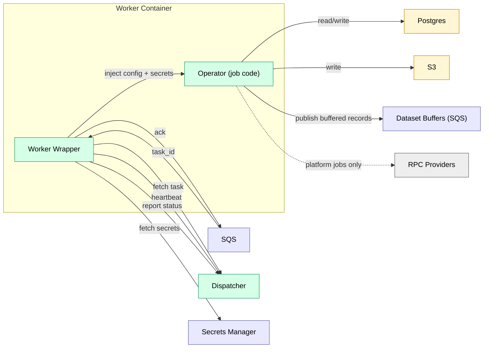

# Workers

Executors. One worker image per runtime.

## Component View

## Runtime Model

| Runtime | Execution | Use Case |
|---------|-----------|----------|
| `dispatcher` | In-process | Platform-only jobs |
| `lambda` | AWS Lambda | Cron/webhook/manual sources, lightweight reactive operators |
| `ecs_rust` | ECS (Rust) | Ingest, transforms, compaction |
| `ecs_python` | ECS (Python) | ML, pandas |

**Queue model (ECS):** One SQS queue per runtime. SQS payload includes `task_id` only; the worker wrapper fetches `operator`, `config`, and event context (`cursor`/`partition_key`) from the Dispatcher.

**Lambda sources:** Invoked by EventBridge/API Gateway, emit upstream events to Dispatcher.

**Lambda reactive jobs:** Invoked by Dispatcher when upstream datasets update (jobs with `runtime: lambda`). Dispatcher invokes the Lambda with the **full task payload** (same shape as `/internal/task-fetch`) and does not wait; a task is “done” only when the Lambda reports `/internal/task-complete`. Timeouts/crashes are handled by the reaper + retries (`max_attempts`) and Lambda built-in retries should be disabled (Dispatcher owns retries uniformly).

**ECS:** Long-polls SQS, stays warm per `idle_timeout`, heartbeats to Dispatcher.

**Architecture (v1):** ECS worker images run on `linux/amd64` to keep user bundle targeting simple. Additional architectures (e.g., `arm64`) can be introduced as separate runtimes in the registry.

## Related

- [contracts.md](../contracts.md) — worker/dispatcher contract
- [dispatcher.md](dispatcher.md) — orchestration and backpressure
- [udf.md](../../features/udf.md) — sandbox model (for user code)
- [security_model.md](../../standards/security_model.md) — isolation model

