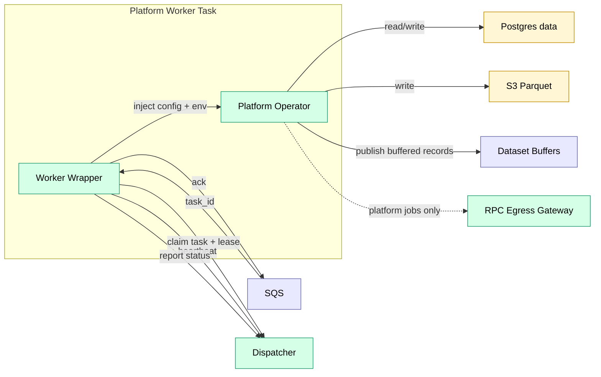
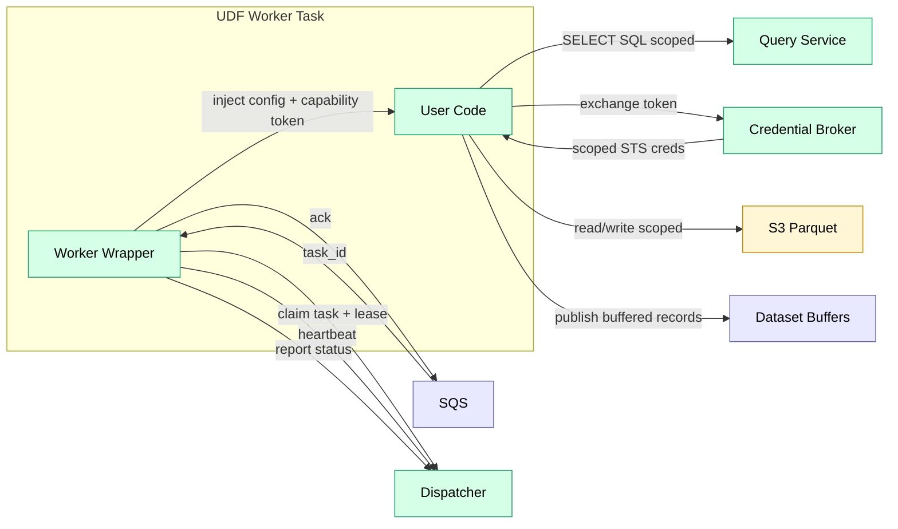

# Workers

Executors. One worker image per runtime.

Trace uses **two worker profiles** with different trust assumptions:

- **Platform workers** run trusted platform operators (block follower, ingest, compaction). They may use platform-managed secrets and may reach the RPC egress gateway.
- **UDF workers** run untrusted user code (alerts, custom transforms). They do **not** have direct Postgres access and receive scoped data access via Query Service + Credential Broker.

## Component View

### Platform Worker

> Secrets are injected at task launch (ECS task definition `secrets`) and are available to the operator as environment variables. Platform operators do not fetch Secrets Manager directly at runtime.

### UDF Worker

## Runtime Model

| Runtime | Execution | Trust | Use Case |
|---------|-----------|-------|----------|
| `dispatcher` | In-process | trusted | Platform-only control-plane jobs |
| `lambda` | AWS Lambda | mixed | Sources (cron/webhook/manual), lightweight reactive operators |
| `ecs_rust` | ECS (Rust) | trusted | Ingest, transforms, compaction |
| `ecs_python` | ECS (Python) | trusted | Platform ML/transforms |
| `ecs_udf_ts` | ECS (Node) | untrusted | User-defined logic (alerts/transforms) |
| `ecs_udf_python` | ECS (Python) | untrusted | User-defined ML/pandas |
| `ecs_udf_rust` | ECS (Rust) | untrusted | User-defined high-perf scanning |

**Queue model (ECS):** One SQS queue per runtime. SQS payload includes `task_id` only; the worker wrapper **claims** the task from the Dispatcher to acquire a lease and receive the full task payload.

**Lambda sources:** Invoked by EventBridge/API Gateway, emit upstream events to Dispatcher.

**Lambda reactive jobs:** Invoked by Dispatcher when upstream datasets update (jobs with `runtime: lambda`). Dispatcher invokes the Lambda with the **full task payload** (same shape as `/internal/task-fetch`) and does not wait; a task is “done” only when the Lambda reports `/internal/task-complete`. Timeouts/crashes are handled by the reaper + retries (`max_attempts`) and Lambda built-in retries should be disabled (Dispatcher owns retries uniformly).

**ECS:** Long-polls SQS, stays warm per `idle_timeout`, heartbeats to Dispatcher.

**SQS visibility:** The wrapper extends visibility (`ChangeMessageVisibility`) for long-running tasks until completion; this avoids premature redelivery while the task is still running.

**UDF runtimes:** Use locked-down network security groups and task roles:
- No internet egress.
- No direct network path to Postgres (RDS).
- No Secrets Manager permissions (secrets are injected at launch; UDFs typically receive only a capability token).
- Data reads go through Query Service; S3 access is via Credential Broker-scoped STS credentials.

**Architecture (v1):** ECS worker images run on `linux/amd64` to keep user bundle targeting simple. Additional architectures (e.g., `arm64`) can be introduced as separate runtimes in the registry.

## Related

- [contracts.md](../contracts.md) — worker/dispatcher contract
- [dispatcher.md](dispatcher.md) — orchestration and backpressure
- [task_lifecycle.md](../task_lifecycle.md) — leasing, retries, rehydration
- [udf.md](../../features/udf.md) — sandbox model (for user code)
- [security_model.md](../../standards/security_model.md) — isolation model

