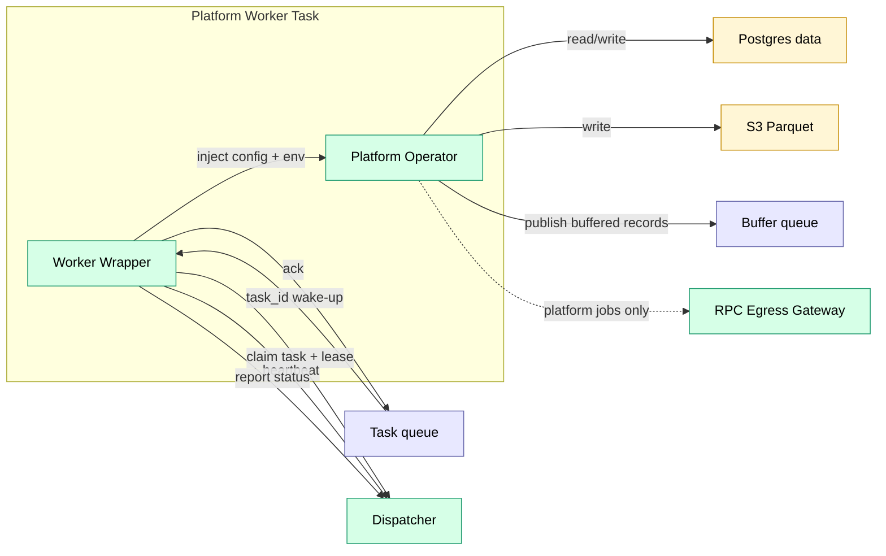
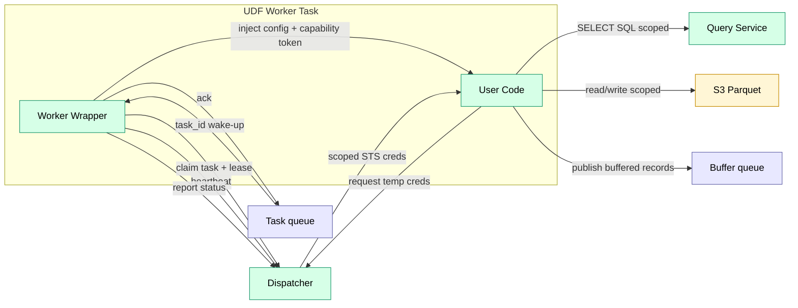

# Workers

Executors. Two worker profiles (platform and UDF).

Trace uses **two worker profiles** with different trust assumptions:

- **Platform workers** run trusted platform operators (block follower, ingest, compaction). They may use platform-managed secrets and may reach the RPC Egress Gateway.
- **UDF workers** run untrusted user code (alerts, custom transforms). They do **not** have direct Postgres access and receive scoped data access via Query Service + short-lived credentials minted by the Dispatcher.

## Component View

### Platform Worker

> Secrets are injected at task launch (ECS task definition `secrets`) and are available to the operator as environment variables. Platform operators do not fetch Secrets Manager directly at runtime.
>
> Internal Dispatcher endpoints (`/internal/*`) are protected by mTLS. Only the **wrapper** container receives the client certificate; untrusted code must not.

### UDF Worker

## Runtimes

To reduce operational surface area, v1 treats language/runtime packaging as an implementation detail and exposes only **four** runtime categories:

| Runtime | Execution | Trust | Use Case |
|---------|-----------|-------|----------|
| `dispatcher` | In-process | trusted | Control-plane-only jobs |
| `lambda` | AWS Lambda | trusted | Sources (cron/webhook/manual) and small operators |
| `ecs_platform` | ECS task | trusted | Platform operators (ingest, compaction, integrity) |
| `ecs_udf` | ECS task | untrusted | User-defined logic (alerts, transforms, queries) |

Notes:
- The operator implementation may be Rust, Python, or Node — that is a build/deployment detail, not a user-facing runtime enum.
- `ecs_udf` is always treated as untrusted and must use Query Service + scoped object-store credentials.

## Execution Model

- **ECS workers**: receive a `task_id` wake-up from the queue backend (SQS in AWS, pgqueue in Lite), claim the task to obtain `(attempt, lease_token, payload)`, execute, heartbeat, then complete. The wrapper extends queue visibility for long tasks.
- **Lambda runtimes**:
  - **Sources**: invoked by EventBridge / API Gateway and emit upstream events.
  - **Reactive jobs**: invoked by Dispatcher with the full task payload and must report completion.

Notes:
- v1 targets `linux/amd64` for ECS workers; additional architectures can be added as needed.

