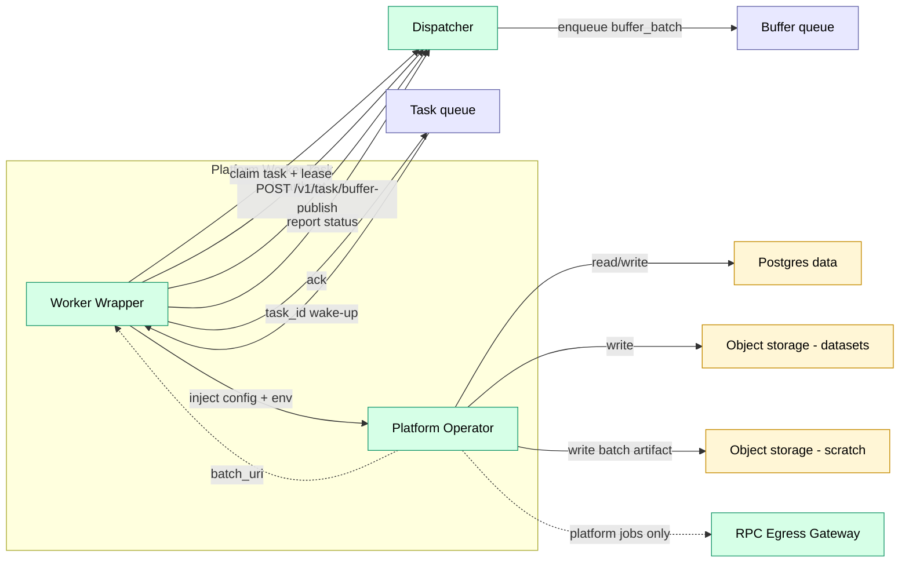
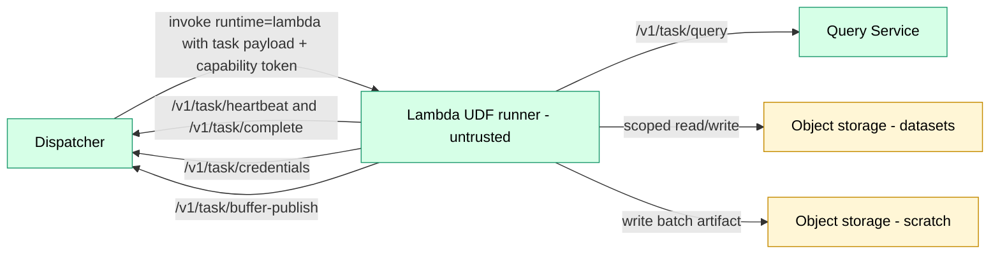
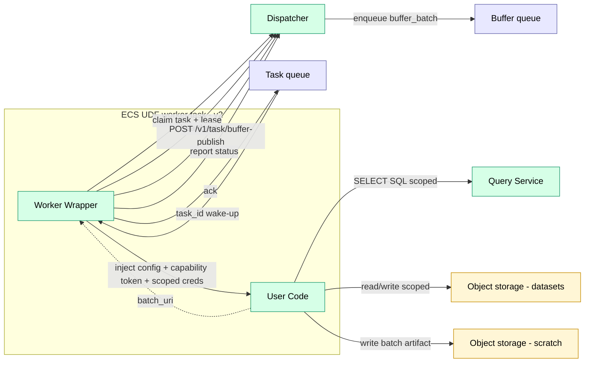

# Workers

Executors. Platform workers (ECS) plus untrusted UDF execution (v1: Lambda runner).

Trace uses **two execution profiles** with different trust assumptions:

- **Platform workers (`ecs_platform`)** run trusted platform operators (block follower, ingest, compaction). They may use platform-managed secrets and may reach the RPC Egress Gateway.
- **Untrusted UDF execution (`runtime: lambda`, v1)** runs user bundles in a platform-managed Lambda runner. It has no Postgres credentials and interacts with the platform only through task-scoped APIs.

> **AWS constraint (important):** ECS/Fargate does not support per-container IAM roles. All containers in a task share the task role and network.
>
> If an ECS UDF wrapper/poller needs AWS API permissions (SQS, queue ack/visibility, ECS `RunTask`, etc.) and runs in the same ECS task as untrusted code, the untrusted code inherits those permissions.
>
> **v1 recommendation:** run untrusted UDF bundles on `runtime: lambda` (platform-managed runner) to keep the execution role near-zero. Support for `ecs_udf` in AWS requires a design where privileged polling/launch is separated from untrusted execution.

## Component View

### Platform Worker

> Secrets are injected at task launch (ECS task definition `secrets`) and are available to the operator as environment variables. Platform operators do not fetch Secrets Manager directly at runtime.
>
> The **wrapper** is the trusted boundary for worker execution:
> - It performs worker-only operations (queue ack/visibility management, task claim/fetch).
> - It holds any worker-only auth material (e.g., a worker token) that must not be visible to untrusted code.
> - It passes the per-attempt **task capability token** to operator/UDF code for task-scoped APIs (task query, credential minting, fenced completion/events).

### Lambda UDF runner (v1)

In v1, untrusted execution uses a platform-managed Lambda runner invoked directly by the Dispatcher (no task queue wake-up, no worker-only claim endpoint).

Notes:
- Lambda UDFs do not have a wrapper boundary. Do not rely on hidden shared secrets.
- Lambda UDFs MUST use the per-attempt task capability token for all task-scoped APIs.

### ECS UDF worker task (deferred to v2)

This is the conceptual ECS shape for untrusted execution once a zero-trust isolation design exists for AWS.
It is not scheduled in v1.

## Runtimes

To reduce operational surface area, v1 treats language/runtime packaging as an implementation detail and exposes only **four** runtime categories:

| Runtime | Execution | Trust | Use Case |
|---------|-----------|-------|----------|
| `dispatcher` | In-process | trusted | Control-plane-only jobs |
| `lambda` | AWS Lambda | trusted or untrusted | Sources + short operators; UDFs are allowed when treated as untrusted and restricted via capability tokens |
| `ecs_platform` | ECS task | trusted | Platform operators (ingest, compaction, integrity) |
| `ecs_udf` | ECS task | untrusted | **Deferred to v2**: user-defined logic once a zero-trust isolation design exists |

Notes:
- In v1, untrusted user code executes via the platform-managed `lambda` runner. `ecs_udf` is not scheduled unless explicitly enabled for development/testing.
- Trust is determined by the **operator** (platform-managed vs user/UDF bundle), not by the compute primitive. Treat `lambda` as **untrusted by default**.
- `lambda` UDFs have no wrapper boundary: do not inject long-lived secrets. They must use the per-attempt task capability token for task-scoped APIs and obtain scoped object-store access via credential minting.
- The operator implementation may be Rust, Python, or Node - that is a build/deployment detail, not a user-facing runtime enum.
- `ecs_udf` is always treated as untrusted and must use Query Service + scoped object-store credentials (and must not have direct Postgres access).

## Execution Model

- **ECS workers**: receive a `task_id` wake-up from the queue backend (SQS in AWS, pgqueue in Lite), claim the task to obtain `(attempt, lease_token, payload)`, execute, heartbeat, then complete. The wrapper extends queue visibility for long tasks.
- **Lambda runtimes**:
  - **Sources**: invoked by EventBridge / API Gateway and emit upstream events.
  - **Reactive jobs**: invoked by Dispatcher with the full task payload and must report completion.

Lambda UDF note:
- When `runtime: lambda` executes untrusted user code, the invocation payload must include a task capability token. Completion/events are reported using that token (fenced by lease_token), not by any hidden internal credential.

Notes:
- v1 targets `linux/amd64` for ECS workers; additional architectures can be added as needed.
