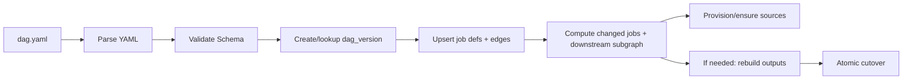

# DAG Deployment

How `dag.yaml` is parsed and synced into orchestration state (jobs/tasks) and how source infrastructure is provisioned.

## Doc ownership

This doc defines deploy, rematerialization, cutover, and rollback invariants. It intentionally does not restate DAG YAML field semantics.

- Core concepts (DAG, job, task): [Architecture index - Core concepts](README.md#core-concepts)
- DAG YAML schema and per-field semantics: [dag_configuration.md](../specs/dag_configuration.md)
- Atomic cutover and rollback model: [ADR 0009](../adr/0009-atomic-cutover-and-query-pinning.md)
- Orchestration schema: [orchestration.md](data_model/orchestration.md)

## Overview

- DAG YAML is the source of truth; Postgres state stores the runtime state.
- Deployment is idempotent: the same `dag.yaml` produces the same `dag_version` (keyed by `org_id + dag_name + yaml_hash`) and job definitions.
- A `dag_version` is immutable once created.
- Activating a version updates the org+dag active pointer (`dag_current_versions`, see [orchestration.md](data_model/orchestration.md)).
- Deploy/rematerialize is **non-destructive** and uses **atomic cutover/rollback** (see [ADR 0009](../adr/0009-atomic-cutover-and-query-pinning.md)).

## Flow

## Database Sync

At deploy time, the system:

1. Parses and validates YAML.
2. Creates (or reuses) a `dag_version` for the YAML (keyed by `org_id + dag_name + yaml_hash`).
3. Upserts the job definitions and the resolved `inputs` edges for that `dag_version`.
4. Applies `publish:` entries to the dataset registry (see [ADR 0008](../adr/0008-dataset-registry-and-publishing.md)).

### Rematerialization scope (“from the edit onward”)

If the deploy changes any **materialization-affecting** job fields (v1: at minimum `runtime`, `operator`, and output-affecting `config`), the system:

- Identifies the edited job(s), then
- Computes the transitive closure of downstream dependents.

That downstream subgraph is the rematerialization scope (“from the edit onward”). Unchanged upstream jobs (especially source jobs) remain running.

### Buffering during rematerialization

While the downstream subgraph is rebuilding:

- The Dispatcher continues accepting `/v1/task/events` from unchanged upstream jobs and persists the resulting work in Postgres state.
- The Dispatcher **pauses dispatch** for the rebuilding downstream subgraph (it does not push those tasks to SQS / workers).
- This creates backpressure at the Dispatcher (the “valve”), not at sources.

After the rebuild completes, the Dispatcher drains the buffered work using the new DAG version.

### Atomic cutover and rollback

When the rebuild is ready:

- The system performs an **atomic cutover** in a single Postgres state transaction:
  - update the affected datasets’ `current` pointer(s) to the new `dataset_version`s, and
  - update the DAG’s active `dag_version`.

Rollback is the inverse: a single transaction restores the prior pointer set and the prior active `dag_version`.

### Rollback and in-flight work

During rollback/rollover, the system pauses DAG processing:

- Dispatcher stops leasing/dispatching tasks for the rolled-back `dag_version`.
- Any queued-but-not-started tasks for that `dag_version` are canceled in Postgres state.
- In-flight tasks are canceled cooperatively (workers see `status: "Canceled"` on `/internal/task-fetch` and exit without running operator code).
- Because outputs are written as versioned artifacts (`dataset_version`), results from the rolled-back version cannot become “current” after rollback.

See [orchestration.md](data_model/orchestration.md) for the current `jobs`/`tasks` schema and [ADR 0009](../adr/0009-atomic-cutover-and-query-pinning.md) for the cutover/rollback model.
