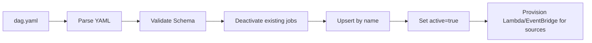

# DAG Deployment

How `dag.yaml` is parsed and synced into orchestration state (jobs/tasks) and how source infrastructure is provisioned.

## Overview

- DAG YAML is the source of truth; Postgres stores the runtime state.
- Deployment is idempotent: the same `dag.yaml` produces the same set of active jobs.
- Jobs are identified by `(dag_name, job name)` and are upserted by name.

## Flow



## Database Sync

At deploy time, the system:

1. Marks existing jobs for the DAG inactive (so removed jobs stop running)
2. Upserts each job definition from YAML (so renamed/updated jobs take effect)
3. Marks the resulting set active

Example SQL (illustrative):

```sql
UPDATE jobs SET active = false WHERE dag_name = 'monad';

INSERT INTO jobs (name, dag_name, activation, runtime, operator, source, execution_strategy, idle_timeout, ...)
VALUES ('block_follower', 'monad', 'source', 'ecs_rust', 'block_follower', '{"kind":"always_on"}', NULL, NULL, ...)
ON CONFLICT (dag_name, name) DO UPDATE SET
  activation = EXCLUDED.activation,
  runtime = EXCLUDED.runtime,
  operator = EXCLUDED.operator,
  source = EXCLUDED.source,
  execution_strategy = EXCLUDED.execution_strategy,
  idle_timeout = EXCLUDED.idle_timeout,
  config = EXCLUDED.config,
  config_hash = EXCLUDED.config_hash,
  active = true,
  updated_at = now();
```

See [orchestration.md](../capabilities/orchestration.md) for the `jobs` table schema and [data_versioning.md](data_versioning.md) for how `config_hash` interacts with staleness.

