# Schema - Postgres data

Column-level sketch for platform-owned data-plane tables.

Canonical DDL lives in `harness/migrations/data/` (applied in order). If this document conflicts with migrations, migrations win.

For relationships, see [`erd_data.md`](erd_data.md).

```mermaid
erDiagram
    ADDRESS_LABELS {
        uuid id PK
        uuid org_id FK
        uuid user_id FK
        text address
        text label
        text visibility
        timestamptz created_at
        timestamptz updated_at
    }
    SAVED_QUERIES {
        uuid id PK
        uuid org_id FK
        uuid user_id FK
        text name
        text query
        text visibility
        timestamptz created_at
        timestamptz updated_at
    }
    QUERY_RESULTS {
        uuid id PK
        uuid org_id FK
        uuid user_id FK
        uuid saved_query_id FK
        uuid task_id FK
        text mode
        text status
        text sql_hash
        text output_format
        text output_location
        bigint row_count
        bigint bytes
        int duration_ms
        text error_code
        text error_message
        timestamptz created_at
        timestamptz updated_at
    }
    QUERY_AUDIT {
        bigint id PK
        uuid org_id FK
        uuid task_id FK
        uuid dataset_id FK
        timestamptz query_time
        jsonb columns_accessed
        bigint result_row_count
    }
    USER_QUERY_AUDIT {
        bigint id PK
        uuid org_id FK
        text user_sub
        uuid dataset_id FK
        timestamptz query_time
        jsonb columns_accessed
        bigint result_row_count
    }
    ALERT_DEFINITIONS {
        uuid id PK
        uuid org_id FK
        uuid user_id FK
        text name
        jsonb condition
        jsonb channels
        text visibility
        boolean enabled
        timestamptz created_at
        timestamptz updated_at
    }
    ALERT_EVENTS {
        uuid id PK
        uuid org_id FK
        uuid alert_definition_id FK
        uuid producer_job_id FK
        uuid producer_task_id FK
        text severity
        bigint chain_id
        text block_hash
        text tx_hash
        bigint block_number
        uuid source_dataset_uuid
        text partition_key
        text cursor_value
        jsonb payload
        text dedupe_key
        timestamptz event_time
        timestamptz created_at
    }
    ALERT_DELIVERIES {
        uuid id PK
        uuid org_id FK
        uuid alert_event_id FK
        text channel
        text status
        int attempt
        timestamptz next_attempt_at
        timestamptz leased_until
        text lease_owner
        timestamptz last_attempt_at
        text provider_message_id
        text error_message
        timestamptz delivered_at
        timestamptz created_at
        timestamptz updated_at
    }
    PII_ACCESS_LOG {
        uuid id PK
        uuid org_id FK
        uuid user_id FK
        uuid task_id FK
        text dataset
        text column_name
        uuid record_id
        text action
        timestamptz accessed_at
    }
```

