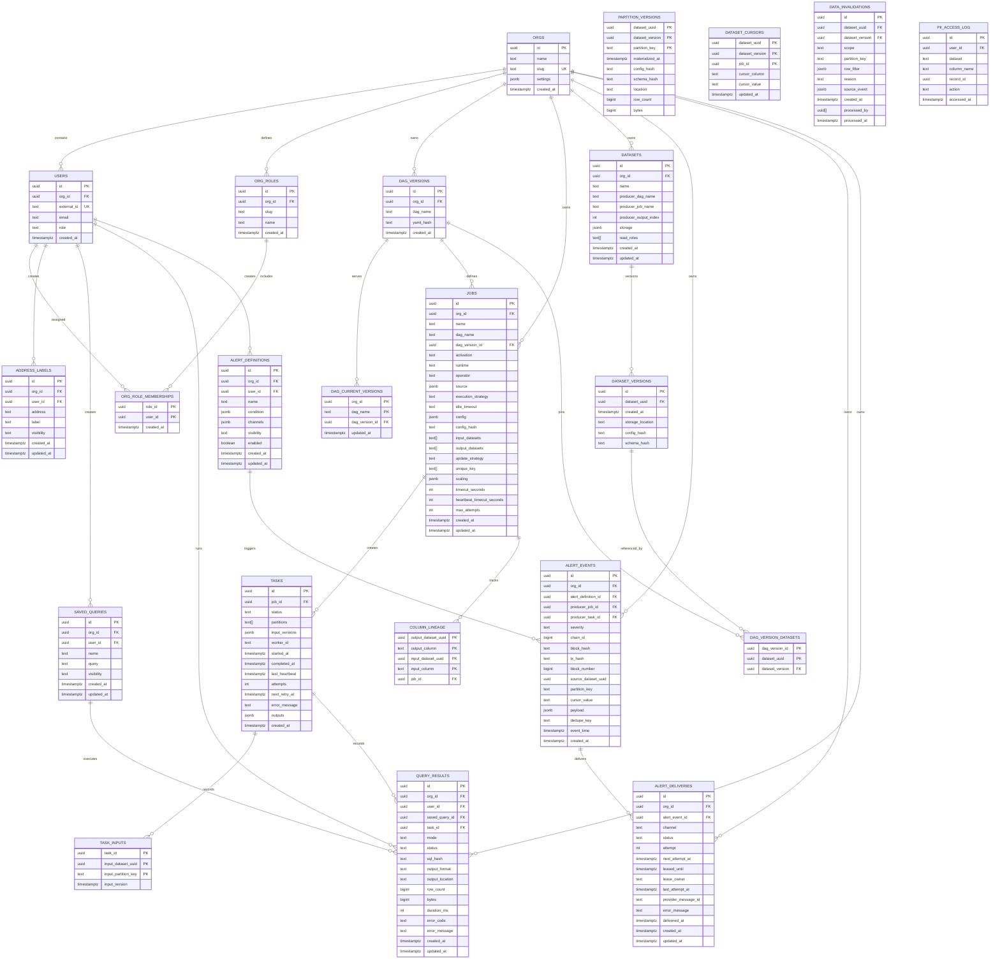

# Entity Relationship Diagram

Complete data model for all system tables.

Note: `jobs.input_datasets` / `jobs.output_datasets` store internal dataset UUIDs (string form), not user-facing dataset names.

## Schema Sources

Full DDL with constraints and indexes:

| Domain | Tables | Location |
|--------|--------|----------|
| Orchestration | orgs, users, org_roles, org_role_memberships, dag_versions, dag_current_versions, jobs, tasks, task_inputs, column_lineage, datasets, dataset_versions, dag_version_datasets | [orchestration.md](orchestration.md) |
| Alerting | alert_definitions, alert_events, alert_deliveries | [alerting.md](../../features/alerting.md) |
| Data Versioning | partition_versions, dataset_cursors, data_invalidations | [data_versioning.md](../data_versioning.md) |
| Query Service | saved_queries, query_results | [query_service.md](../containers/query_service.md) |
| PII | pii_access_log | [pii.md](pii.md) |
| Operators | address_labels | [address_labels.md](../operators/address_labels.md) |
