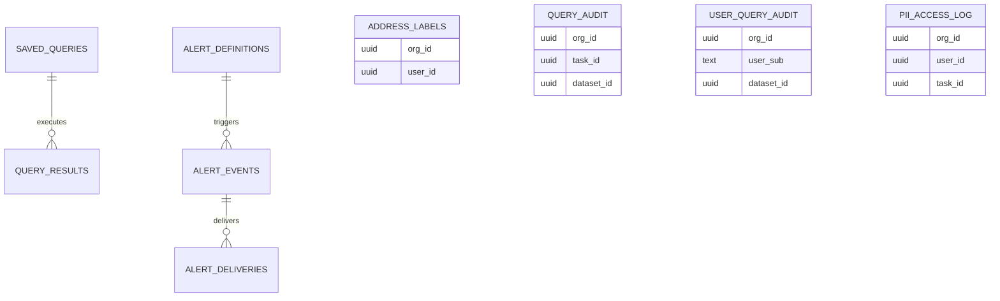

# ERD - Postgres data

Relationships for platform-owned data-plane tables.

Canonical DDL lives in `harness/migrations/data/` (applied in order). This ERD is intentionally relationship-focused and omits most columns to reduce drift.

For a column-level sketch, see [`data_schema.md`](data_schema.md).

> Note: `org_id`/`user_id`/`task_id` are **soft references** to Postgres state (no cross-DB FKs).

