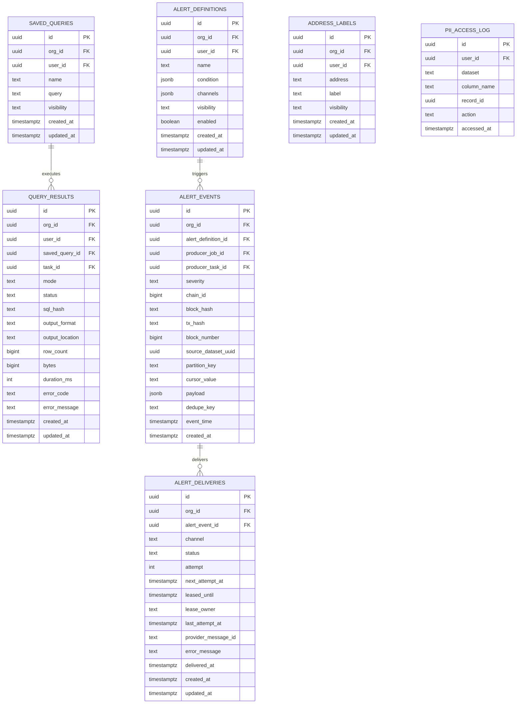

# ERD - Postgres data

Canonical relationships for platform-owned data-plane tables.

> Note: `org_id`/`user_id`/`task_id` are **soft references** to Postgres state (no cross-DB FKs).

```mermaid
erDiagram
    SAVED_QUERIES ||--o{ QUERY_RESULTS : executes
    ALERT_DEFINITIONS ||--o{ ALERT_EVENTS : triggers
    ALERT_EVENTS ||--o{ ALERT_DELIVERIES : delivers

    ADDRESS_LABELS {
        uuid id PK
        uuid org_id FK
        uuid user_id FK
        text address
        text label
        text visibility
        timestamptz created_at
        timestamptz updated_at
    }
    SAVED_QUERIES {
        uuid id PK
        uuid org_id FK
        uuid user_id FK
        text name
        text query
        text visibility
        timestamptz created_at
        timestamptz updated_at
    }
    QUERY_RESULTS {
        uuid id PK
        uuid org_id FK
        uuid user_id FK
        uuid saved_query_id FK
        uuid task_id FK
        text mode
        text status
        text sql_hash
        text output_format
        text output_location
        bigint row_count
        bigint bytes
        int duration_ms
        text error_code
        text error_message
        timestamptz created_at
        timestamptz updated_at
    }
    ALERT_DEFINITIONS {
        uuid id PK
        uuid org_id FK
        uuid user_id FK
        text name
        jsonb condition
        jsonb channels
        text visibility
        boolean enabled
        timestamptz created_at
        timestamptz updated_at
    }
    ALERT_EVENTS {
        uuid id PK
        uuid org_id FK
        uuid alert_definition_id FK
        uuid producer_job_id FK
        uuid producer_task_id FK
        text severity
        bigint chain_id
        text block_hash
        text tx_hash
        bigint block_number
        uuid source_dataset_uuid
        text partition_key
        text cursor_value
        jsonb payload
        text dedupe_key
        timestamptz event_time
        timestamptz created_at
    }
    ALERT_DELIVERIES {
        uuid id PK
        uuid org_id FK
        uuid alert_event_id FK
        text channel
        text status
        int attempt
        timestamptz next_attempt_at
        timestamptz leased_until
        text lease_owner
        timestamptz last_attempt_at
        text provider_message_id
        text error_message
        timestamptz delivered_at
        timestamptz created_at
        timestamptz updated_at
    }
    PII_ACCESS_LOG {
        uuid id PK
        uuid user_id FK
        text dataset
        text column_name
        uuid record_id
        text action
        timestamptz accessed_at
    }
```
