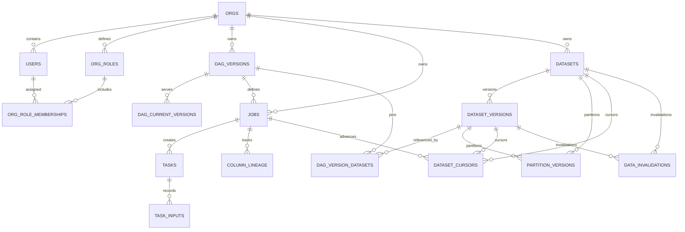

# ERD - Postgres state

Relationships for orchestration, lineage, and dataset registry.

Canonical DDL lives in `harness/migrations/state/` (applied in order). This ERD is intentionally relationship-focused and omits most columns to reduce drift.

For a column-level sketch, see [`state_schema.md`](state_schema.md).

