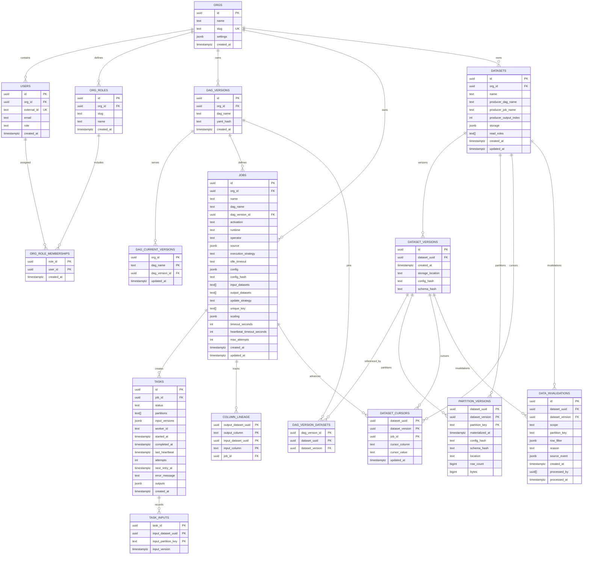

# ERD — Postgres state

Canonical relationships for orchestration, lineage, and dataset registry.

```mermaid
erDiagram
    ORGS ||--o{ USERS : contains
    ORGS ||--o{ ORG_ROLES : defines
    ORG_ROLES ||--o{ ORG_ROLE_MEMBERSHIPS : includes
    USERS ||--o{ ORG_ROLE_MEMBERSHIPS : assigned
    ORGS ||--o{ DAG_VERSIONS : owns
    DAG_VERSIONS ||--o{ DAG_CURRENT_VERSIONS : serves
    DAG_VERSIONS ||--o{ JOBS : defines
    ORGS ||--o{ JOBS : owns
    ORGS ||--o{ DATASETS : owns
    DATASETS ||--o{ DATASET_VERSIONS : versions
    DAG_VERSIONS ||--o{ DAG_VERSION_DATASETS : pins
    DATASET_VERSIONS ||--o{ DAG_VERSION_DATASETS : referenced_by
    JOBS ||--o{ TASKS : creates
    TASKS ||--o{ TASK_INPUTS : records
    JOBS ||--o{ COLUMN_LINEAGE : tracks
    DATASET_VERSIONS ||--o{ PARTITION_VERSIONS : partitions
    DATASETS ||--o{ PARTITION_VERSIONS : partitions
    DATASET_VERSIONS ||--o{ DATASET_CURSORS : cursors
    DATASETS ||--o{ DATASET_CURSORS : cursors
    JOBS ||--o{ DATASET_CURSORS : advances
    DATASET_VERSIONS ||--o{ DATA_INVALIDATIONS : invalidations
    DATASETS ||--o{ DATA_INVALIDATIONS : invalidations

    ORGS {
        uuid id PK
        text name
        text slug UK
        jsonb settings
        timestamptz created_at
    }
    USERS {
        uuid id PK
        uuid org_id FK
        text external_id UK
        text email
        text role
        timestamptz created_at
    }
    ORG_ROLES {
        uuid id PK
        uuid org_id FK
        text slug
        text name
        timestamptz created_at
    }
    ORG_ROLE_MEMBERSHIPS {
        uuid role_id PK
        uuid user_id PK
        timestamptz created_at
    }
    DAG_VERSIONS {
        uuid id PK
        uuid org_id FK
        text dag_name
        text yaml_hash
        timestamptz created_at
    }
    DAG_CURRENT_VERSIONS {
        uuid org_id PK
        text dag_name PK
        uuid dag_version_id FK
        timestamptz updated_at
    }
    JOBS {
        uuid id PK
        uuid org_id FK
        text name
        text dag_name
        uuid dag_version_id FK
        text activation
        text runtime
        text operator
        jsonb source
        text execution_strategy
        text idle_timeout
        jsonb config
        text config_hash
        text[] input_datasets
        text[] output_datasets
        text update_strategy
        text[] unique_key
        jsonb scaling
        int timeout_seconds
        int heartbeat_timeout_seconds
        int max_attempts
        timestamptz created_at
        timestamptz updated_at
    }
    DATASETS {
        uuid id PK
        uuid org_id FK
        text name
        text producer_dag_name
        text producer_job_name
        int producer_output_index
        jsonb storage
        text[] read_roles
        timestamptz created_at
        timestamptz updated_at
    }
    DATASET_VERSIONS {
        uuid id PK
        uuid dataset_uuid FK
        timestamptz created_at
        text storage_location
        text config_hash
        text schema_hash
    }
    DAG_VERSION_DATASETS {
        uuid dag_version_id PK
        uuid dataset_uuid PK
        uuid dataset_version FK
    }
    TASKS {
        uuid id PK
        uuid job_id FK
        text status
        text[] partitions
        jsonb input_versions
        text worker_id
        timestamptz started_at
        timestamptz completed_at
        timestamptz last_heartbeat
        int attempts
        timestamptz next_retry_at
        text error_message
        jsonb outputs
        timestamptz created_at
    }
    TASK_INPUTS {
        uuid task_id PK
        uuid input_dataset_uuid PK
        text input_partition_key PK
        timestamptz input_version
    }
    COLUMN_LINEAGE {
        uuid output_dataset_uuid PK
        text output_column PK
        uuid input_dataset_uuid PK
        text input_column PK
        uuid job_id FK
    }
    PARTITION_VERSIONS {
        uuid dataset_uuid PK
        uuid dataset_version PK
        text partition_key PK
        timestamptz materialized_at
        text config_hash
        text schema_hash
        text location
        bigint row_count
        bigint bytes
    }
    DATASET_CURSORS {
        uuid dataset_uuid PK
        uuid dataset_version PK
        uuid job_id PK
        text cursor_column
        text cursor_value
        timestamptz updated_at
    }
    DATA_INVALIDATIONS {
        uuid id PK
        uuid dataset_uuid FK
        uuid dataset_version FK
        text scope
        text partition_key
        jsonb row_filter
        text reason
        jsonb source_event
        timestamptz created_at
        uuid[] processed_by
        timestamptz processed_at
    }
```
