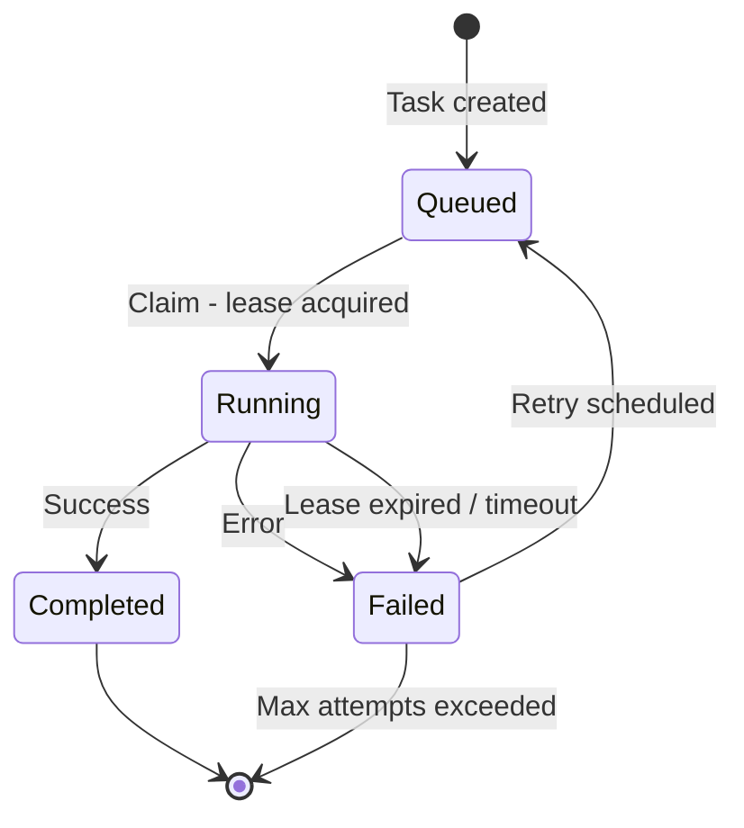
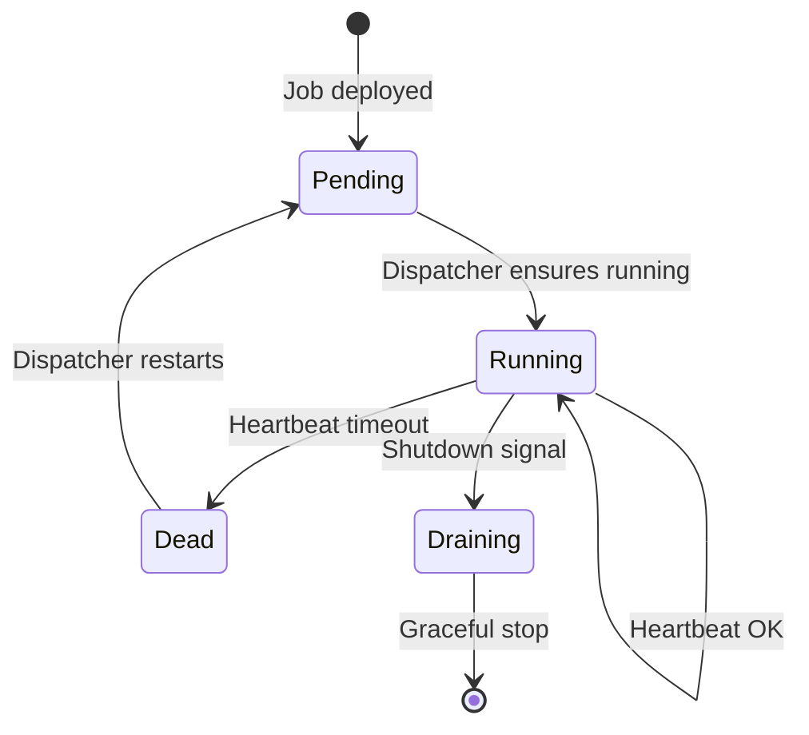
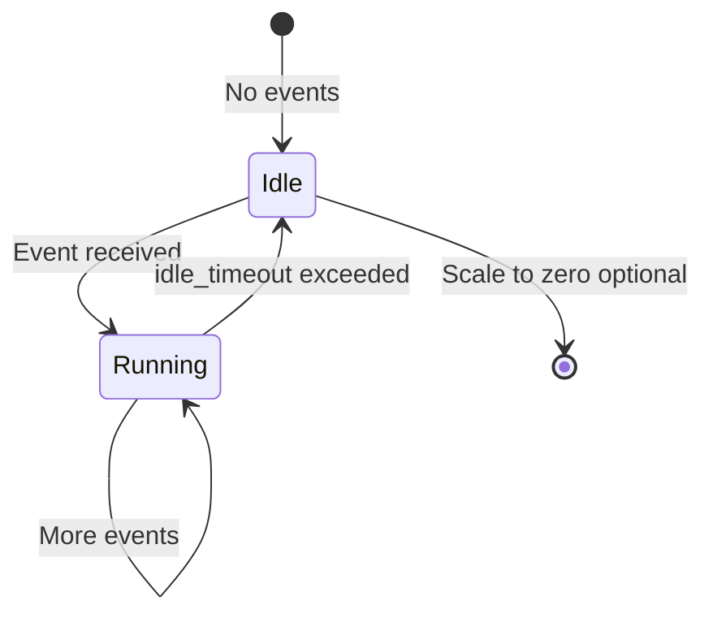

# Orchestration Data Model

Core schemas for job orchestration, task management, and lineage tracking.

## Organizations

```sql
CREATE TABLE orgs (
    id UUID PRIMARY KEY DEFAULT gen_random_uuid(),
    name TEXT NOT NULL,
    slug TEXT NOT NULL UNIQUE,
    settings JSONB NOT NULL DEFAULT '{}',
    created_at TIMESTAMPTZ DEFAULT now()
);
```

## Users

```sql
CREATE TABLE users (
    id UUID PRIMARY KEY DEFAULT gen_random_uuid(),
    org_id UUID NOT NULL REFERENCES orgs(id),
    external_id TEXT NOT NULL UNIQUE,  -- IdP subject
    email TEXT,
    role TEXT NOT NULL,                -- platform permission role: 'reader', 'writer', 'admin'
    created_at TIMESTAMPTZ DEFAULT now()
);
```

## Org Roles (User-Defined)

Org-defined roles used for visibility scoping (e.g., `role:finance`).

```sql
CREATE TABLE org_roles (
    id UUID PRIMARY KEY DEFAULT gen_random_uuid(),
    org_id UUID NOT NULL REFERENCES orgs(id),
    slug TEXT NOT NULL,                -- e.g., 'finance'
    name TEXT NOT NULL,                -- e.g., 'Finance'
    created_at TIMESTAMPTZ DEFAULT now(),
    UNIQUE (org_id, slug)
);
```

## Org Role Memberships

```sql
CREATE TABLE org_role_memberships (
    role_id UUID NOT NULL REFERENCES org_roles(id),
    user_id UUID NOT NULL REFERENCES users(id),
    created_at TIMESTAMPTZ DEFAULT now(),
    PRIMARY KEY (role_id, user_id)
);

CREATE INDEX idx_org_role_memberships_user ON org_role_memberships(user_id);
```

## DAG Versions

Deploys are versioned. A `dag_version` represents an immutable DAG definition (YAML hash).

```sql
CREATE TABLE dag_versions (
    id UUID PRIMARY KEY DEFAULT gen_random_uuid(),
    org_id UUID NOT NULL REFERENCES orgs(id),
    dag_name TEXT NOT NULL,
    yaml_hash TEXT NOT NULL,
    created_at TIMESTAMPTZ DEFAULT now(),
    UNIQUE (org_id, dag_name, yaml_hash)
);

-- Which DAG version is currently serving reads/dispatch (per org + dag_name).
CREATE TABLE dag_current_versions (
    org_id UUID NOT NULL REFERENCES orgs(id),
    dag_name TEXT NOT NULL,
    dag_version_id UUID NOT NULL REFERENCES dag_versions(id),
    updated_at TIMESTAMPTZ DEFAULT now(),
    PRIMARY KEY (org_id, dag_name)
);
```

## Jobs

Job definitions synced from YAML DAG config.

```sql
CREATE TABLE jobs (
    id UUID PRIMARY KEY DEFAULT gen_random_uuid(),
    org_id UUID NOT NULL REFERENCES orgs(id),
    name TEXT NOT NULL,
    dag_name TEXT NOT NULL,
    dag_version_id UUID NOT NULL REFERENCES dag_versions(id),
    activation TEXT NOT NULL,           -- 'source', 'reactive'
    runtime TEXT NOT NULL,              -- 'lambda', 'ecs_platform', 'ecs_udf', 'dispatcher'
    operator TEXT NOT NULL,             -- 'block_follower', 'alert_evaluate', etc.
    source JSONB,                       -- { "kind": "cron", "schedule": "0 0 * * *" }
    bootstrap JSONB,                   -- source only: { "reset_outputs": true }
    execution_strategy TEXT,            -- NULL for sources, else 'PerUpdate' | 'PerPartition' (Bulk is not supported)
    idle_timeout TEXT,                  -- reactive only: 'never', '5m', '0', etc.
    config JSONB NOT NULL DEFAULT '{}', -- operator config
    config_hash TEXT NOT NULL,
    input_datasets TEXT[],              -- upstream edges resolved to dataset UUIDs (string form)
    output_datasets TEXT[],             -- output dataset UUIDs by output index (string form)
    update_strategy TEXT NOT NULL,      -- 'append' | 'replace'
    unique_key TEXT[],                  -- required if update_strategy = 'append'
    scaling JSONB,                      -- { "max_concurrency": 20 }
    timeout_seconds INT,
    heartbeat_timeout_seconds INT,
    max_attempts INT DEFAULT 3,
    created_at TIMESTAMPTZ DEFAULT now(),
    updated_at TIMESTAMPTZ DEFAULT now(),
    UNIQUE (dag_version_id, name)
);

CREATE INDEX idx_jobs_dag_version ON jobs(dag_version_id);
```

## Datasets (Registry)

Published datasets are registered for discovery and querying. The registry:

- Maps `dataset_name` (human-readable, unique per org) → `dataset_uuid` (system UUID primary key).
- Links datasets back to their producer (`dag_name`, `job_name`, `output_index`) for navigation and “single producer” enforcement.

```sql
CREATE TABLE datasets (
    id UUID PRIMARY KEY DEFAULT gen_random_uuid(), -- dataset_uuid
    org_id UUID NOT NULL REFERENCES orgs(id),
    name TEXT NOT NULL,                            -- dataset_name (unique per org)
    producer_dag_name TEXT NOT NULL,
    producer_job_name TEXT NOT NULL,
    producer_output_index INT NOT NULL,
    storage JSONB NOT NULL DEFAULT '{}',            -- backend config (versioned location is in dataset_versions)
    read_roles TEXT[] NOT NULL DEFAULT '{}',        -- admin-managed visibility
    created_at TIMESTAMPTZ DEFAULT now(),
    updated_at TIMESTAMPTZ DEFAULT now(),
    UNIQUE (org_id, name),
    UNIQUE (org_id, producer_dag_name, producer_job_name, producer_output_index)
);
```

## Dataset Versions (Deploy/Rematerialize)

Each published dataset has a stable `dataset_uuid` plus versioned generations (`dataset_version`) so deploy/rematerialize can be non-destructive (build new versions in parallel and swap pointers atomically).

```sql
CREATE TABLE dataset_versions (
    id UUID PRIMARY KEY DEFAULT gen_random_uuid(), -- dataset_version
    dataset_uuid UUID NOT NULL REFERENCES datasets(id),
    created_at TIMESTAMPTZ DEFAULT now(),
    storage_location TEXT NOT NULL,                -- S3/Parquet: version-addressed storage reference (prefix + glob) for Parquet objects; Postgres data (v1): stable table/view name
    config_hash TEXT NOT NULL,                     -- stable hash of producer config + dataset kind + chain_id + range + etc
    schema_hash TEXT,

    -- Optional range metadata for partitioned/chain-range datasets (v1 Cryo bootstrap).
    -- If present, this is used to enforce determinism/idempotency at the version registry boundary.
    range_start BIGINT,
    range_end BIGINT,
    UNIQUE (dataset_uuid, config_hash, range_start, range_end)
);

-- The dataset-version pointer set for a given DAG version.
CREATE TABLE dag_version_datasets (
    dag_version_id UUID NOT NULL REFERENCES dag_versions(id),
    dataset_uuid UUID NOT NULL REFERENCES datasets(id),
    dataset_version UUID NOT NULL REFERENCES dataset_versions(id),
    PRIMARY KEY (dag_version_id, dataset_uuid)
);
```

For S3/Parquet datasets, `storage_location` is a version-resolved prefix (ending with `/`) that contains Parquet objects. Query Service attaches datasets by prefix+glob (fail-closed on authz mismatch). A Trace-owned file list manifest may exist as an optimization, but Cryo output must not require it.

### Runtime Execution Model

The `runtime` field determines how the Dispatcher executes a task:

- `ecs_*`: Dispatcher enqueues `task_id` to an SQS task queue; ECS workers long-poll, execute, then report completion.
- `lambda`: Dispatcher invokes a Lambda directly (no SQS) with the **full task payload** (same shape as `/internal/task-fetch`); the Lambda runs without Postgres state credentials and reports completion via the same Dispatcher endpoints.
- `dispatcher`: Dispatcher runs the operator in-process (no SQS, no Lambda).

See [README.md](../../README.md) for diagrams and [lambda_invocation.md](../contracts/lambda_invocation.md) for the Dispatcher-to-Lambda invocation payload shape.

## Tasks

Task instances. Durable state lives in Postgres state. SQS carries only `task_id` wake-ups; workers must claim tasks to acquire a lease. See [task_lifecycle.md](../task_lifecycle.md).

```sql
CREATE TABLE tasks (
    id UUID PRIMARY KEY DEFAULT gen_random_uuid(),
    job_id UUID NOT NULL REFERENCES jobs(id),

    -- Optional idempotency key for the unit of work (recommended for reactive jobs).
    -- Examples:
    --   partition:{dataset_uuid}:{dataset_version}:{partition_key}
    --   cursor:{dataset_uuid}:{dataset_version}:{cursor_value}
    dedupe_key TEXT,

    status TEXT NOT NULL DEFAULT 'Queued',  -- Queued | Running | Completed | Failed | Canceled

    -- Current attempt number (1-based). Incremented on retry.
    attempt INT NOT NULL DEFAULT 1,

    partitions TEXT[],
    input_versions JSONB,

    -- Lease (only one active worker may run the current attempt).
    worker_id TEXT,
    lease_token UUID,
    lease_expires_at TIMESTAMPTZ,
    last_heartbeat TIMESTAMPTZ,

    started_at TIMESTAMPTZ,
    completed_at TIMESTAMPTZ,

    next_retry_at TIMESTAMPTZ,
    error_message TEXT,
    outputs JSONB,                      -- per-output metadata (paths, cursors, partitions, metrics)
    created_at TIMESTAMPTZ DEFAULT now()
);

-- Prevent duplicate task creation for the same unit-of-work.
CREATE UNIQUE INDEX idx_tasks_job_dedupe
    ON tasks(job_id, dedupe_key)
    WHERE dedupe_key IS NOT NULL;

CREATE INDEX idx_tasks_status
    ON tasks(status)
    WHERE status IN ('Queued', 'Running');

CREATE INDEX idx_tasks_next_retry
    ON tasks(next_retry_at)
    WHERE status = 'Failed';

CREATE INDEX idx_tasks_lease_expiry
    ON tasks(lease_expires_at)
    WHERE status = 'Running';
```

### Claim (Lease Acquisition)

Workers claim tasks via the Dispatcher. A claim is an atomic update:

- `Queued -> Running`
- sets `worker_id`, `lease_token`, and `lease_expires_at`

This prevents concurrent execution even if SQS delivers duplicates.

### Outbox (Required)

To make enqueueing and event routing **crash-safe** and **rehydratable**, the Dispatcher uses an outbox table.

**Rule:** any durable mutation in Postgres state that requires a side effect (enqueue to SQS, route an upstream event) must create an outbox row **in the same transaction**.

- Task creation / retry → outbox `enqueue_task`
- Event acceptance / task completion → outbox `route_event`
- A background outbox worker drains `Pending` rows and performs the side effects.

```sql
CREATE TABLE outbox (
    id BIGSERIAL PRIMARY KEY,
    kind TEXT NOT NULL,               -- 'enqueue_task' | 'route_event'
    payload JSONB NOT NULL,
    status TEXT NOT NULL DEFAULT 'Pending', -- Pending | Processing | Done | Failed
    available_at TIMESTAMPTZ NOT NULL DEFAULT now(),
    attempts INT NOT NULL DEFAULT 0,
    last_error TEXT,
    created_at TIMESTAMPTZ DEFAULT now(),
    processed_at TIMESTAMPTZ
);

CREATE INDEX idx_outbox_pending
    ON outbox(status, available_at)
    WHERE status = 'Pending';
```


## Task Inputs

Task input versions for memoization.

```sql
CREATE TABLE task_inputs (
    task_id UUID REFERENCES tasks(id),
    input_dataset_uuid UUID NOT NULL REFERENCES datasets(id),
    input_partition_key TEXT NOT NULL,
    input_version TIMESTAMPTZ NOT NULL,
    PRIMARY KEY (task_id, input_dataset_uuid, input_partition_key)
);
```

## Column Lineage (Optional)

```sql
CREATE TABLE column_lineage (
    output_dataset_uuid UUID NOT NULL REFERENCES datasets(id),
    output_column TEXT NOT NULL,
    input_dataset_uuid UUID NOT NULL REFERENCES datasets(id),
    input_column TEXT NOT NULL,
    job_id UUID REFERENCES jobs(id),
    PRIMARY KEY (output_dataset_uuid, output_column, input_dataset_uuid, input_column)
);
```

## Operator State

Some operators maintain durable per-job state (e.g., `range_aggregator` cursor/range bookkeeping). This state lives in Postgres state and is keyed by `(org_id, job_id)` plus an optional `state_key` when a single job needs multiple independent state slots.

```sql
CREATE TABLE operator_state (
    org_id UUID NOT NULL REFERENCES orgs(id),
    job_id UUID NOT NULL REFERENCES jobs(id),
    state_key TEXT NOT NULL DEFAULT 'default',
    state JSONB NOT NULL DEFAULT '{}',
    updated_at TIMESTAMPTZ DEFAULT now(),
    PRIMARY KEY (org_id, job_id, state_key)
);
```

## Task Lifecycle

Task execution is at-least-once and lease-based. Only the worker holding the current `lease_token` for the current `attempt` may heartbeat or complete the task. See [task_lifecycle.md](../task_lifecycle.md).



**Retry behavior:** failed tasks retry up to `jobs.max_attempts`. `next_retry_at` schedules retries with backoff; retries reuse the same `task_id` and increment `tasks.attempt`.

**Leasing:** `tasks.lease_expires_at` is extended by `/v1/task/heartbeat`. If the lease expires, the reaper marks the task failed and schedules a retry.

**Idempotent creation:** when `dedupe_key` is set, the Dispatcher enforces one task per `(job_id, dedupe_key)` even if an upstream event is delivered multiple times.

## Source Job Lifecycle

Jobs with `activation: source` run continuously:



## Reactive Job Lifecycle

Jobs with `activation: reactive` scale based on events:



## Related

- [Architecture Overview](../../README.md) - system design and component diagrams
- [DAG Configuration](../../specs/dag_configuration.md) - YAML schema
- [DAG Deployment](../dag_deployment.md) - deploy/sync flow
