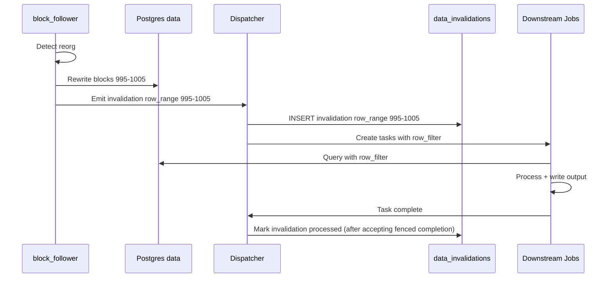
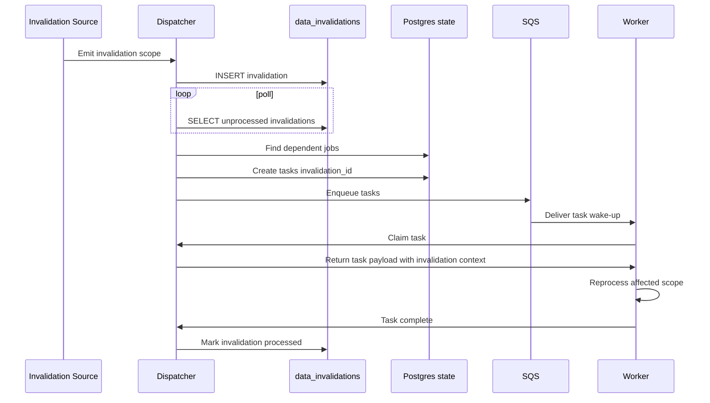

# Data Versioning and Incremental Processing

How the system tracks data changes, handles reorgs, and efficiently reprocesses only what's needed.

## Overview

- Tasks and upstream events are **at-least-once**. Correctness comes from leasing, strict attempt fencing, and idempotent dataset writes.
- Reactive jobs trigger on upstream output events. Events include `dataset_uuid` + `dataset_version` plus a scope (`cursor` or `partition_key`).
- `dataset_version` changes on deploy/rematerialize so new definitions can build in parallel and cut over atomically.
- For onchain datasets, `block_hash` is the stable identity. Reorgs rewrite affected block-number ranges and create invalidations so downstream jobs rematerialize impacted outputs.

The system supports two granularities of change tracking:

| Level | Use Case | Storage Type |
|-------|----------|--------------|
| **Partition** | Cold storage (S3 Parquet), batch jobs | Partitioned by block range |
| **Row/Cursor** | Hot storage (Postgres data), incremental jobs | Unpartitioned tables |

Both levels coexist. Jobs declare which mode they use.

---

## Dataset Versions (Generations)

`dataset_version` is an opaque UUID that identifies a version-addressed location for a dataset’s outputs (a “generation”).

It changes on deploy/rematerialize cutovers (definition changes), not on every incremental write.

Postgres data-backed datasets are **live** in v1 (stable table/view names). Repair/rollback is handled via reprocessing/bounded recompute or explicit reset (`bootstrap.reset_outputs`), rather than retaining historical physical tables per `dataset_version`.

Committed dataset versions are retained until an admin explicitly purges them (v1: manual GC). See [ADR 0009](../adr/0009-atomic-cutover-and-query-pinning.md).

### Partition Versions

Tracks per-partition materialization metadata within a given `dataset_version`.

For Cryo-style Parquet layouts, the range should remain visible in the object key / filename (e.g., `blocks_{start}_{end}.parquet`), even if the dataset prefix is UUID/version-addressed.

### Dataset Cursors

Tracks high-water marks for cursor-based incremental jobs (scoped to a `dataset_version`).

### Data Invalidations

Records when data needs reprocessing (reorgs, corrections, manual fixes).

---

## Incremental Modes

Reactive jobs declare their incremental mode via `execution_strategy` in the DAG YAML:

- `PerPartition` — partition-key events (cold/batch)
- `PerUpdate` — cursor or row-range events (hot/incremental)

Operator-specific details (e.g., cursor column, range size) live in the operator `config`.


### Mode: `partition` (`execution_strategy: PerPartition`)

For jobs operating on partitioned data (typically cold storage).

**Behavior:**
1. After output commit, Dispatcher emits an event `{dataset_uuid, dataset_version, partition_key}` (at-least-once).
2. Dispatcher creates a downstream task pinned to the triggering `dataset_version`.
3. Job reads the input partition and writes the output partition (replace).
4. Dispatcher records the materialization in `partition_versions` when it accepts task completion.

**On invalidation:**
1. Invalidation created with `scope: partition`
2. Dispatcher detects unprocessed invalidation
3. Job re-runs for that partition
4. Output partition is replaced entirely

### Mode: `cursor` (`execution_strategy: PerUpdate`)

For jobs operating on unpartitioned data (typically hot storage).

**Behavior:**
1. Dispatcher resolves the pinned input `dataset_version` for the task and reads the consumer cursor from `dataset_cursors`.
2. Job queries incrementally (e.g., `WHERE block_number > last_cursor`).
3. Job writes output (append or replace depending on strategy).
4. Dispatcher advances `dataset_cursors.cursor_value` when it accepts task completion.

**On invalidation:**
1. Invalidation created with `scope: row_range` and `row_filter`
2. Dispatcher creates task with invalidation context
3. Job queries using `row_filter` (not full table scan)
4. Job processes affected rows
5. Dispatcher records the invalidation as processed for this job when it accepts fenced task completion

### Mode: `full`

For jobs that must recompute everything (rare).

**Behavior:**
- Always reads entire input dataset
- Always replaces entire output
- No cursor or partition tracking

---

## Update Strategies

How jobs write their output:

| Strategy | Behavior | Use Case |
|----------|----------|----------|
| `replace` | Overwrite a materialized scope (partition/range) | Compaction, rollups, derived views |
| `append` | Append immutable facts, dedupe by `unique_key` | Event logs, audit trails |

### Replace Output Commit Protocol (S3 / Parquet)

`update_strategy: replace` must be crash-safe and tolerate retries. The platform separates **write** from **commit**:

1. **Write (worker)**: write Parquet objects to a unique, attempt-scoped **staging prefix** (includes `task_id` + `attempt`).
2. **Finalize (worker)**: write a small `_manifest.json` and a `_SUCCESS` marker under the same prefix.
3. **Commit (Dispatcher)**: on `/v1/task/complete`, verify the marker/manifest exists and atomically update scope metadata (e.g., `partition_versions`) for `(dataset_uuid, dataset_version, partition_key)` to point at the staging prefix.
   - Commit is **attempt-fenced**: if the completion is rejected as stale (non-current attempt), no dataset pointers are updated.
4. **Emit (Dispatcher)**: only after commit, emit the upstream event `{dataset_uuid, dataset_version, partition_key}`.

This avoids S3 “renames” (copy+delete) and avoids rewriting data: Parquet files are written once; commit is metadata.

Uncommitted staging prefixes (non-committed attempt artifacts) may be cleaned up to control cost; this cleanup MUST NOT remove committed outputs. The TTL is an implementation detail.

### Replace and Downstream Invalidations

If a job rewrites a scope (partition or row-range) it should emit an invalidation for that same scope so dependent jobs recompute. Invalidations cascade transitively through the DAG.

### Append with `unique_key`

For `update_strategy: append`, the dataset must declare a deterministic `unique_key` and writers must upsert / do-nothing on conflict so reprocessing doesn't create duplicates.

```sql
INSERT INTO alert_events (org_id, dedupe_key, ...)
VALUES (...)
ON CONFLICT (org_id, dedupe_key) DO NOTHING;
```

Guidance:
- derive keys from input identity (`block_hash`, `tx_hash`, `log_index`, external ids) plus stable configuration (e.g., `alert_definition_id`)
- avoid timestamps / runtime-generated values
- do not rely on `task_id` or `attempt` unless the dataset is explicitly a run log


## Reorg Handling

### Flow




### Downstream Behavior by Job Type

| Job | Mode | On Reorg |
|-----|------|----------|
| `alert_evaluate` | cursor + append | Re-evaluate blocks 995-1005; new alerts inserted (dedupe by block_hash) |
| `enrich_transfers` | cursor + replace | Re-enrich affected rows; output updated |
| `parquet_compact` | partition | No impact (only compacts finalized blocks past reorg window) |

---

## Staleness, Invalidations, and Definition Changes

### What Causes Reprocessing?

| Trigger | Detection | How It Runs |
|---------|-----------|------------|
| **Data stale** | New input partition/rows since last run | Upstream event |
| **Invalidation** | `data_invalidations` record | Dispatcher schedules scoped reprocessing |
| **Definition change** | New `dag_version` → new `dataset_version` | Deploy/rematerialize + atomic cutover |
| **Manual repair/recompute** | User/API initiated | Emit bounded range work (typically `replace`) |

Provenance fields like `config_hash` and `schema_hash` help audit what produced a partition materialization or cursor advancement.

Bounded recompute is an explicit repair mechanism (recompute specific partitions or a bounded range). It is not the primary mechanism for deploy/rematerialize cutovers.

Historical bootstrap sync (empty → tip) is modeled the same way: generate a bounded range, split into partitions, and run batch operators in parallel under `scaling.max_concurrency`.


---

## Append idempotency and dedupe keys

For `update_strategy: append`, the platform assumes **at-least-once** execution and requires idempotent sinks.

Invariants:
- Each appended row MUST carry a deterministic `dedupe_key` that is stable across retries and replays.
- The sink MUST enforce `UNIQUE(dedupe_key)` (or an equivalent constraint) and use upserts to avoid duplicates.

This pattern is used by alerting (`alert_events`) and any other “event log” style datasets.
---

## Dispatcher Integration

The Dispatcher watches for:

1. **Upstream events** → route to dependent jobs based on DAG
2. **Unprocessed invalidations** → create tasks with invalidation context
3. **Manual sources** → create tasks via API

### Upstream Events (New Rows Exist)

When a task materializes an output, it reports completion to the Dispatcher with `outputs` describing what was written (including the changed scope: `cursor` or `partition_key`). The Dispatcher then:

1. **Commits** the output for the pinned `{dataset_uuid, dataset_version}` (updates `partition_versions` or advances `dataset_cursors`).
2. **Emits** an upstream event `{dataset_uuid, dataset_version, cursor|partition_key}` after commit.

Events are **wake-ups**, not authoritative payloads: duplicates and out-of-order delivery are expected.

- For cursor-based jobs, missed events are harmless because consumers query `WHERE cursor_column > last_cursor` (from `dataset_cursors`), not `WHERE cursor_column = event_cursor`.
- For partition-based jobs, events may be dropped; the Dispatcher must periodically reconcile upstream partitions vs downstream materializations to schedule any missing partitions.

See [event_flow.md](event_flow.md) for the end-to-end sequence.

### Invalidation Handling

Jobs declare their input edges in the DAG. When an invalidation is created for a dataset (scoped to a specific `dataset_version`), the Dispatcher:

1. Finds all jobs that directly depend on the invalidated dataset
2. Creates tasks with `invalidation_id` in context
3. Jobs receive `row_filter` from the invalidation record
4. Jobs process only affected rows
5. Dispatcher marks the invalidation as processed for this job when it accepts fenced task completion (workers do not write to `data_invalidations`)

Because `replace` rewrites emit downstream invalidations for the rewritten scope/range, invalidations effectively cascade transitively through the DAG: downstream jobs don’t need awareness of “3 levels upstream” causes.



---

## Summary

| Concern | Solution |
|---------|----------|
| Deploy/rematerialize | `dataset_versions` + atomic cutover/rollback (ADR 0009) |
| Cold storage (S3) | Partition-level tracking (`partition_versions`) within a `dataset_version` |
| Hot storage (Postgres data) | Cursor-based high-water mark (`dataset_cursors`) within a `dataset_version` |
| Reorg handling | Row-range invalidations, scoped reprocessing |
| Alert deduplication | `append` + deterministic `unique_key` (see [alerting.md](../specs/alerting.md#deduplication)) |
| Definition changes | New `dataset_version` generation; optional manual bounded recompute |
| Efficiency | Never full-table scan; use partition or row_filter |
