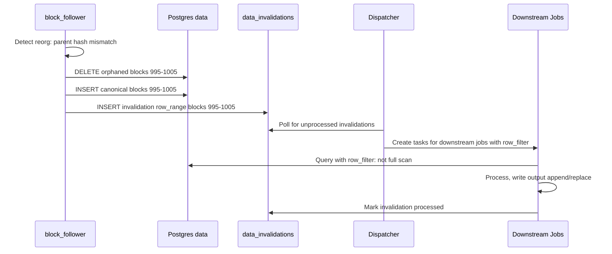
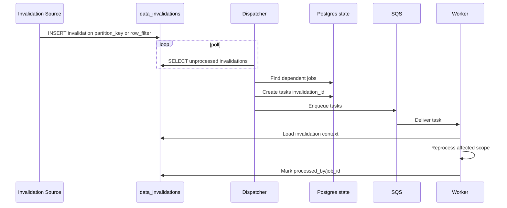

# Data Versioning and Incremental Processing

How the system tracks data changes, handles reorgs, and efficiently reprocesses only what's needed.

## Overview

**Delivery semantics:** Tasks and upstream events are **at-least-once**. The platform uses leasing to prevent concurrent execution, and uses `update_strategy` plus `unique_key` (for append) to achieve an exactly-once *effect* for datasets. See [task_lifecycle.md](task_lifecycle.md).

Reactive jobs trigger on upstream output events. Events include `dataset_uuid` + `dataset_version` plus scope (`cursor` or `partition_key`). Duplicates and out-of-order delivery are expected; the Dispatcher dedupes task creation and operators must be idempotent.

**Dataset generations:** Each published dataset has a stable `dataset_uuid`. Deploy/rematerialize creates a new `dataset_version` (a generation) so the platform can build new outputs in parallel and then swap “current” pointers atomically (cutover/rollback). See [ADR 0009](adr/0009-atomic-cutover-and-query-pinning.md).

Within a single `dataset_version`, the platform still does incremental updates (new partitions/rows) over time. Query pinning ensures reads are not a “moving target” mid-query even while new data arrives.

**Chain identity:** For onchain datasets, `block_hash` is the stable identifier. `block_number` is an ordering/partitioning field and may be reused during reorgs. Hot datasets like `hot_blocks` are therefore mutable: the platform reconciles reorgs by rewriting the affected block-number range and emitting a `data_invalidations` record (scoped to the affected `dataset_version`) so downstream jobs can rematerialize impacted outputs.

The system supports two granularities of change tracking:

| Level | Use Case | Storage Type |
|-------|----------|--------------|
| **Partition** | Cold storage (S3 Parquet), batch jobs | Partitioned by block range |
| **Row/Cursor** | Hot storage (Postgres data), incremental jobs | Unpartitioned tables |

Both levels coexist. Jobs declare which mode they use.

---

## Dataset Versions (Generations)

`dataset_version` is an opaque UUID that identifies a version-addressed location for a dataset’s outputs (a “generation”).

It changes on deploy/rematerialize cutovers (definition changes), not on every incremental write.

Postgres data-backed datasets are **live** in v1 (stable table/view names). Repair/rollback is handled via reprocessing/backfill or explicit reset (`bootstrap.reset_outputs`), rather than retaining historical physical tables per `dataset_version`.

Committed dataset versions are retained until an admin explicitly purges them (v1: manual GC). See [ADR 0009](adr/0009-atomic-cutover-and-query-pinning.md).

### Partition Versions

Tracks per-partition materialization metadata within a given `dataset_version`.

For Cryo-style Parquet layouts, the range should remain visible in the object key / filename (e.g., `blocks_{start}_{end}.parquet`), even if the dataset prefix is UUID/version-addressed.

### Dataset Cursors

Tracks high-water marks for cursor-based incremental jobs (scoped to a `dataset_version`).

### Data Invalidations

Records when data needs reprocessing (reorgs, corrections, manual fixes).

---

## Incremental Modes

Reactive jobs declare their incremental mode via `execution_strategy` in the DAG YAML:

- `PerPartition` — partition-key events (cold/batch)
- `PerUpdate` — cursor or row-range events (hot/incremental)

Operator-specific details (e.g., cursor column, range size) live in the operator `config`.


### Mode: `partition` (`execution_strategy: PerPartition`)

For jobs operating on partitioned data (typically cold storage).

**Behavior:**
1. After output commit, Dispatcher emits an event `{dataset_uuid, dataset_version, partition_key}` (at-least-once).
2. Dispatcher creates a downstream task pinned to the triggering `dataset_version`.
3. Job reads the input partition and writes the output partition (replace).
4. Dispatcher records the materialization in `partition_versions` when it accepts task completion.

**On invalidation:**
1. Invalidation created with `scope: partition`
2. Dispatcher detects unprocessed invalidation
3. Job re-runs for that partition
4. Output partition is replaced entirely

### Mode: `cursor` (`execution_strategy: PerUpdate`)

For jobs operating on unpartitioned data (typically hot storage).

**Behavior:**
1. Dispatcher resolves the pinned input `dataset_version` for the task and reads the consumer cursor from `dataset_cursors`.
2. Job queries incrementally (e.g., `WHERE block_number > last_cursor`).
3. Job writes output (append or replace depending on strategy).
4. Dispatcher advances `dataset_cursors.cursor_value` when it accepts task completion.

**On invalidation:**
1. Invalidation created with `scope: row_range` and `row_filter`
2. Dispatcher creates task with invalidation context
3. Job queries using `row_filter` (not full table scan)
4. Job processes affected rows
5. Invalidation marked processed for this job

### Mode: `full`

For jobs that must recompute everything (rare).

**Behavior:**
- Always reads entire input dataset
- Always replaces entire output
- No cursor or partition tracking

---

## Update Strategies

How jobs write their output:

| Strategy | Behavior | Use Case |
|----------|----------|----------|
| `replace` | Overwrite a materialized scope (partition/range) | Compaction, rollups, derived views |
| `append` | Append immutable facts, dedupe by `unique_key` | Event logs, audit trails |

### Replace Output Commit Protocol (S3 / Parquet)

`update_strategy: replace` must be crash-safe and tolerate retries. The platform separates **write** from **commit**:

1. **Write (worker)**: write Parquet objects to a unique, attempt-scoped **staging prefix** (includes `task_id` + `attempt`).
2. **Finalize (worker)**: write a small `_manifest.json` and a `_SUCCESS` marker under the same prefix.
3. **Commit (Dispatcher)**: on `/internal/task-complete`, verify the marker/manifest exists and atomically update scope metadata (e.g., `partition_versions`) for `(dataset_uuid, dataset_version, partition_key)` to point at the staging prefix.
   - Commit is **attempt-fenced**: if the completion is rejected as stale (non-current attempt), no dataset pointers are updated.
4. **Emit (Dispatcher)**: only after commit, emit the upstream event `{dataset_uuid, dataset_version, partition_key}`.

This avoids S3 “renames” (copy+delete) and avoids rewriting data: Parquet files are written once; commit is metadata.

Uncommitted staging prefixes (non-committed attempt artifacts) may be cleaned up to control cost; this cleanup MUST NOT remove committed outputs. The TTL is an implementation detail.

### Replace and Downstream Invalidations

If a job uses `update_strategy: replace` and rewrites a scope/range, it must emit a downstream invalidation for that same scope/range so dependent jobs recompute (invalidations cascade transitively through the DAG).

### Append Means “Don’t Delete”

If a job uses `update_strategy: append`, it never deletes prior rows. Reprocessing may introduce new rows for the same historical range, but old rows can remain as auditable history/orphans. If you need retractions/corrections, use `replace` (or introduce explicit tombstones as a future extension).

### Append with Deduplication

For `update_strategy: append`, the job **must** declare a `unique_key`. DAG validation rejects `append` without `unique_key`.

```sql
INSERT INTO alert_events (org_id, dedupe_key, ...)
VALUES (...)
ON CONFLICT (org_id, dedupe_key) DO NOTHING;
```

This ensures:
- Reprocessing the same data doesn't create duplicate alerts
- Reorgs with same tx in new block → new alert (different `block_hash`)
- Same tx in same block reprocessed → no duplicate (same key)

### Unique Key Requirements

For `update_strategy: append`, `unique_key` must be **deterministic** from input data and stable configuration. Avoid timestamps and runtime-generated values.

Good examples (often combined):
- Input identity: `block_hash`, `tx_hash`, `log_index`, `record_id`, `external_id`
- Stable config identity: `alert_definition_id`, `producer_job_id`

Avoid: `created_at`, `processed_at`, `now()`, `random()`, and other per-execution values.

> **Note:** platform-level idempotency uses `task_id` + `attempt` gating, but dataset-level `unique_key` should not depend on task execution identity unless the dataset is explicitly a run log.

---

## Reorg Handling

### Flow



### Invalidation Record

When `block_follower` detects a reorg:

```sql
INSERT INTO data_invalidations (dataset_uuid, dataset_version, scope, row_filter, reason, source_event)
VALUES (
    'uuid', -- dataset_uuid for hot_blocks
    'uuid', -- dataset_version for hot_blocks (current generation)
    'row_range',
    '{"block_number": {"gte": 995, "lte": 1005}}',
    'reorg',
    '{"old_tip": "0xabc...", "new_tip": "0xdef...", "fork_block": 994}'
);
```

### Downstream Behavior by Job Type

| Job | Mode | On Reorg |
|-----|------|----------|
| `alert_evaluate` | cursor + append | Re-evaluate blocks 995-1005; new alerts inserted (dedupe by block_hash) |
| `enrich_transfers` | cursor + replace | Re-enrich affected rows; output updated |
| `parquet_compact` | partition | No impact (only compacts finalized blocks past reorg window) |

---

## Staleness, Invalidations, and Definition Changes

### What Causes Reprocessing?

| Trigger | Detection | How It Runs |
|---------|-----------|------------|
| **Data stale** | New input partition/rows since last run | Upstream event |
| **Invalidation** | `data_invalidations` record | Dispatcher schedules scoped reprocessing |
| **Definition change** | New `dag_version` → new `dataset_version` | Deploy/rematerialize + atomic cutover (see [dag_deployment.md](dag_deployment.md) and [ADR 0009](adr/0009-atomic-cutover-and-query-pinning.md)) |
| **Manual repair/backfill** | User/API initiated | Explicit backfill tasks (typically `replace`) |

### Provenance: `config_hash` and `schema_hash`

Even though definition changes create new `dataset_version`s, it’s still useful to record what produced a given partition/cursor advancement:

```sql
-- On partition materialization, upsert the partition metadata for this dataset_version.
UPDATE partition_versions
SET materialized_at = now(), config_hash = $config_hash, schema_hash = $schema_hash
WHERE dataset_uuid = $dataset_uuid AND dataset_version = $dataset_version AND partition_key = $partition_key;
```

### Backfill API (Repair)

Backfill is an explicit repair mechanism (e.g., recompute specific partitions/ranges). It is not the primary mechanism for deploy/rematerialize cutovers.

```
POST /v1/backfill
{
  "job": "enrich_transfers",
  "dataset_version": "uuid",                // optional; defaults to current
  "partitions": ["2024-01-01", "2024-01-02"],  // or "all"
  "reason": "repair"
}
```

---

## Alert Deduplication

Alerts use `update_strategy: append` with a deterministic `unique_key` so reprocessing doesn't re-fire alerts while still behaving correctly across reorgs.

See [alerting.md](../features/alerting.md#deduplication) for the dedupe schema and behavior matrix.

---

## Dispatcher Integration

The Dispatcher watches for:

1. **Upstream events** → route to dependent jobs based on DAG
2. **Unprocessed invalidations** → create tasks with invalidation context
3. **Manual sources** → create tasks via API

### Upstream Events (New Rows Exist)

When a task materializes an output, it reports completion to the Dispatcher with `outputs` describing what was written (including the changed scope: `cursor` or `partition_key`). The Dispatcher then:

1. **Commits** the output for the pinned `{dataset_uuid, dataset_version}` (updates `partition_versions` or advances `dataset_cursors`).
2. **Emits** an upstream event `{dataset_uuid, dataset_version, cursor|partition_key}` after commit.

Events are **wake-ups**, not authoritative payloads: duplicates and out-of-order delivery are expected.

- For cursor-based jobs, missed events are harmless because consumers query `WHERE cursor_column > last_cursor` (from `dataset_cursors`), not `WHERE cursor_column = event_cursor`.
- For partition-based jobs, events may be dropped; the Dispatcher must periodically reconcile upstream partitions vs downstream materializations to schedule any missing partitions.

See [event_flow.md](event_flow.md) for the end-to-end sequence.

### Invalidation Handling

Jobs declare their input edges in the DAG. When an invalidation is created for a dataset (scoped to a specific `dataset_version`), the Dispatcher:

1. Finds all jobs that directly depend on the invalidated dataset
2. Creates tasks with `invalidation_id` in context
3. Jobs receive `row_filter` from the invalidation record
4. Jobs process only affected rows
5. Jobs mark invalidation as processed (appends job_id to `processed_by`)

Because `replace` rewrites emit downstream invalidations for the rewritten scope/range, invalidations effectively cascade transitively through the DAG: downstream jobs don’t need awareness of “3 levels upstream” causes.



---

## Summary

| Concern | Solution |
|---------|----------|
| Deploy/rematerialize | `dataset_versions` + atomic cutover/rollback (ADR 0009) |
| Cold storage (S3) | Partition-level tracking (`partition_versions`) within a `dataset_version` |
| Hot storage (Postgres data) | Cursor-based high-water mark (`dataset_cursors`) within a `dataset_version` |
| Reorg handling | Row-range invalidations, scoped reprocessing |
| Alert deduplication | `append` + deterministic `unique_key` (see [alerting.md](../features/alerting.md#deduplication)) |
| Definition changes | New `dataset_version` generation; optional manual repair backfills |
| Efficiency | Never full-table scan; use partition or row_filter |
