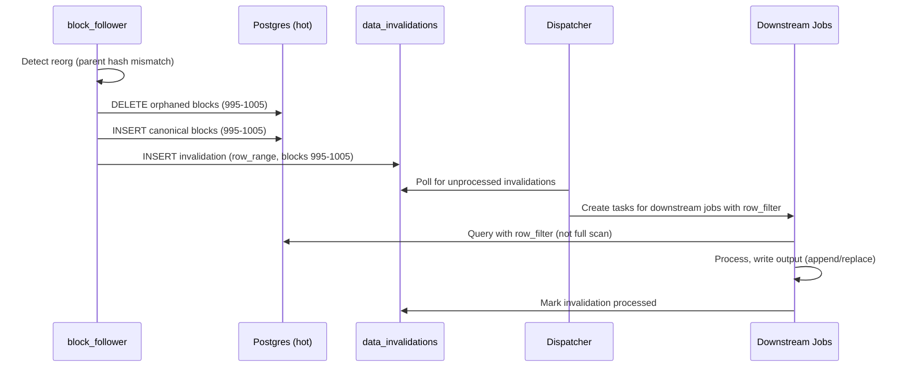
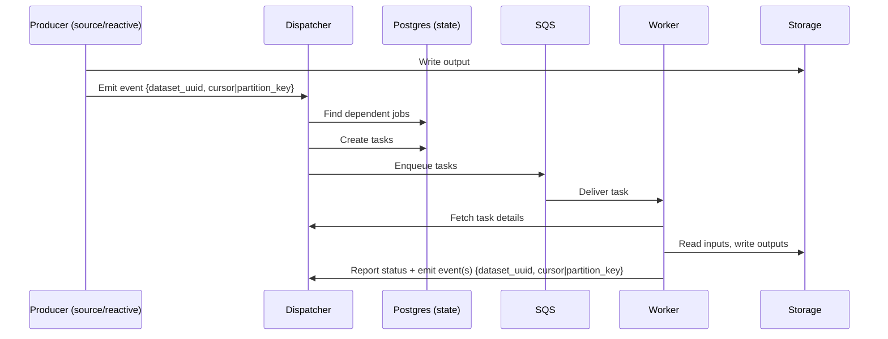
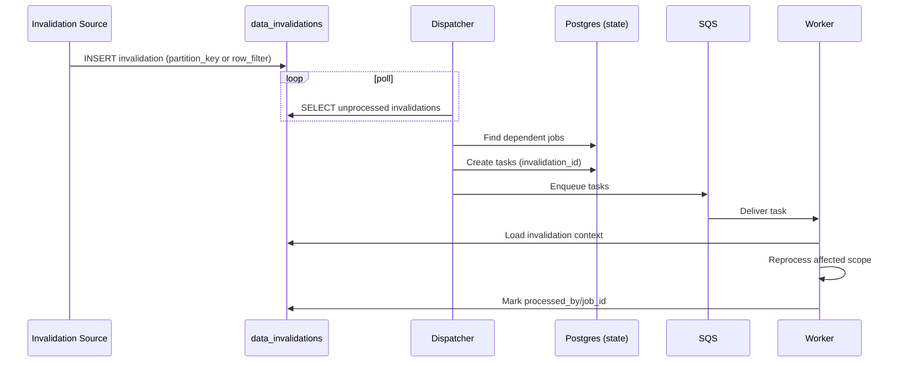

# Data Versioning and Incremental Processing

How the system tracks data changes, handles reorgs, and efficiently reprocesses only what's needed.

## Overview

**Delivery semantics:** Tasks may be delivered more than once (at-least-once via SQS). Idempotency is achieved through `update_strategy`: `replace` overwrites the scope; `append` dedupes via `unique_key`. The combination provides exactly-once *effect*.

**Dataset generations:** Each published dataset has a stable `dataset_uuid`. Deploy/rematerialize creates a new `dataset_version` (a generation) so the platform can build new outputs in parallel and then swap “current” pointers atomically (cutover/rollback). See [ADR 0009](adr/0009-atomic-cutover-and-query-pinning.md).

Within a single `dataset_version`, the platform still does incremental updates (new partitions/rows) over time. Query pinning ensures reads are not a “moving target” mid-query even while new data arrives.

**Chain identity:** For onchain datasets, `block_hash` is the stable identifier. `block_number` is an ordering/partitioning field and may be reused during reorgs. Hot datasets like `hot_blocks` are therefore mutable: the platform reconciles reorgs by rewriting the affected block-number range and emitting a `data_invalidations` record (scoped to the affected `dataset_version`) so downstream jobs can rematerialize impacted outputs.

The system supports two granularities of change tracking:

| Level | Use Case | Storage Type |
|-------|----------|--------------|
| **Partition** | Cold storage (S3 Parquet), batch jobs | Partitioned by block range |
| **Row/Cursor** | Hot storage (Postgres), incremental jobs | Unpartitioned tables |

Both levels coexist. Jobs declare which mode they use.

---

## Data Model

### Dataset Versions (Generations)

`dataset_version` is an opaque UUID that identifies a version-addressed location for a dataset’s outputs (a “generation”).

It changes on deploy/rematerialize cutovers (definition changes), not on every incremental write.

Old `dataset_version`s are retained until an admin explicitly purges them (no automatic GC in v1) to support fast rollback.

```sql
CREATE TABLE dataset_versions (
    id UUID PRIMARY KEY DEFAULT gen_random_uuid(), -- dataset_version
    dataset_uuid UUID NOT NULL REFERENCES datasets(id),
    created_at TIMESTAMPTZ DEFAULT now(),
    storage_location TEXT NOT NULL,                -- version-addressed location (S3 prefix or Postgres physical table)
    config_hash TEXT,                              -- producing job/DAG definition hash (materialization-affecting)
    schema_hash TEXT
);
```

### Partition Versions

Tracks per-partition materialization metadata within a given `dataset_version`.

```sql
CREATE TABLE partition_versions (
    dataset_uuid UUID NOT NULL REFERENCES datasets(id),
    dataset_version UUID NOT NULL REFERENCES dataset_versions(id),
    partition_key TEXT NOT NULL,      -- e.g., "1000000-1010000" (block ranges are inclusive)
    materialized_at TIMESTAMPTZ NOT NULL DEFAULT now(),
    config_hash TEXT,                 -- job config at time of materialization
    schema_hash TEXT,                 -- data shape (columns, types)
    location TEXT,                    -- s3://bucket/path or postgres table
    row_count BIGINT,
    bytes BIGINT,
    PRIMARY KEY (dataset_uuid, dataset_version, partition_key)
);
```

For Cryo-style Parquet layouts, the range should remain visible in the object key / filename (e.g., `blocks_{start}_{end}.parquet`), even if the dataset prefix is UUID/version-addressed.

### Dataset Cursors

Tracks high-water marks for cursor-based incremental jobs (scoped to a `dataset_version`).

```sql
CREATE TABLE dataset_cursors (
    dataset_uuid UUID NOT NULL REFERENCES datasets(id),
    dataset_version UUID NOT NULL REFERENCES dataset_versions(id),
    job_id UUID NOT NULL REFERENCES jobs(id),
    cursor_column TEXT NOT NULL,      -- e.g., "block_number"
    cursor_value TEXT NOT NULL,       -- e.g., "1005000" (stored as text for flexibility)
    updated_at TIMESTAMPTZ DEFAULT now(),
    PRIMARY KEY (dataset_uuid, dataset_version, job_id)
);
```

### Data Invalidations

Records when data needs reprocessing (reorgs, corrections, manual fixes).

```sql
CREATE TABLE data_invalidations (
    id UUID PRIMARY KEY DEFAULT gen_random_uuid(),
    dataset_uuid UUID NOT NULL REFERENCES datasets(id),
    dataset_version UUID NOT NULL REFERENCES dataset_versions(id),
    scope TEXT NOT NULL,              -- 'partition' | 'row_range'
    partition_key TEXT,               -- for scope='partition'
    row_filter JSONB,                 -- for scope='row_range', e.g., {"block_number": {"gte": 995, "lte": 1005}}
    reason TEXT NOT NULL,             -- 'reorg' | 'correction' | 'manual' | 'schema_change'
    source_event JSONB,               -- details (e.g., reorg info: old_tip, new_tip, fork_block)
    created_at TIMESTAMPTZ DEFAULT now(),
    processed_by UUID[],              -- job_ids that have processed this invalidation
    processed_at TIMESTAMPTZ
);

CREATE INDEX idx_invalidations_dataset ON data_invalidations(dataset_uuid, dataset_version) WHERE processed_at IS NULL;
```

---

## Incremental Modes

Jobs declare their incremental mode in YAML config:

```yaml
- name: alert_evaluate
  incremental:
    mode: cursor
    cursor_column: block_number
    unique_key: [alert_def_id, block_hash, tx_hash]
  update_strategy: append

- name: parquet_compact
  incremental:
    mode: partition
  update_strategy: replace
```

### Mode: `partition`

For jobs operating on partitioned data (typically cold storage).

**Behavior:**
1. Trigger fires with `partition_key` (e.g., `"1000000-1010000"`; block ranges are inclusive)
2. Job reads entire partition from input dataset
3. Job writes output partition
4. System updates `partition_versions.materialized_at` for the current `dataset_version`

**On invalidation:**
1. Invalidation created with `scope: partition`
2. Dispatcher detects unprocessed invalidation
3. Job re-runs for that partition
4. Output partition is replaced entirely

### Mode: `cursor`

For jobs operating on unpartitioned data (typically hot storage).

**Behavior:**
1. Job reads `cursor_value` from `dataset_cursors` (e.g., block 1000)
2. Job queries: `WHERE block_number > 1000`
3. Job processes new rows, writes output
4. Job updates `cursor_value` to max processed (e.g., block 1050)

**On invalidation:**
1. Invalidation created with `scope: row_range` and `row_filter`
2. Dispatcher creates task with invalidation context
3. Job queries using `row_filter` (not full table scan)
4. Job processes affected rows
5. Invalidation marked processed for this job

### Mode: `full`

For jobs that must recompute everything (rare).

**Behavior:**
- Always reads entire input dataset
- Always replaces entire output
- No cursor or partition tracking

---

## Update Strategies

How jobs write their output:

| Strategy | Behavior | Use Case |
|----------|----------|----------|
| `replace` | Overwrite a materialized scope (partition/range) | Compaction, rollups, derived views |
| `append` | Append immutable facts, dedupe by `unique_key` | Event logs, audit trails |

### Replace and Downstream Invalidations

If a job uses `update_strategy: replace` and rewrites a scope/range, it must emit a downstream invalidation for that same scope/range so dependent jobs recompute (invalidations cascade transitively through the DAG).

### Append Means “Don’t Delete”

If a job uses `update_strategy: append`, it never deletes prior rows. Reprocessing may introduce new rows for the same historical range, but old rows can remain as auditable history/orphans. If you need retractions/corrections, use `replace` (or introduce explicit tombstones as a future extension).

### Append with Deduplication

For `update_strategy: append`, the job **must** declare a `unique_key`. DAG validation rejects `append` without `unique_key`.

```sql
INSERT INTO alert_events (org_id, dedupe_key, ...)
VALUES (...)
ON CONFLICT (org_id, dedupe_key) DO NOTHING;
```

This ensures:
- Reprocessing the same data doesn't create duplicate alerts
- Reorgs with same tx in new block → new alert (different `block_hash`)
- Same tx in same block reprocessed → no duplicate (same key)

### Unique Key Requirements

`unique_key` must be **deterministic** — derived solely from input data, never execution context.

**Valid unique_key columns** (examples):
- Input data fields: `block_hash`, `tx_hash`, `log_index`, `record_id`, `external_id`
- Config references: `alert_definition_id`, `job_id`
- Any field that comes from the input dataset or job config

**Invalid unique_key columns (will cause duplicates on retry):**
- `created_at`, `processed_at` — different timestamp per attempt
- `task_id`, `worker_id` — different per execution
- `now()`, `random()` — non-deterministic functions
- Any value generated at execution time

---

## Reorg Handling

### Flow



### Invalidation Record

When `block_follower` detects a reorg:

```sql
INSERT INTO data_invalidations (dataset_uuid, dataset_version, scope, row_filter, reason, source_event)
VALUES (
    'uuid', -- dataset_uuid for hot_blocks
    'uuid', -- dataset_version for hot_blocks (current generation)
    'row_range',
    '{"block_number": {"gte": 995, "lte": 1005}}',
    'reorg',
    '{"old_tip": "0xabc...", "new_tip": "0xdef...", "fork_block": 994}'
);
```

### Downstream Behavior by Job Type

| Job | Mode | On Reorg |
|-----|------|----------|
| `alert_evaluate` | cursor + append | Re-evaluate blocks 995-1005; new alerts inserted (dedupe by block_hash) |
| `enrich_transfers` | cursor + replace | Re-enrich affected rows; output updated |
| `parquet_compact` | partition | No impact (only compacts finalized blocks past reorg window) |

---

## Staleness, Invalidations, and Definition Changes

### What Causes Reprocessing?

| Trigger | Detection | How It Runs |
|---------|-----------|------------|
| **Data stale** | New input partition/rows since last run | Upstream event |
| **Invalidation** | `data_invalidations` record | Dispatcher schedules scoped reprocessing |
| **Definition change** | New `dag_version` → new `dataset_version` | Deploy/rematerialize + atomic cutover (see [dag_deployment.md](dag_deployment.md) and [ADR 0009](adr/0009-atomic-cutover-and-query-pinning.md)) |
| **Manual repair/backfill** | User/API initiated | Explicit backfill tasks (typically `replace`) |

### Provenance: `config_hash` and `schema_hash`

Even though definition changes create new `dataset_version`s, it’s still useful to record what produced a given partition/cursor advancement:

```sql
-- On partition materialization, upsert the partition metadata for this dataset_version.
UPDATE partition_versions
SET materialized_at = now(), config_hash = $config_hash, schema_hash = $schema_hash
WHERE dataset_uuid = $dataset_uuid AND dataset_version = $dataset_version AND partition_key = $partition_key;
```

### Backfill API (Repair)

Backfill is an explicit repair mechanism (e.g., recompute specific partitions/ranges). It is not the primary mechanism for deploy/rematerialize cutovers.

```
POST /v1/backfill
{
  "job": "enrich_transfers",
  "dataset_version": "uuid",                // optional; defaults to current
  "partitions": ["2024-01-01", "2024-01-02"],  // or "all"
  "reason": "repair"
}
```

---

## Alert Deduplication

Alerts use `update_strategy: append` with a deterministic `unique_key` so reprocessing doesn't re-fire alerts while still behaving correctly across reorgs.

See [alerting.md](../capabilities/alerting.md#deduplication) for the dedupe schema and behavior matrix.

---

## Dispatcher Integration

The Dispatcher watches for:

1. **Upstream events** → route to dependent jobs based on DAG
2. **Unprocessed invalidations** → create tasks with invalidation context
3. **Manual sources** → create tasks via API

### Upstream Events ("New Rows Exist")

When a job writes to one of its outputs, it emits an upstream event `{dataset_uuid, cursor|partition_key}` to the Dispatcher (one event per output). The Dispatcher routes the event to dependent jobs (those whose input edges reference that `dataset_uuid`) and enqueues tasks.

Upstream events are best-effort push. For cursor-based jobs, if an event is missed, the next event catches the job up because it queries `WHERE cursor_column > last_cursor` (from `dataset_cursors`), not `WHERE cursor_column = event_cursor`.



### Invalidation Handling

Jobs declare their input edges in the DAG. When an invalidation is created for a dataset (scoped to a specific `dataset_version`), the Dispatcher:

1. Finds all jobs that directly depend on the invalidated dataset
2. Creates tasks with `invalidation_id` in context
3. Jobs receive `row_filter` from the invalidation record
4. Jobs process only affected rows
5. Jobs mark invalidation as processed (appends job_id to `processed_by`)

Because `replace` rewrites emit downstream invalidations for the rewritten scope/range, invalidations effectively cascade transitively through the DAG: downstream jobs don’t need awareness of “3 levels upstream” causes.



---

## Summary

| Concern | Solution |
|---------|----------|
| Deploy/rematerialize | `dataset_versions` + atomic cutover/rollback (ADR 0009) |
| Cold storage (S3) | Partition-level tracking (`partition_versions`) within a `dataset_version` |
| Hot storage (Postgres) | Cursor-based high-water mark (`dataset_cursors`) within a `dataset_version` |
| Reorg handling | Row-range invalidations, scoped reprocessing |
| Alert deduplication | `append` + deterministic `unique_key` (see [alerting.md](../capabilities/alerting.md#deduplication)) |
| Definition changes | New `dataset_version` generation; optional manual repair backfills |
| Efficiency | Never full-table scan; use partition or row_filter |
