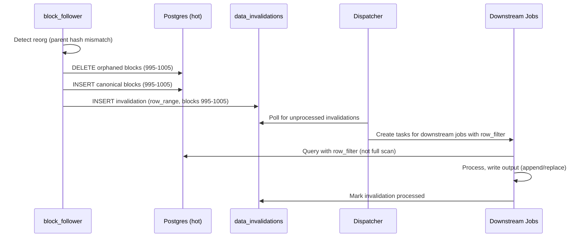

# Data Versioning and Incremental Processing

How the system tracks data changes, handles reorgs, and efficiently reprocesses only what's needed.

## Overview

The system supports two granularities of change tracking:

| Level | Use Case | Storage Type |
|-------|----------|--------------|
| **Partition** | Cold storage (S3 Parquet), batch jobs | Partitioned by block range |
| **Row/Cursor** | Hot storage (Postgres), incremental jobs | Unpartitioned tables |

Both levels coexist. Jobs declare which mode they use.

---

## Data Model

### Partition Versions

Tracks the version (last materialization time) and config hash for each partition.

```sql
CREATE TABLE partition_versions (
    dataset TEXT NOT NULL,
    partition_key TEXT NOT NULL,      -- e.g., "1000000-1010000"
    version TIMESTAMPTZ NOT NULL DEFAULT now(),
    config_hash TEXT,                 -- job config at time of materialization
    schema_hash TEXT,                 -- data shape (columns, types)
    location TEXT,                    -- s3://bucket/path or postgres table
    row_count BIGINT,
    bytes BIGINT,
    PRIMARY KEY (dataset, partition_key)
);
```

### Dataset Cursors

Tracks high-water marks for cursor-based incremental jobs.

```sql
CREATE TABLE dataset_cursors (
    dataset TEXT NOT NULL,
    job_id UUID NOT NULL,
    cursor_column TEXT NOT NULL,      -- e.g., "block_number"
    cursor_value TEXT NOT NULL,       -- e.g., "1005000" (stored as text for flexibility)
    updated_at TIMESTAMPTZ DEFAULT now(),
    PRIMARY KEY (dataset, job_id)
);
```

### Data Invalidations

Records when data needs reprocessing (reorgs, corrections, manual fixes).

```sql
CREATE TABLE data_invalidations (
    id UUID PRIMARY KEY DEFAULT gen_random_uuid(),
    dataset TEXT NOT NULL,
    scope TEXT NOT NULL,              -- 'partition' | 'row_range'
    partition_key TEXT,               -- for scope='partition'
    row_filter JSONB,                 -- for scope='row_range', e.g., {"block_number": {"gte": 995, "lte": 1005}}
    reason TEXT NOT NULL,             -- 'reorg' | 'correction' | 'manual' | 'schema_change'
    source_event JSONB,               -- details (e.g., reorg info: old_tip, new_tip, fork_block)
    created_at TIMESTAMPTZ DEFAULT now(),
    processed_by UUID[],              -- job_ids that have processed this invalidation
    processed_at TIMESTAMPTZ
);

CREATE INDEX idx_invalidations_dataset ON data_invalidations(dataset) WHERE processed_at IS NULL;
```

---

## Incremental Modes

Jobs declare their incremental mode in YAML config:

```yaml
- name: alert_evaluate
  incremental:
    mode: cursor
    cursor_column: block_number
    unique_key: [alert_def_id, block_hash, tx_hash]
  update_strategy: append

- name: parquet_compact
  incremental:
    mode: partition
  update_strategy: replace
```

### Mode: `partition`

For jobs operating on partitioned data (typically cold storage).

**Behavior:**
1. Trigger fires with `partition_key` (e.g., `"1000000-1010000"`)
2. Job reads entire partition from input dataset
3. Job writes output partition
4. System updates `partition_versions` with new version timestamp

**On invalidation:**
1. Invalidation created with `scope: partition`
2. Dispatcher detects unprocessed invalidation
3. Job re-runs for that partition
4. Output partition is replaced entirely

### Mode: `cursor`

For jobs operating on unpartitioned data (typically hot storage).

**Behavior:**
1. Job reads `cursor_value` from `dataset_cursors` (e.g., block 1000)
2. Job queries: `WHERE block_number > 1000`
3. Job processes new rows, writes output
4. Job updates `cursor_value` to max processed (e.g., block 1050)

**On invalidation:**
1. Invalidation created with `scope: row_range` and `row_filter`
2. Dispatcher creates task with invalidation context
3. Job queries using `row_filter` (not full table scan)
4. Job processes affected rows
5. Invalidation marked processed for this job

### Mode: `full`

For jobs that must recompute everything (rare).

**Behavior:**
- Always reads entire input dataset
- Always replaces entire output
- No cursor or partition tracking

---

## Update Strategies

How jobs write their output:

| Strategy | Behavior | Use Case |
|----------|----------|----------|
| `replace` | Delete existing output for scope, write new | Aggregations, compaction |
| `append` | Insert new rows, dedupe by `unique_key` | Alerts, event logs |

### Append with Deduplication

For `update_strategy: append`, the system uses `unique_key` to prevent duplicates:

```sql
INSERT INTO alert_events (alert_definition_id, block_hash, tx_hash, ...)
VALUES (...)
ON CONFLICT (alert_definition_id, block_hash, tx_hash) DO NOTHING;
```

This ensures:
- Reprocessing the same data doesn't create duplicate alerts
- Reorgs with same tx in new block → new alert (different `block_hash`)
- Same tx in same block reprocessed → no duplicate (same key)

---

## Reorg Handling

### Flow



### Invalidation Record

When `block_follower` detects a reorg:

```sql
INSERT INTO data_invalidations (dataset, scope, row_filter, reason, source_event)
VALUES (
    'hot_blocks',
    'row_range',
    '{"block_number": {"gte": 995, "lte": 1005}}',
    'reorg',
    '{"old_tip": "0xabc...", "new_tip": "0xdef...", "fork_block": 994}'
);
```

### Downstream Behavior by Job Type

| Job | Mode | On Reorg |
|-----|------|----------|
| `alert_evaluate` | cursor + append | Re-evaluate blocks 995-1005; new alerts inserted (dedupe by block_hash) |
| `enrich_transfers` | cursor + replace | Re-enrich affected rows; output updated |
| `parquet_compact` | partition | No impact (only compacts finalized blocks past reorg window) |

---

## Staleness and Code Changes

### What Makes Data Stale?

| Staleness Type | Detection | Auto-Rerun? |
|----------------|-----------|-------------|
| **Data stale** | New input partition/rows since last run | Yes (upstream event) |
| **Invalidation** | `data_invalidations` record | Yes (Dispatcher) |
| **Config stale** | `config_hash` changed | No (mark stale, manual backfill) |

### Config Hash Tracking

Every job run records the `config_hash` (hash of job config at execution time).

```sql
-- On job completion, update partition version
UPDATE partition_versions
SET version = now(), config_hash = $new_config_hash
WHERE dataset = $dataset AND partition_key = $partition_key;
```

When config changes:
1. New jobs run with new `config_hash`
2. Old partitions have old `config_hash`
3. System can report: "partition X is stale (config changed)"
4. User initiates a manual backfill

### Backfill API

```
POST /v1/backfill
{
  "job": "enrich_transfers",
  "partitions": ["2024-01-01", "2024-01-02"],  // or "all"
  "reason": "config_change"
}
```

Creates tasks for each partition; runs replace entire output.

---

## Alert Deduplication

Alerts require special handling to prevent re-firing on reprocessing.

### Dedupe Key

```sql
CREATE TABLE alert_events (
    id UUID PRIMARY KEY DEFAULT gen_random_uuid(),
    alert_definition_id UUID NOT NULL,
    block_hash TEXT NOT NULL,         -- chain-specific, changes on reorg
    tx_hash TEXT,                     -- nullable for block-level alerts
    block_number BIGINT NOT NULL,     -- for display, not dedupe
    triggered_at TIMESTAMPTZ DEFAULT now(),
    delivered_at TIMESTAMPTZ,
    delivery_status TEXT,
    UNIQUE (alert_definition_id, block_hash, tx_hash)
);
```

### Behavior Matrix

| Scenario | block_hash | tx_hash | Result |
|----------|------------|---------|--------|
| Normal processing | 0xabc | 0x123 | Alert created, delivered |
| Reprocess same block | 0xabc | 0x123 | Dedupe → no new alert |
| Reorg, same tx in new block | 0xdef | 0x123 | New alert (different block_hash) |
| Reorg, tx dropped | N/A | N/A | No alert (tx not in canonical chain) |

### Append-Only Guarantee

The `alert_events` table is **append-only**:
- Never delete alerts (audit trail)
- Never update alerts (immutable record)
- Orphaned alerts (from reorged blocks) remain but can be flagged via join with canonical chain

---

## Job Configuration Reference

```yaml
jobs:
  - name: block_follower
    # Source, no incremental config (always at tip)
    output_dataset: hot_blocks

  - name: alert_evaluate
    incremental:
      mode: cursor
      cursor_column: block_number
      unique_key: [alert_definition_id, block_hash, tx_hash]
    update_strategy: append
    input_datasets: [hot_blocks]
    output_dataset: alert_events

  - name: enrich_transfers
    incremental:
      mode: cursor
      cursor_column: block_number
    update_strategy: replace          # replaces rows for affected block range
    input_datasets: [hot_blocks, hot_logs]
    output_dataset: enriched_transfers

  - name: parquet_compact
    incremental:
      mode: partition
    update_strategy: replace
    input_datasets: [hot_blocks]
    output_dataset: cold_blocks
    config:
      finality_threshold: 100         # only compact blocks older than tip - 100

  - name: daily_summary
    incremental:
      mode: partition
    update_strategy: replace
    input_datasets: [cold_blocks]
    output_dataset: daily_summaries
```

---

## Dispatcher Integration

The Dispatcher watches for:

1. **Upstream events** → route to dependent jobs based on DAG
2. **Unprocessed invalidations** → create tasks with invalidation context
3. **Manual sources** → create tasks via API

### Invalidation Handling

Jobs declare their input datasets in the DAG. When an invalidation is created for a dataset, the Dispatcher:

1. Finds all jobs that depend on the invalidated dataset
2. Creates tasks with `invalidation_id` in context
3. Jobs receive `row_filter` from the invalidation record
4. Jobs process only affected rows
5. Jobs mark invalidation as processed (appends job_id to `processed_by`)

---

## Summary

| Concern | Solution |
|---------|----------|
| Cold storage (S3) | Partition-level versioning |
| Hot storage (Postgres) | Cursor-based high-water mark |
| Reorg handling | Row-range invalidations, scoped reprocessing |
| Alert deduplication | Unique key on `(def_id, block_hash, tx_hash)`, append-only |
| Code changes | Config hash tracking, manual backfill |
| Efficiency | Never full-table scan; use partition or row_filter |
