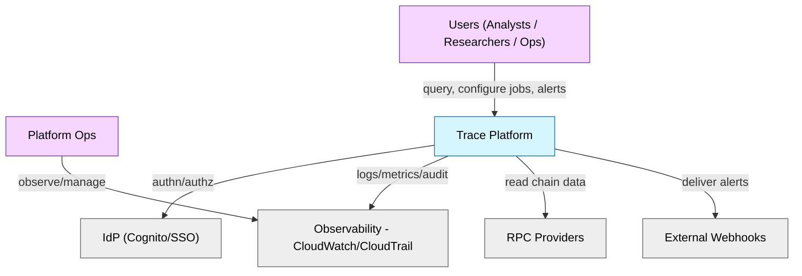
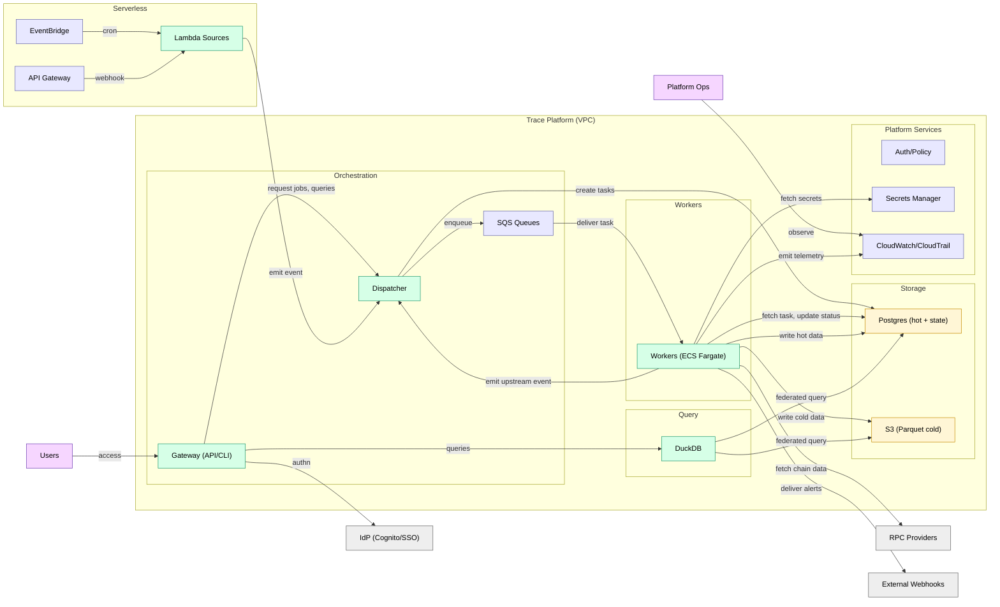
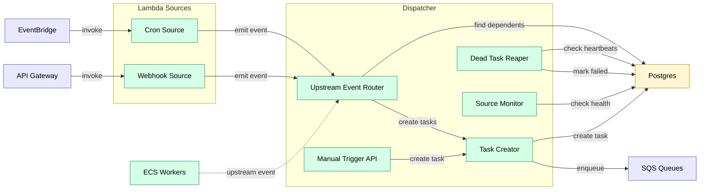
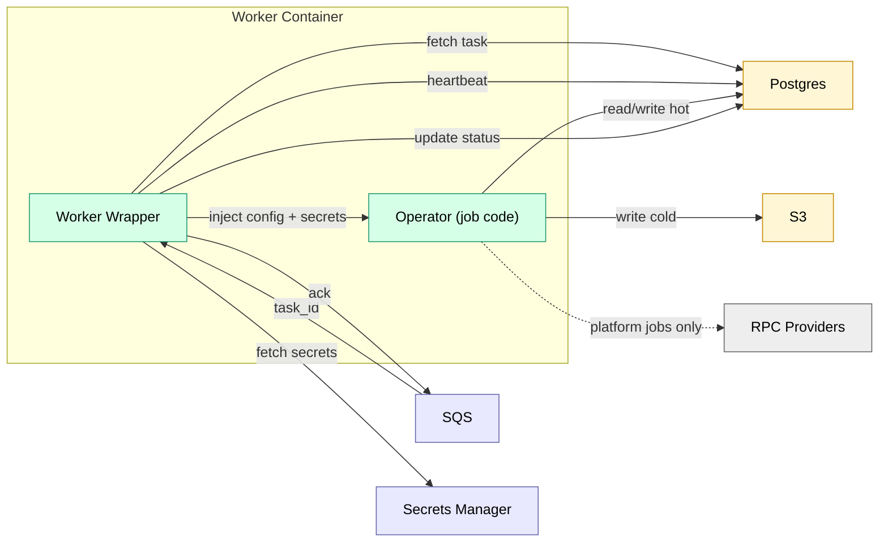
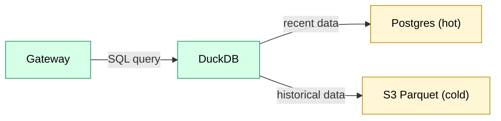

# C4 Diagrams (Mermaid)

## System Context

## Container View

## Component View: Orchestration

## Component View: Workers

## Component View: Query Service

## Operator Examples

Operators are job implementations. See [Operator Catalog](../operators/README.md).

| Operator | Trigger | Execution |
|----------|---------|----------|
| `block_follower` | `none` | — |
| `cryo_ingest` | `upstream` | PerPartition |
| `parquet_compact` | `upstream` | Bulk |
| `alert_evaluate_*` | `upstream` | PerUpdate |
| `alert_deliver` | `upstream` | PerUpdate |
| `duckdb_query` | `upstream` | Bulk |
