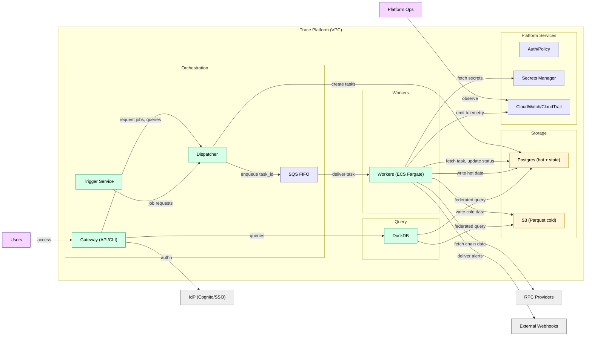
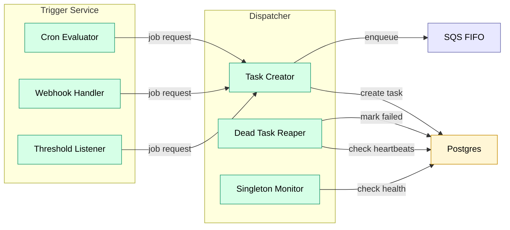

# C4 Diagrams (Mermaid)

## System Context

## Container View

## Component View: Orchestration

## Component View: Workers

## Component View: Query Service

## Operator Examples

Operators are job implementations. They are not fixed services—new operators can be added without changing the platform. See [Operator Catalog](../operators/README.md).

| Operator | Purpose | Execution |
|----------|---------|-----------|
| `cryo_ingest` | Backfill historical chain data | Bulk |
| `block_follower` | Follow chain tip, handle reorgs | Singleton |
| `parquet_compact` | Compact hot → cold | Bulk |
| `integrity_check` | Verify cold storage | Bulk |
| `alert_evaluate_*` | Evaluate alert conditions | PerPartition |
| `alert_deliver` | Send alert notifications | PerPartition |
| `duckdb_query` | Execute user queries | Bulk |
