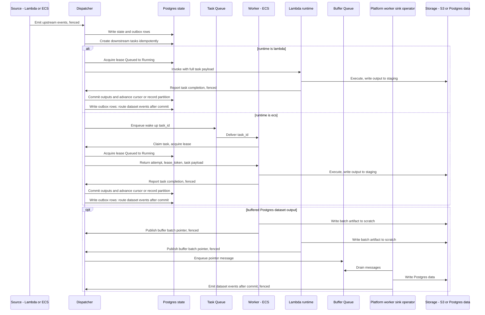

# Event Flow

Reactive execution is event-driven, but durability comes from Postgres state plus leasing.

This document is a sequence view only. Details live in:
- Task lifecycle and background loops: [task_lifecycle.md](task_lifecycle.md)
- Endpoint fencing and payload contracts: [contracts.md](contracts.md)
- Lambda invocation contract: [contracts/lambda_invocation.md](contracts/lambda_invocation.md)
- Output commit and dataset events: [data_versioning.md](data_versioning.md)

**Notes:**

- Dispatcher side effects (enqueue tasks, invoke Lambda, route events) are executed via the Postgres state outbox worker; the diagram shows the logical effects.
- Queue semantics, leases, retries, and recovery behavior are defined in [task_lifecycle.md](task_lifecycle.md).
- For `replace` outputs to S3, workers write to a staging prefix and the Dispatcher commits output metadata before routing events (see [data_versioning.md](data_versioning.md)).
