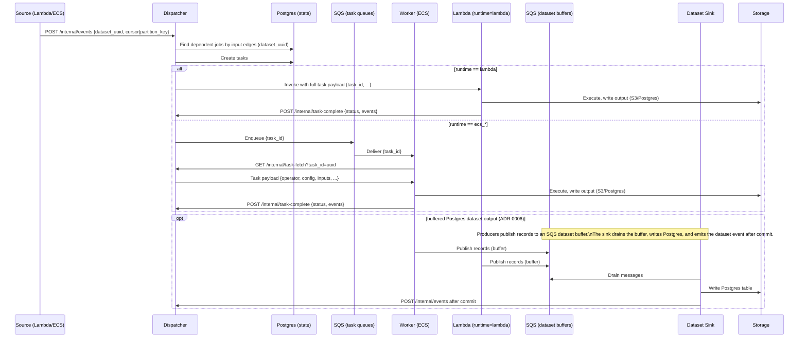

# Event Flow

**Flow:** Source emits → Dispatcher routes → Worker/Lambda executes → emit events → repeat.

## Related

- [contracts.md](contracts.md) — task/event payload shapes
- [dispatcher.md](containers/dispatcher.md) — orchestration details
- [workers.md](containers/workers.md) — execution model
- [ADR 0006](adr/0006-buffered-postgres-datasets.md) — buffered Postgres datasets
