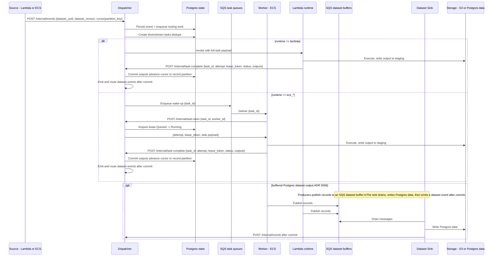

# Event Flow

Reactive execution is event-driven, but durability comes from Postgres state plus leasing (see [task_lifecycle.md](task_lifecycle.md)).

**Notes:**

- Dispatcher side effects (enqueue tasks, route events) are executed via the Postgres state outbox worker; the diagram shows the logical effects.

- SQS is treated as unordered at-least-once. Workers must claim tasks (leases) before running.
- Workers extend SQS visibility for long tasks and heartbeat leases to Dispatcher.
- For `replace` outputs to S3, workers write to a staging prefix and the Dispatcher commits the output (metadata) before routing events (see [data_versioning.md](data_versioning.md)).

## Related

- [contracts.md](contracts.md) — task/event payload shapes
- [task_lifecycle.md](task_lifecycle.md) — leasing, retries, rehydration
- [dispatcher.md](containers/dispatcher.md) — orchestration details
- [workers.md](containers/workers.md) — execution model
