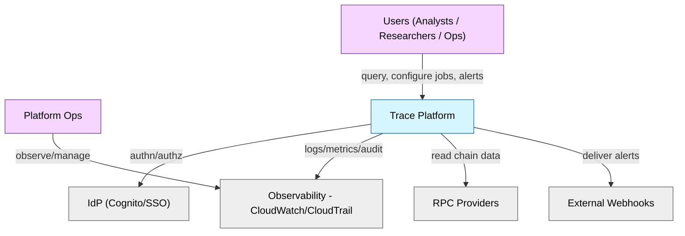
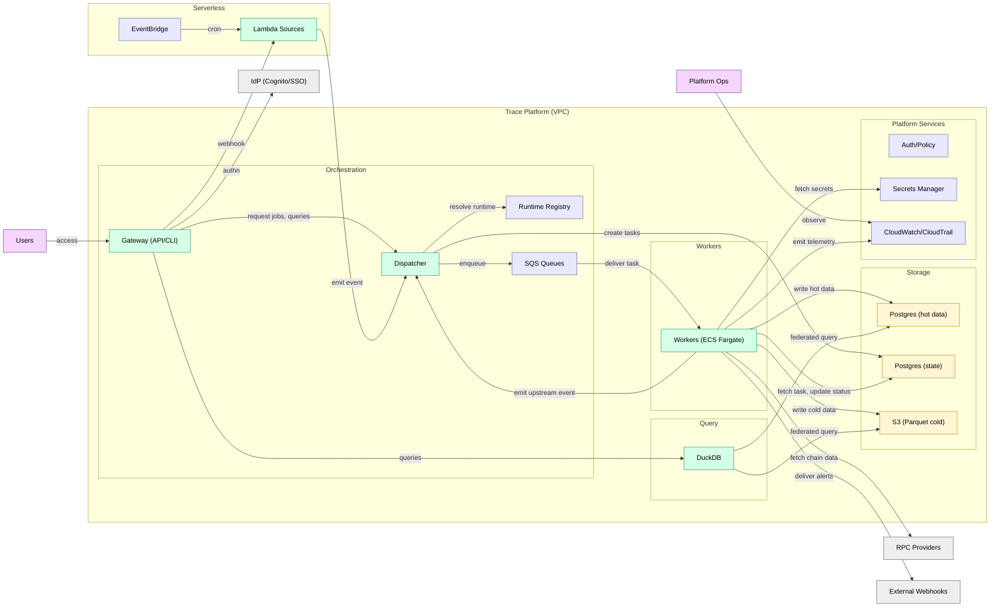
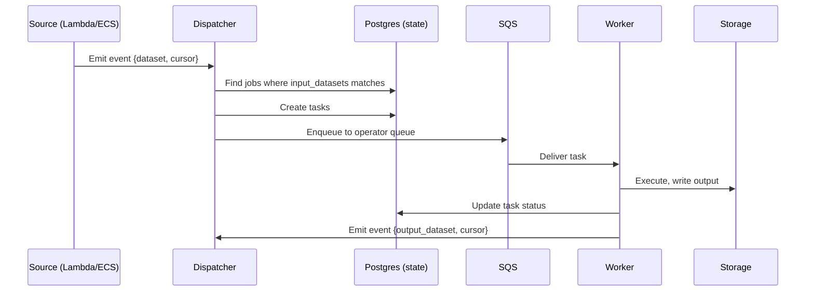
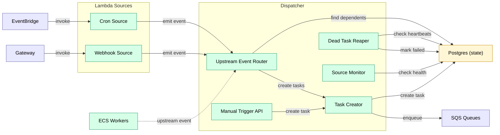
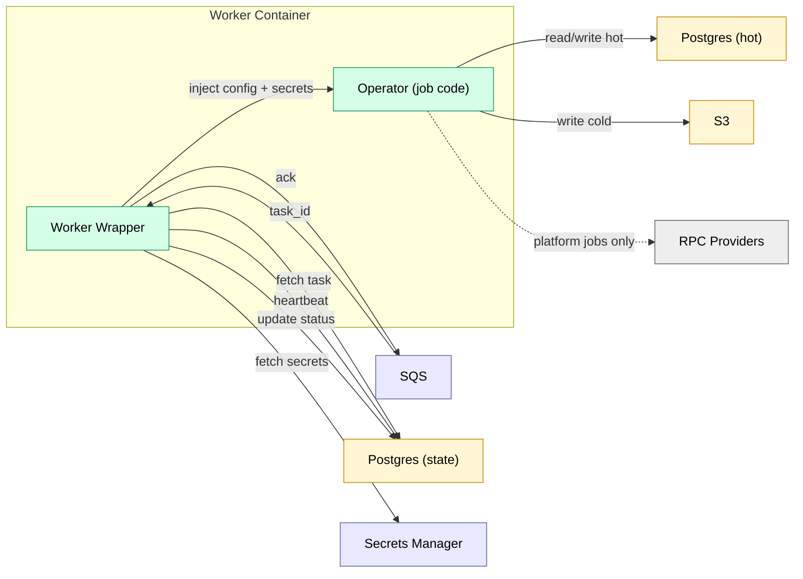
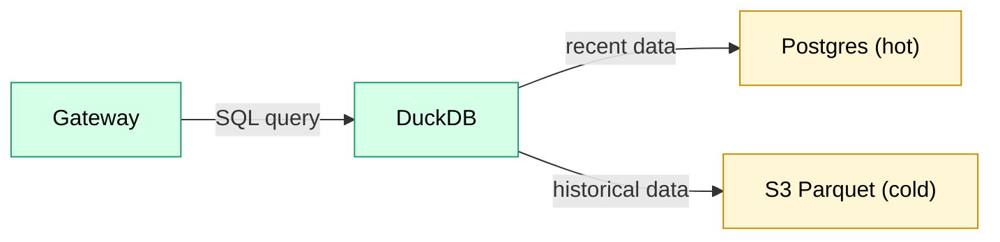
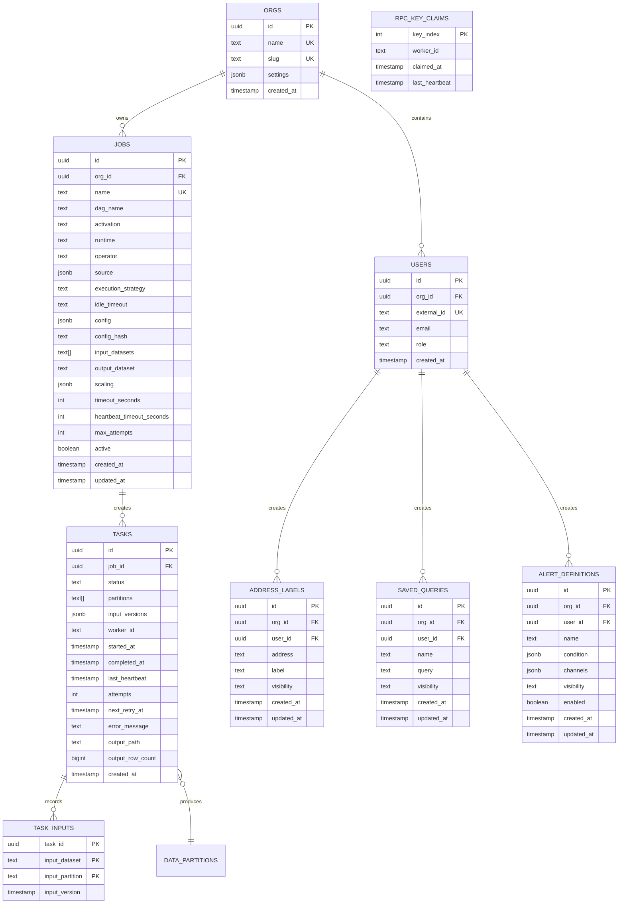
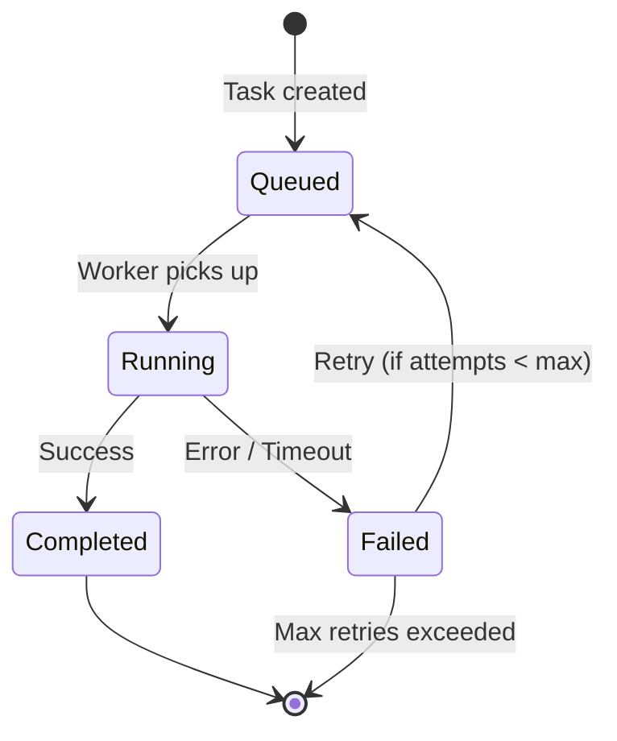
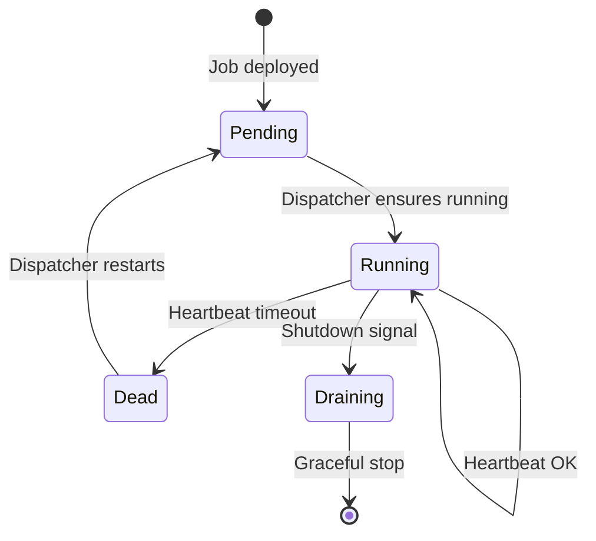
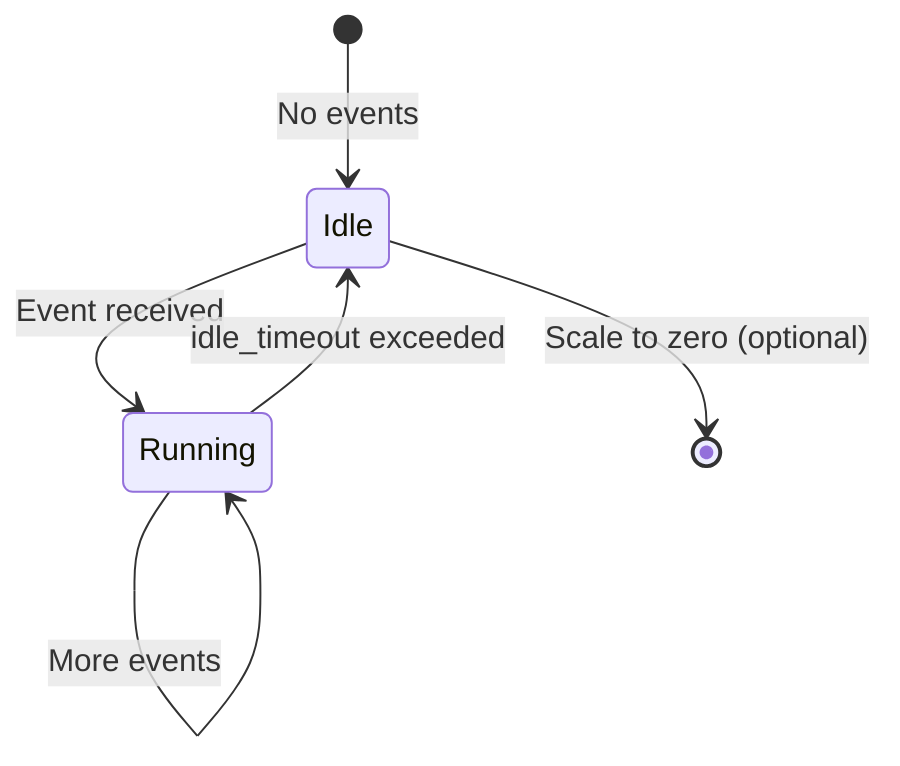

# ETL Orchestration System Architecture

**Version:** 1.2  
**Date:** December 2025

---

## Table of Contents

1. [Overview](#overview)
2. [System Architecture](#system-architecture)
3. [Core Components](#core-components)
4. [Data Model](#data-model)
5. [Access Control](#access-control)
6. [PII and User Data](#pii-and-user-data)
7. [Job Lifecycle](#job-lifecycle)
8. [DAG Configuration](#dag-configuration)
9. [Infrastructure](#infrastructure)
10. [Deployment](#deployment)

---

## Overview

A general-purpose ETL orchestration system designed for:

- **Multi-runtime support** — Rust, Python, R, TypeScript, Scala
- **Asset-based lineage** — Everything produces trackable assets
- **Flexible partitioning** — Data-driven, not static time-based
- **Source jobs** — Long-running services with `activation: source` (e.g., blockchain followers)
- **Config-as-code** — DAGs defined in YAML, version controlled

See the Build Plan in [docs/plan/build.md](../plan/build.md) for the phased delivery roadmap.

### Design Principles

1. **Everything is a job** — Streaming services, batch transforms, checks
2. **Everything produces assets** — Postgres tables, S3 Parquet, any URI
3. **Workers are dumb** — Receive task, execute, report result
4. **YAML is source of truth** — Definitions in git, state in Postgres
5. **Single dispatcher** — Simple, stateless, restartable

### Job Characteristics

- **Containerized**: jobs run as containers or services, called remotely (not co-located)
- **Polyglot**: any runtime — Rust, Python, TypeScript, etc. — packaged as a container
- **Standard contract**: jobs receive inputs, produce outputs, return metadata
- **Composable**: jobs can depend on outputs of other jobs, forming DAGs

### Job Types

| Type | Purpose | Example |
|------|---------|---------|
| Ingest | Pull data from on-chain or off-chain sources | `block_follower`, `cryo_ingest` |
| Transform | Alter, clean, reshape data | decode logs |
| Combine | Join or merge datasets | on-chain + off-chain |
| Enrich | Add labels, annotations, computed fields | address tagging |
| Summarize | Aggregate, roll up, compute metrics | daily volumes |
| Validate | Check invariants, data quality | `integrity_check` |
| Alert | Evaluate conditions, deliver notifications | `alert_evaluate`, `alert_deliver` |

---

---

## System Architecture

### System Context



### Container View



Storage split: Postgres (state) for orchestration metadata (multi-AZ, PITR); Postgres (hot) for recent mutable data (partitioned with retention); S3 for cold Parquet.

### Event Flow



**Flow:** Source emits → Dispatcher routes → Worker executes → Worker emits → repeat.

### Component View: Orchestration



### Component View: Workers



### Component View: Query Service



---

## Core Components

### Platform Components

These are infrastructure services, not jobs:

### 1. Dispatcher

Central orchestration coordinator. The only platform service.

**Responsibilities:**
- Route all upstream events to dependent jobs
- Create tasks and enqueue to operator queues (SQS)
- Handle virtual operators (e.g., `aggregator`) directly — no worker needed
- Monitor source job health (ECS workers with `activation: source`, `source.kind: always_on`)
- Track in-flight jobs per operator (scaling control)
- Run reaper for dead tasks
- Publish queue depth metrics to CloudWatch
- Expose manual source API (emits events)

**Event model:**

Every job emits an event when it writes to its `output_dataset`. The event is simple:

```json
{"dataset": "hot_blocks", "cursor": 12345}
```

Events can also include partition or row-range context when relevant:

```json
{"dataset": "cold_blocks", "partition_key": "1000000-1010000"}
```

The Dispatcher routes based on dataset name alone. Reactive jobs that list the
dataset as an input receive the event.

**Event routing:**
1. Worker emits event: `{dataset: "hot_blocks", cursor: 12345}`
2. Dispatcher queries: jobs where `input_datasets` includes `"hot_blocks"`
3. For each dependent reactive job:
   - If `runtime: dispatcher` → Dispatcher handles directly
   - Else → create task, enqueue to SQS

**Backpressure:**

Propagates upstream through DAG edges. When a queue trips its threshold (depth or age), dispatcher pauses upstream producers recursively until pressure clears.

- Per-job thresholds: `max_queue_depth`, `max_queue_age`
- Modes: `pause` (default), `coalesce`, `drop_oldest`
- Priority tiers: `high` (alerts/ingest), `normal`, `low` (backfill) — shed low first
- Deferred tasks held in Postgres (`pending_backpressure`) until promoted to SQS

**Does NOT:**
- Execute compute tasks (that's workers)
- Pull from queues
- Evaluate cron schedules (that's EventBridge + Lambda)

### 2. SQS Queues

Task dispatch mechanism. One queue per runtime.

**Why SQS over Postgres-as-queue:**
- Push to workers (no polling loop in workers)
- Native ECS autoscaling integration
- Built-in visibility timeout
- Workers stay dumb — no orchestration logic

**Configuration:**
- FIFO queue with deduplication
- Visibility timeout: 5 minutes (configurable per job)
- Dead letter queue after 3 failed receives

### 3. Workers

Executors. One worker image per runtime.

| Runtime | Execution | Use Case |
|---------|-----------|----------|
| `dispatcher` | In-process | Virtual operators (aggregator, wire_tap) |
| `lambda` | AWS Lambda | Cron/webhook/manual sources |
| `ecs_rust` | ECS (Rust) | Ingest, transforms, compaction |
| `ecs_python` | ECS (Python) | ML, pandas |

**Queue model:** One SQS queue per runtime (except `dispatcher`). Task payload includes
`operator`, `config`, and event context (`cursor` or `partition_key`).

**Lambda:** Invoked by EventBridge/API Gateway, emits event to Dispatcher.

**ECS:** Long-polls SQS, stays warm per `idle_timeout`, heartbeats to Dispatcher.

### Runtime Registry (Extensible)

Runtimes are identifiers used by the Dispatcher to select a worker image and queue.
They are modeled as strings (not a fixed enum) to allow future additions.

**Registry responsibilities:**
- Map `runtime` → worker image and SQS queue.
- Declare capabilities (e.g., supports long-running tasks, source jobs, GPU, etc.).
- Define default resource limits and heartbeat expectations.

**Adding a new runtime:**
1. Build a worker image (e.g., `ecs_r` for R).
2. Register it in the Dispatcher config with queue + capabilities.
3. Use `runtime: ecs_r` in job YAML.

### 4. Postgres

Source of truth for all state.

**Stores:**
- Job definitions (synced from YAML)
- Tasks (append-only history)
- Task inputs (for memoization)
- Data partitions (asset registry)
- RPC key claims (resource pool)

### 5. Asset Storage

**Flexibility:** Jobs can write anywhere (S3, Postgres, external), provided downstream jobs can access the output as input.

**Hot path:** Postgres
- Immediate writes
- Immediate queries for alerts
- UPDATE/DELETE for reorgs

**Cold path:** S3 Parquet
- Compacted from hot
- Immutable partitions
- Analytics optimized

**Manifests:** Emitted per job run for integrity verification.

**Query layer:** DuckDB
- Spans both Postgres and S3
- Federated queries

---

## Data Model

### Entity Relationship



### Schema SQL

```sql
-- Organizations
CREATE TABLE orgs (
    id UUID PRIMARY KEY DEFAULT gen_random_uuid(),
    name TEXT NOT NULL,
    slug TEXT NOT NULL UNIQUE,
    settings JSONB NOT NULL DEFAULT '{}',
    created_at TIMESTAMPTZ DEFAULT now()
);

-- Job definitions (synced from YAML)
CREATE TABLE jobs (
    id UUID PRIMARY KEY DEFAULT gen_random_uuid(),
    org_id UUID NOT NULL REFERENCES orgs(id),
    name TEXT NOT NULL,
    dag_name TEXT NOT NULL,
    activation TEXT NOT NULL,           -- 'source', 'reactive'
    runtime TEXT NOT NULL,              -- 'lambda', 'ecs_rust', 'ecs_python', 'dispatcher'
    operator TEXT NOT NULL,             -- 'block_follower', 'alert_evaluate', etc.
    source JSONB,                       -- { "kind": "cron", "schedule": "0 0 * * *" }
    execution_strategy TEXT,            -- NULL for sources, else 'PerUpdate', 'PerPartition', 'Bulk'
    idle_timeout TEXT,                  -- reactive only: 'never', '5m', '0', etc.
    config JSONB NOT NULL DEFAULT '{}', -- operator config
    config_hash TEXT NOT NULL,
    input_datasets TEXT[],
    output_dataset TEXT,
    scaling JSONB,                      -- { "mode": "backfill", "max_concurrency": 20 }
    timeout_seconds INT,
    heartbeat_timeout_seconds INT,
    max_attempts INT DEFAULT 3,
    active BOOLEAN DEFAULT true,
    created_at TIMESTAMPTZ DEFAULT now(),
    updated_at TIMESTAMPTZ DEFAULT now(),
    CONSTRAINT unique_job_name UNIQUE (dag_name, name)
);

-- Task instances (append-only)
CREATE TABLE tasks (
    id UUID PRIMARY KEY DEFAULT gen_random_uuid(),
    job_id UUID NOT NULL REFERENCES jobs(id),
    status TEXT NOT NULL DEFAULT 'Queued',
    partitions TEXT[],
    input_versions JSONB,
    worker_id TEXT,
    started_at TIMESTAMPTZ,
    completed_at TIMESTAMPTZ,
    last_heartbeat TIMESTAMPTZ,
    attempts INT DEFAULT 0,
    next_retry_at TIMESTAMPTZ,
    error_message TEXT,
    output_path TEXT,
    output_row_count BIGINT,
    created_at TIMESTAMPTZ DEFAULT now()
);

-- Task input versions (for memoization)
CREATE TABLE task_inputs (
    task_id UUID REFERENCES tasks(id),
    input_dataset TEXT NOT NULL,
    input_partition TEXT NOT NULL,
    input_version TIMESTAMPTZ NOT NULL,
    PRIMARY KEY (task_id, input_dataset, input_partition)
);

-- RPC key pool
CREATE TABLE rpc_key_claims (
    key_index INT PRIMARY KEY,
    worker_id TEXT,
    claimed_at TIMESTAMPTZ,
    last_heartbeat TIMESTAMPTZ
);

-- Column lineage (optional)
CREATE TABLE column_lineage (
    output_dataset TEXT NOT NULL,
    output_column TEXT NOT NULL,
    input_dataset TEXT NOT NULL,
    input_column TEXT NOT NULL,
    job_id UUID REFERENCES jobs(id),
    PRIMARY KEY (output_dataset, output_column, input_dataset, input_column)
);

-- Indexes
CREATE INDEX idx_tasks_status ON tasks(status) WHERE status IN ('Queued', 'Running');
CREATE INDEX idx_tasks_job_id ON tasks(job_id);
CREATE INDEX idx_tasks_next_retry ON tasks(next_retry_at) WHERE status = 'Failed';
CREATE INDEX idx_tasks_last_heartbeat ON tasks(last_heartbeat) WHERE status = 'Running';
CREATE INDEX idx_jobs_active ON jobs(dag_name) WHERE active = true;

-- PII: Address labels
CREATE TABLE address_labels (
    id UUID PRIMARY KEY DEFAULT gen_random_uuid(),
    org_id UUID NOT NULL REFERENCES orgs(id),
    user_id UUID NOT NULL REFERENCES users(id),
    address TEXT NOT NULL,
    label TEXT NOT NULL,
    visibility TEXT NOT NULL DEFAULT 'private',  -- private, org, public
    created_at TIMESTAMPTZ DEFAULT now(),
    updated_at TIMESTAMPTZ DEFAULT now(),
    UNIQUE (org_id, user_id, address, label)
);

-- PII: Saved queries
CREATE TABLE saved_queries (
    id UUID PRIMARY KEY DEFAULT gen_random_uuid(),
    org_id UUID NOT NULL REFERENCES orgs(id),
    user_id UUID NOT NULL REFERENCES users(id),
    name TEXT NOT NULL,
    query TEXT NOT NULL,
    visibility TEXT NOT NULL DEFAULT 'private',
    created_at TIMESTAMPTZ DEFAULT now(),
    updated_at TIMESTAMPTZ DEFAULT now()
);

-- PII: Alert definitions
CREATE TABLE alert_definitions (
    id UUID PRIMARY KEY DEFAULT gen_random_uuid(),
    org_id UUID NOT NULL REFERENCES orgs(id),
    user_id UUID NOT NULL REFERENCES users(id),
    name TEXT NOT NULL,
    condition JSONB NOT NULL,
    channels JSONB NOT NULL,  -- email, sms, webhook configs
    visibility TEXT NOT NULL DEFAULT 'private',
    enabled BOOLEAN DEFAULT true,
    created_at TIMESTAMPTZ DEFAULT now(),
    updated_at TIMESTAMPTZ DEFAULT now()
);

-- PII access audit log
CREATE TABLE pii_access_log (
    id UUID PRIMARY KEY DEFAULT gen_random_uuid(),
    user_id UUID NOT NULL REFERENCES users(id),
    table_name TEXT NOT NULL,
    record_id UUID NOT NULL,
    action TEXT NOT NULL,  -- read, write, delete
    accessed_at TIMESTAMPTZ DEFAULT now()
);

CREATE INDEX idx_address_labels_org ON address_labels(org_id);
CREATE INDEX idx_address_labels_user ON address_labels(user_id);
CREATE INDEX idx_address_labels_address ON address_labels(address);
CREATE INDEX idx_saved_queries_org ON saved_queries(org_id);
CREATE INDEX idx_alert_definitions_org ON alert_definitions(org_id);
CREATE INDEX idx_pii_access_log_user ON pii_access_log(user_id);
CREATE INDEX idx_pii_access_log_time ON pii_access_log(accessed_at);
```

---

## Access Control

**Hierarchy:** Global → Org → Role (reader/writer/admin) → User

**Identity:** Users authenticate via external IdP (OIDC/SAML). `external_id` links to IdP subject.

**Enforcement:** All actions (job execution, data access, config changes) require authn/authz. All API requests include org context. Jobs, tasks, assets scoped by `org_id`.

**Tenant isolation:** Logical by default (queries filtered by `org_id`). Physical isolation optional (separate Terraform deployment). One org's workload cannot starve another's resources.

**Cross-org sharing:** Users can be granted access to another org's data via explicit grants, not shared infrastructure.

---

## PII and User Data

PII = address labels, saved queries, alert definitions.

All PII tables have: `org_id`, `user_id`, `visibility` (private/org/public).

**Rules:**
- `private`: only creator can read
- `org`: any org member can read
- Reads logged to `pii_access_log`
- Hard delete only (GDPR)

---

## Job Lifecycle

### Job Properties

Every job has two key properties:

| Property | Description | Values |
|----------|-------------|--------|
| `activation` | How the job is started | `source`, `reactive` |
| `runtime` | Where code executes | `lambda`, `ecs_rust`, `ecs_python`, `dispatcher` |

Reactive jobs can also set:

| Property | Description | Values |
|----------|-------------|--------|
| `idle_timeout` | How long to stay alive with no work | `never`, duration (`5m`), or `0` |

**Activation behavior:**

| Activation | Behavior | Example |
|------------|----------|--------|
| `source` | Emits events; not scheduled by Dispatcher | `block_follower` (always_on) |
| `reactive` | Runs from Dispatcher tasks | `alert_evaluate` — reacts to new blocks |

**Source kinds:** `always_on`, `cron`, `webhook`, `manual`.

**Cron and manual:** They are source kinds that emit events. Reactive jobs subscribe
to `input_datasets` and are scheduled by the Dispatcher.

### Execution Strategies

How work is divided for reactive jobs:

| Strategy | Description | Use Case |
|----------|-------------|----------|
| `PerUpdate` | One task per upstream event | Alert evaluation |
| `PerPartition` | One task per partition | Historical backfills |
| `Bulk` | Single task for all pending work | Compaction, aggregations |

Source jobs do not have an execution strategy — they emit events directly.

### Task States



### Source Job Lifecycle (activation: source)



### Reactive Job Lifecycle (activation: reactive)



### Staleness, Memoization & Reorgs

See [data_versioning.md](data_versioning.md) for full specification of:
- Partition vs. cursor-based incremental processing
- Staleness detection and memoization
- Reorg handling and invalidations
- Alert deduplication

### Scaling

Dispatcher-controlled, not AWS auto-scaling.

| Mode | Behavior |
|------|----------|
| `backfill` | Max parallelism (e.g., 20 concurrent) |
| `steady` | Single worker |

```yaml
scaling:
  mode: backfill
  max_concurrency: 20
```

Dispatcher tracks in-flight jobs and only releases work when slots available.

---

## DAG Configuration

See [dag_configuration.md](../../capabilities/dag_configuration.md) for:
- Directory structure
- YAML schema with examples
- Deploy process and SQL logic

---

## Infrastructure

See [infrastructure.md](../../capabilities/infrastructure.md) for:
- AWS architecture diagram
- Terraform module structure
- Deployment order and rollback

---

## Monitoring

**Key alerts:**
- Queue depth > 1000
- Task failure rate > 5%
- Source heartbeat stale > 2 min
- Workers at max capacity

**Logging:** Structured JSON to CloudWatch, 30 day retention.

---

## Security

**IAM roles:** dispatcher-role (SQS, RDS, CloudWatch), worker-role (SQS, RDS, S3, Secrets Manager)

**Secrets:** RPC keys and DB creds in Secrets Manager, injected as env vars.

**Network:** Workers in private subnets. VPC endpoints for S3, SQS, Secrets Manager. ALB HTTPS only.

---

## Appendix

### Glossary

| Term | Definition |
|------|------------|
| Operator | Job implementation (e.g., `block_follower`, `alert_evaluate`) |
| Operator Type | Runtime category: `lambda`, `polars`, `python`, `ingest` |
| Activation | `source` (emits events) or `reactive` (runs from tasks) |
| Source | Job with `activation: source` — maintains connections, emits events |
| Asset | Output of a job — Parquet file, table rows |
| Partition | A subset of an asset (e.g., blocks 0-10000) |

### References

- [cryo GitHub](https://github.com/paradigmxyz/cryo)
- [DuckDB Documentation](https://duckdb.org/docs/)
- [AWS ECS Autoscaling](https://docs.aws.amazon.com/AmazonECS/latest/developerguide/service-auto-scaling.html)
