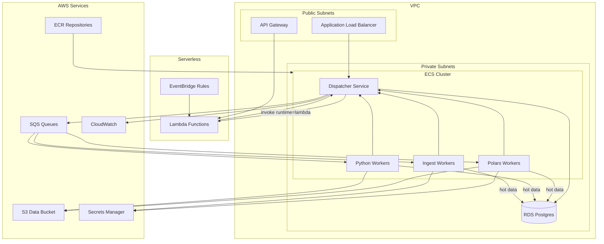

# Infrastructure

AWS architecture and Terraform structure.

## AWS Architecture



## Terraform Structure

```
/terraform
  /modules
    /vpc           # VPC, subnets, NAT, VPC endpoints
    /rds           # Postgres, security groups
    /ecs           # Cluster, services, task definitions, autoscaling
    /sqs           # FIFO queues, DLQ
    /s3            # Data bucket, lifecycle rules
    /lambda        # Lambda functions (sources + operators), API Gateway
    /eventbridge   # Cron schedules
  /environments
    /dev
    /prod
```

## Key Resources

- **VPC**: Private/public subnets, VPC endpoints for S3/SQS/Secrets Manager
- **ECS**: Fargate services, SQS-based autoscaling (v1 runs workers on `linux/amd64`)
- **RDS**: Postgres 15, encrypted, multi-AZ in prod
- **SQS**: FIFO with deduplication, 5min visibility, DLQ after 3 failures
- **S3**: Versioned, lifecycle to Glacier after 1 year

## Deployment Order

1. Terraform apply (infra)
2. Database migrations
3. Sync DAG YAML → Postgres
4. Deploy ECS services

## Rollback

Terraform state rollback, ECS deployment rollback, git revert DAGs.
