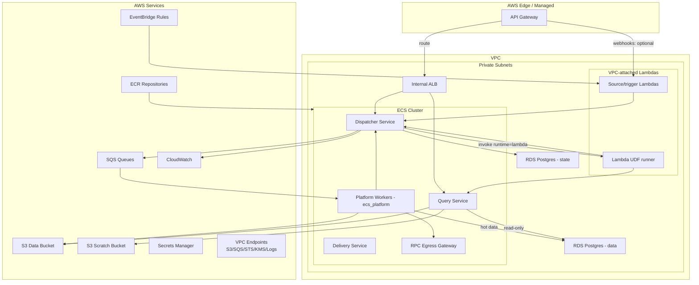

# Infrastructure

AWS deployment topology and constraints.

For the canonical C4 system and container views, see [../architecture/c4.md](../architecture/c4.md).

## AWS Architecture

> Note: Untrusted ECS UDF execution (`ecs_udf`) is deferred to v2. In v1, untrusted UDFs execute via the platform-managed Lambda runner.

## Infrastructure as code

This repo does not include Terraform or any other infrastructure-as-code tree. If you manage AWS infrastructure as code, keep it in a separate repo and treat this document as the required resource inventory and constraints.

## Key Resources

- **Ingress**: API Gateway routes user `/v1/*` requests to an internal ALB via VPC Link. Semantics: [Gateway](../architecture/containers/gateway.md), [Security model](../architecture/security.md).
- **Lambda**: any Lambda that calls internal services (Dispatcher, Query Service, sinks) is VPC-attached in private subnets with no NAT. Required AWS APIs are reached via VPC endpoints.
- **VPC**: private subnets, VPC endpoints (S3/SQS/STS/KMS/Logs), and egress controls. See [ADR 0002](../adr/0002-networking.md).
- **ECS**: Fargate services and workers. v1 runs workers on `linux/amd64`. Container responsibilities: [Containers](../architecture/containers/README.md).
- **RDS**: two Postgres databases (v1 target: Postgres 15), encrypted, in private subnets (multi-AZ in prod):
  - Postgres state (orchestration): [db_boundaries.md](../architecture/db_boundaries.md), [orchestration.md](../architecture/data_model/orchestration.md)
  - Postgres data (hot tables): [db_boundaries.md](../architecture/db_boundaries.md), [Data model](../architecture/data_model/README.md)
  - Postgres data tuning notes for chain datasets:
    - Expect bounded block-range rewrites (reorg repair) and bounded deletes (post-compaction retention).
    - Baseline: row-range deletes are supported. Large deletes can create bloat; tune autovacuum accordingly.
    - Optional: partition by `chain_id` and `block_number` range. If partition boundaries align with compaction ranges, retention cleanup can be implemented as partition drops.
    - Retention and compaction are DAG-defined operator behaviors. The platform does not enforce a retention policy at the database layer.
    - In prod, consider a read replica for Query Service to protect ingestion latency.
- **SQS**: standard queues plus DLQs. Correctness is not based on queue ordering. See [task_lifecycle.md](../architecture/task_lifecycle.md).
- **S3**: data bucket for datasets and scratch bucket for query exports and task scratch. Default retention guidance: [operations.md](../architecture/operations.md).
- **Query Service**: DuckDB federation layer (read-only Postgres user) plus result export to S3. See [Query Service](../architecture/containers/query_service.md).
- **Dispatcher credential minting**: short-lived, prefix-scoped STS credentials for untrusted tasks. See [credential_minting.md](../architecture/contracts/credential_minting.md).

## Scheduled and webhook triggers

- **Cron / schedules**: use EventBridge Rules (or EventBridge Scheduler) to invoke a Lambda function on a schedule.
  The scheduled Lambda can enqueue work by calling the Dispatcher or publishing to SQS.
- **Webhooks**: use API Gateway to invoke Lambda (or forward to Gateway/Dispatcher).
  API Gateway is the recommended entry point when you want auth, rate limiting, and request validation.

## Deployment Order

1. Apply infrastructure (Terraform or equivalent)
2. Database migrations
3. Sync DAG YAML → Postgres state (see [dag_deployment.md](../architecture/dag_deployment.md))
4. Deploy ECS services

## Rollback

There are two rollback layers:

- **Infra rollback**: revert infrastructure and service deploys (Terraform and ECS).
- **Orchestration rollback**: atomic cutover rollback of `dag_version` and `dataset_version` pointers. See [dag_deployment.md](../architecture/dag_deployment.md) and [ADR 0009](../adr/0009-atomic-cutover-and-query-pinning.md).
