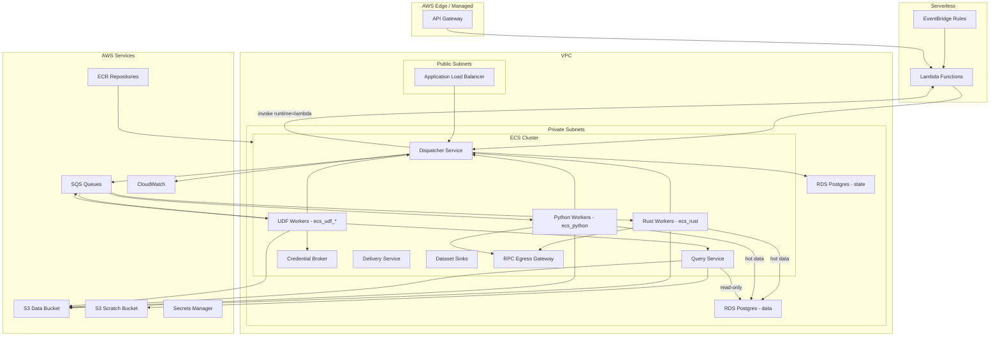

# Infrastructure

AWS architecture and Terraform structure.

## AWS Architecture



## Terraform Structure

```
/terraform
  /modules
    /vpc           # VPC, subnets, NAT, VPC endpoints
    /rds           # Postgres, security groups
    /ecs           # Cluster, services, task definitions, autoscaling
    /sqs           # SQS queues, DLQ
    /s3            # Data bucket, lifecycle rules
    /lambda        # Lambda functions (sources + operators), API Gateway
    /eventbridge   # Cron schedules
  /environments
    /dev
    /prod
```

## Key Resources

- **VPC**: Private/public subnets, VPC endpoints for S3/SQS (and other AWS APIs as needed)
- **ECS**: Fargate services, SQS-based autoscaling (v1 runs workers on `linux/amd64`)
- **RDS**: Two clusters/instances:
  - **Postgres state** for orchestration metadata
  - **Postgres data** for hot tables and platform-managed datasets
  Both are Postgres 15, encrypted, multi-AZ in prod, deployed into **private subnets**.
  
  For chain datasets, Postgres data should be optimized for frequent **block-range rewrites** (reorgs) and bounded deletes (post-compaction retention):
  - Baseline: bounded **row-range deletes** are supported. Large deletes can create bloat; tune autovacuum accordingly.
  - Optional optimization: **partition by `chain_id` + `block_number` range**. If partition boundaries align with compaction ranges, retention cleanup can later be implemented as partition drops.
  - Retention and compaction are **DAG-defined behaviors** (operators decide finality/TTL); the Dispatcher does not enforce a retention policy.
  - In prod, consider a read replica for Query Service to protect ingestion latency.
- **SQS**: Standard queues (one per runtime) + DLQ. Base visibility is minutes; worker wrappers extend visibility for long tasks. Ordering is enforced by DAG dependencies, not SQS.
- **S3**: Data bucket for dataset storage + scratch bucket for query exports and task scratch
- **Query Service**: DuckDB federation layer (read-only Postgres user) + result export to S3
- **Credential Broker**: Issues short-lived, prefix-scoped STS credentials for untrusted UDF tasks

## Deployment Order

1. Terraform apply (infra)
2. Database migrations
3. Sync DAG YAML → Postgres
4. Deploy ECS services

## Rollback

Terraform state rollback, ECS deployment rollback, git revert DAGs.
