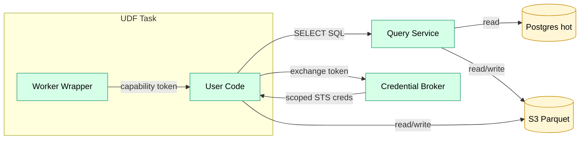

# User-Defined Functions (UDFs)

User-defined code for alerts, transforms, enrichments, and custom operators.

## Overview

UDFs allow users to define custom logic in their preferred runtime.

## Supported Runtimes

| Runtime | Use Case | Example |
|---------|----------|---------|
| TypeScript | JSON-heavy, async | `balance > 1000 ETH` |
| Python | ML, pandas, statistical | `df['value'].std() > threshold` |
| Rust | High-performance scanning | `col("value").gt(threshold)` |

## Contract

- **Input**: A pinned dataset version (or partition/range), plus config/parameters.
- **Output**: A result set (alerts, enriched rows, transformed partitions).
- **Stateless**: No state persists between invocations; all context is passed in.

## Sandbox

UDFs are **untrusted**. The full sandbox and isolation requirements live in
[security_model.md](../standards/security_model.md) (single source of truth).

In v1, assume:

- Runs in isolated ECS tasks with CPU/memory/timeout limits.
- No internet egress; UDFs can only call in-VPC platform services and required AWS VPC endpoints.
- No direct Postgres access; ad-hoc reads go through the Query Service.
- No Secrets Manager access; secrets (when needed for trusted platform tasks) are injected at task launch.

UDFs should be deterministic for backfill/replay. Any non-deterministic values (e.g., time) must be passed explicitly as inputs/parameters.

### Data Access

UDFs do not receive broad infrastructure credentials.

They access data through two platform primitives:

1. **Query Service** (SQL gateway)
   - UDFs can issue arbitrary **SELECT-only** SQL, but only over the datasets declared as inputs to the task (enforced by the task capability token).
   - Large results can be exported to S3 (Parquet) and returned as an S3 location.

2. **Credential Broker** (scoped S3 credentials)
   - The worker wrapper provides a short-lived **capability token** for the task attempt.
   - The UDF exchanges the token for short-lived STS credentials restricted to:
     - input dataset prefixes
     - output dataset prefix
     - task scratch/export prefix

## Use Cases

| Use Case | Description | Docs |
|---------|-------------|------|
| Alert conditions | Evaluate user-defined conditions on data | [alerting.md](alerting.md) |

Additional use cases (custom transforms, enrichments) are in the
[backlog](../plan/backlog.md#udf).

## Packaging

UDFs are submitted as code bundles (e.g., zip) and validated before execution.
See:

- [ADR 0003](../architecture/adr/0003-udf-bundles.md) for bundle format.
- [security_model.md](../standards/security_model.md) for signing/provenance requirements.
