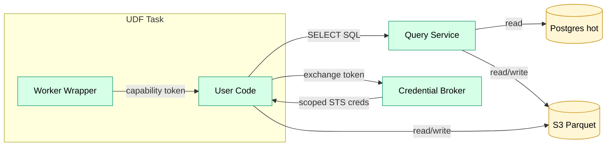

# User-Defined Functions (UDFs)

User-defined code for alerts, transforms, enrichments, and custom operators.

## Overview

UDFs allow users to define custom logic in their preferred runtime. All UDFs share a common sandbox and contract.

## Supported Runtimes

| Runtime | Use Case | Example |
|---------|----------|---------|
| TypeScript | JSON-heavy, async | `balance > 1000 ETH` |
| Python | ML, pandas, statistical | `df['value'].std() > threshold` |
| Rust | High-performance scanning | `col("value").gt(threshold)` |

## Contract

- **Input**: Data partition or row set, plus config/parameters.
- **Output**: Result set (e.g., triggered alerts, enriched rows, transformed data).
- **Stateless**: No state persists between invocations; all context passed in.

## Sandbox

User-defined code runs in isolated containers with strict constraints:

- **Isolation**: Each invocation runs in its own container (see [security_model.md](../standards/security_model.md) for container/network isolation).
- **Resource caps**: CPU (0.25 vCPU default), memory (512 MB default), timeout (60s default); configurable per job.
- **No internet egress**: UDFs cannot make arbitrary outbound calls. Network access is limited to in-VPC platform services and required AWS VPC endpoints.
- **No platform control-plane access**: UDFs cannot call Trace internal APIs (e.g., `/internal/*`); only the worker wrapper/runtime may interact with platform endpoints.
- **No direct database access**: UDFs cannot connect to Postgres. Any ad-hoc reads must go through the Query Service.
- **No filesystem**: Read-only except for ephemeral `/tmp`; no persistent state.
- **Determinism**: UDFs must be deterministic—same inputs produce same outputs. Required for backfill/replay consistency. Non-deterministic functions (e.g., `random()`, `now()`) are prohibited or injected as parameters.
- **Allowed imports**: Restricted to a vetted set of libraries per runtime; no arbitrary package installation.

### Data Access (v1)

UDFs are untrusted and therefore never receive broad infrastructure credentials.

Instead, UDFs access data through two platform primitives:

1. **Query Service** (SQL gateway)
   - UDFs can issue arbitrary **SELECT-only** SQL, but only over the datasets declared as inputs to the task.
   - Query Service pins dataset versions at query start and enforces dataset visibility.
   - Large results can be exported to S3 (Parquet) and returned as an S3 location.

2. **Credential Broker** (scoped S3 credentials)
   - At task start, the worker wrapper provides the UDF a short-lived **capability token** that encodes:
     - `task_id`, `attempt`, `org_id`
     - allowed input dataset version prefixes (S3)
     - allowed output prefix (S3)
     - task scratch/export prefix (S3)
     - expiry
   - The UDF exchanges the token with the Credential Broker for short-lived STS credentials restricted to those prefixes.
   - The UDF uses those credentials to read input Parquet partitions and write output Parquet objects.

This model achieves “arbitrary queries” without granting UDFs any direct network path to Postgres or Secrets Manager.

## Use Cases

| Use Case | Description | Docs |
|----------|-------------|------|
| Alert conditions | Evaluate user-defined conditions on data | [alerting.md](alerting.md) |

Additional use cases (custom transforms, enrichments) are in the [backlog](../plan/backlog.md#udf).

## Packaging

UDFs are submitted as code bundles (e.g., zip) and validated before execution. Bundles are versioned and signed; see [security_model.md](../standards/security_model.md) for signing requirements.

v1 uses AWS Lambda-style zip bundles (including Rust custom runtime `bootstrap`) executed in ECS for maximum tooling reuse. See [ADR 0003](../architecture/adr/0003-udf-bundles.md).
