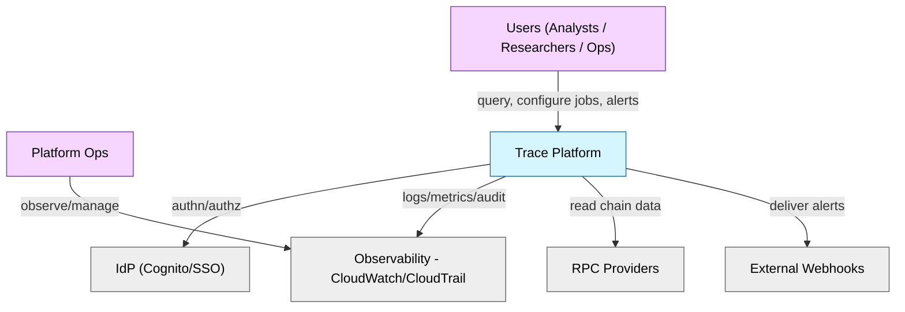
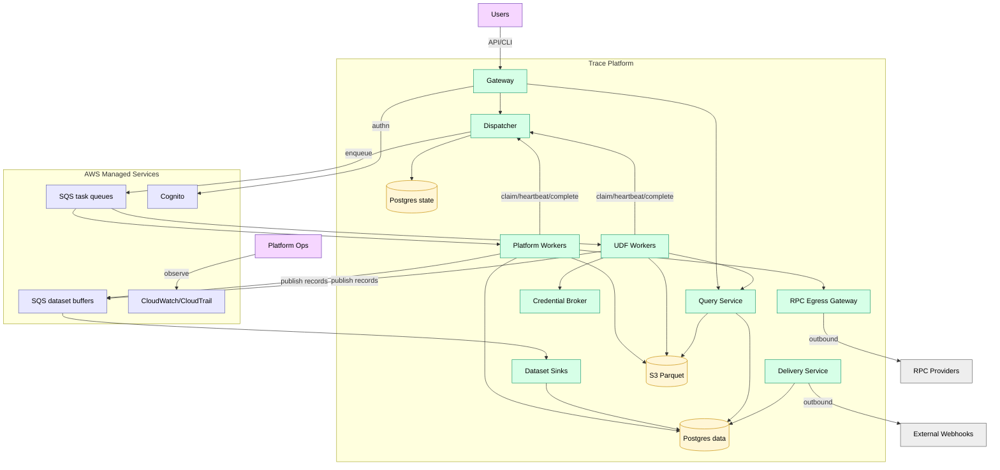

# Trace Platform

Architecture overview for Trace: an ETL orchestration platform for blockchain research and operations.

## Overview

A general-purpose ETL orchestration system designed for:

- **Multi-runtime support** — Rust, Python, TypeScript (v1); additional runtimes are deferred (see backlog)
- **Asset-based lineage** — Everything produces trackable assets
- **Flexible partitioning** — Data-driven, not static time-based
- **Source jobs** — Long-running services with `activation: source` (e.g., blockchain followers)
- **Config-as-code** — DAGs defined in YAML, version controlled

See [backlog.md](plan/backlog.md) for the phased delivery roadmap.

### Design Principles

1. **Everything is a job** — Streaming services, batch transforms, checks
2. **Everything produces assets** — Postgres tables, S3 Parquet, any URI
3. **Workers are dumb** — Receive task, execute, report result
4. **YAML is source of truth** — Definitions in git, state in Postgres
5. **Single dispatcher** — Simple, stateless, restartable

### Tenancy Model

> **v1 is single-tenant.** The architecture includes `org_id` scoping throughout (jobs, tasks, data, queries) to support future multi-tenant expansion, but v1 deploys as a single-org instance. Multi-tenancy (shared infrastructure with logical isolation) and physical tenant isolation (per-org deployments) are deferred. See [backlog.md](plan/backlog.md).

### Job Characteristics

- **Containerized**: jobs run as containers or services, called remotely (not co-located)
- **Polyglot**: any runtime — Rust, Python, TypeScript, etc. — packaged as a container
- **Standard contract**: jobs receive inputs, produce outputs, return metadata
- **Composable**: jobs can depend on outputs of other jobs, forming DAGs

### Job Types

| Type | Purpose | Example |
|------|---------|---------|
| Ingest | Pull data from onchain or offchain sources | `block_follower`, `cryo_ingest` |
| Transform | Alter, clean, reshape data | decode logs |
| Combine | Join or merge datasets | onchain + offchain |
| Enrich | Add labels, annotations, computed fields | address tagging |
| Summarize | Aggregate, roll up, compute metrics | daily volumes |
| Validate | Check invariants, data quality | `integrity_check` |
| Alert | Evaluate conditions, route notifications | `alert_evaluate`, `alert_route` |

### Glossary

| Term | Definition |
|------|------------|
| Operator | Job implementation (e.g., `block_follower`, `alert_evaluate`) |
| Activation | `source` (emits events) or `reactive` (runs from tasks) |
| Source | Job with `activation: source` — maintains connections, emits events |
| Asset | Output of a job — Parquet file, table rows |
| Partition | A subset of an asset (e.g., blocks 0-10000) |
| Runtime | Execution environment: `lambda`, `ecs_rust`, `ecs_python`, `ecs_udf_ts`, `ecs_udf_python`, `ecs_udf_rust`, `dispatcher` |

---

## Architecture

### System Context (C4 L1)

### Container View (C4 L2)

### Storage

**Storage:** Postgres (state) holds orchestration metadata (multi-AZ, PITR). Postgres (data) and S3 are used for job data: Postgres (data) is typically used for hot/mutable datasets (e.g., recent chain ranges, alert tables), while S3 Parquet is used for cold/immutable datasets and exported results. The "hot" vs "cold" split is a **naming convention** used by operators like `block_follower` and `parquet_compact`, not a separate storage engine. DuckDB federates across both.

For the complete C4 diagrams (including AWS dependencies and lower-level components), see [c4.md](architecture/c4.md).

### Deep Dives

- C4 diagrams: [c4.md](architecture/c4.md)
- End-to-end flow: [event_flow.md](architecture/event_flow.md)
- Task lifecycle: [task_lifecycle.md](architecture/task_lifecycle.md)
- Orchestration internals: [dispatcher.md](architecture/containers/dispatcher.md)
- Execution model: [workers.md](architecture/containers/workers.md)
- Query federation: [query_service.md](architecture/containers/query_service.md)
- Scoped data access: [credential_broker.md](architecture/containers/credential_broker.md)
- Outbound egress: [delivery_service.md](architecture/containers/delivery_service.md), [rpc_egress_gateway.md](architecture/containers/rpc_egress_gateway.md)
- API/task/event schemas: [contracts.md](architecture/contracts.md)

## Documentation Map

| Area | Documents |
|------|-----------|
| Containers | [gateway.md](architecture/containers/gateway.md), [dispatcher.md](architecture/containers/dispatcher.md), [workers.md](architecture/containers/workers.md), [query_service.md](architecture/containers/query_service.md), [credential_broker.md](architecture/containers/credential_broker.md), [delivery_service.md](architecture/containers/delivery_service.md), [rpc_egress_gateway.md](architecture/containers/rpc_egress_gateway.md), [dataset_sinks.md](architecture/containers/dataset_sinks.md) |
| Data Model | [erd.md](architecture/data_model/erd.md), [orchestration.md](architecture/data_model/orchestration.md), [pii.md](architecture/data_model/pii.md) |
| Architecture | [c4.md](architecture/c4.md), [contracts.md](architecture/contracts.md), [event_flow.md](architecture/event_flow.md), [data_versioning.md](architecture/data_versioning.md), [dag_deployment.md](architecture/dag_deployment.md), [ADRs](architecture/adr/) |
| Operators | [catalog](architecture/operators/README.md) |
| Features | [alerting.md](features/alerting.md), [dag_configuration.md](features/dag_configuration.md), [ingestion.md](features/ingestion.md), [metadata.md](features/metadata.md), [udf.md](features/udf.md) |
| Deploy | [infrastructure.md](deploy/infrastructure.md), [monitoring.md](deploy/monitoring.md) |
| Standards | [security_model.md](standards/security_model.md), [nfr.md](standards/nfr.md) |
| Use Cases | [use_cases](use_cases/README.md) |
| Planning | [backlog.md](plan/backlog.md), [prd.md](prd/prd.md) |

## Security

**IAM roles (high-level):**

- dispatcher-role (SQS, Postgres (state), CloudWatch)
- platform-worker-role (SQS, Postgres (data), S3)
- udf-worker-role (SQS only; data access is via Query Service + Credential Broker)
- query-service-role (Postgres (data) read-only, S3 read/write for results)
- credential-broker-role (STS AssumeRole into a constrained base role)
- delivery-service-role (Postgres (data) + controlled internet egress)
- rpc-egress-gateway-role (controlled internet egress; provider creds injected at launch)
- dataset-sink-role (SQS buffers, Postgres (data))

**Secrets:** RPC keys and DB creds in Secrets Manager, injected as env vars.

**Network:** Services and workers in private subnets. VPC endpoints for S3/SQS (and others as needed). No internet egress from job containers; external calls go only through platform egress gateway services.

See [security_model.md](standards/security_model.md) for job isolation, threat model, and credential handling.

## References

- [cryo GitHub](https://github.com/paradigmxyz/cryo)
- [DuckDB Documentation](https://duckdb.org/docs/)
- [AWS ECS Autoscaling](https://docs.aws.amazon.com/AmazonECS/latest/developerguide/service-auto-scaling.html)
